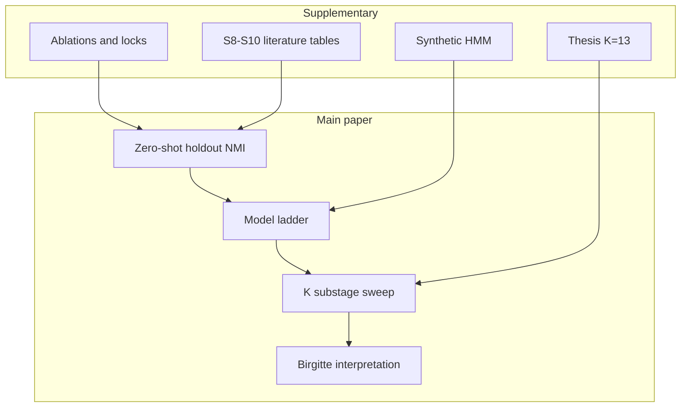
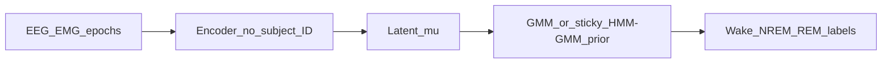

# 5-Page Paper Plan (canonical)

**Replaces:** `5-page_paper_plan_28f9ec08`, `paper_plan_v2_literature_3caca90e`, `zero-shot_holdout_framing_e5526f64`.

**PLOS manuscript (2026-06-09):** [`docs/paper/plos_my_paper.tex`](../docs/paper/plos_my_paper.tex) — official template, Author summary, caption-only figures. Rule: [`.cursor/rules/plos-compbiol-tex.mdc`](../.cursor/rules/plos-compbiol-tex.mdc). Figures: `docs/paper/figures/Fig1–4`. Venue section: **Neuroscience**. Striking image: hypnogram strip from Fig 4.

---

## One-sentence pitch

Decoder-only subject-conditioned representation learning with a **temporal Gaussian-mixture latent prior** improves **zero-shot** cross-mouse sleep staging on MSSV and yields **interpretable substages** that refine Wake/NREM/REM transitions—beyond static mixture priors or feature-domain HMMs.

**Main text (~5 pages):** ladder + holdout + substage biology.  
**Supplement:** thesis details (synthetic validation, raw HMM, K=13 taxonomy, encoder+decoder ablation, preprocessing locks, seed tables, extended literature).



---

## Core narrative

**Problem (lead with Rose 2026):** Manual mouse scoring lacks cross-lab consensus; supervised DL inherits rater noise and fails to generalize across MSSV sites until retrained on multi-lab labels ([Rose et al. 2026 bioRxiv](https://www.biorxiv.org/content/10.64898/2026.03.27.714381v1)).

**Our route:** Unsupervised population learning on MSSV with a **controlled ladder** (HMM features → HMMGMVAE → cGMVAE → cHMMGMVAE), **zero-shot holdout inference** on unseen mice, and **substage biology** (K sweep + Fig-27 panels + Birgitte interview).

### Zero-shot holdout inference (Methods must state explicitly)

- **Train:** population on cv4fold training folds (joint or within-lab scope).
- **Eval:** held-out mice/labs with **no per-subject calibration** (contrast AccuSleep 10-min mixture z-scoring).
- **Decoder-only conditioning is training-only** — encoder learns subject-invariant latents; subject embeddings used only in decoder reconstruction during training.
- **At inference for staging:** signal → encoder (no subject ID) → latent → temporal mixture prior only. **No subject embedding, no decoder** on the evaluation path.



**Code alignment** ([`src/models/vae.py`](src/models/vae.py)): `decoder_only_conditioning: true` → `use_encoder_conditioning = False`; `predict_gmm_labels()` calls `encode()` then prior only — decoder never used for holdout NMI. Validator passes `sub_ids` but they are ignored at encode for decoder-only models.

| Model | emb at train | Subject ID at staging inference |
|-------|----------------|----------------------------------|
| hmmgmvae_locked | 0 | N/A |
| cgmvae_locked / chmmgmvae_locked | 8 (decoder only) | **Not used** |

**Honest limit:** Zero-shot applies to **prior assignment**; per-lab spectral front-end locks (`cvae_overrides`) from incohort tuning remain — not per-mouse manual scoring.

### Contrast triad (Intro / Discussion)

| Prior | What they do | Our differentiator |
|-------|----------------|---------------------|
| **Supervised ceiling** (SPINDLE, REST) | High accuracy, needs labels | Discovery + cross-lab holdout without one-lab label bias |
| **Transductive** (AccuSleep mixture z-score, per-mouse SegWay) | Per-subject calibration or per-animal fit | **Population-trained; zero-shot on held-out mice** — signal → latent → temporal prior only |
| **Static unsupervised** (FASTER/FASTER2, mcRBM, WUCSS) | Clustering or shallow substates | Deep latent + sticky HMM-GMM prior + MSSV holdout protocol |
| **Encoder-conditioned cVAE** (thesis supplement) | Subject ID in encoder at train and eval | Decoder-only: conditioning **training-only**; holdout **without** subject ID |

---

## Sharpened claims (stay honest)

1. **Leave-mice-out cv4fold** across labs 2/3/5 — not "leave-lab-out" ([`unified_holdout_paper_line.md`](docs/cv4fold/unified_holdout_paper_line.md)).
2. **Zero-shot holdout inference** for staging / prior NMI — no subject embeddings at eval; contrast AccuSleep.
3. **NMI is a feature** — Rose 2026 justifies noisy expert labels; physiology panels are the biological payoff.
4. **K=3–15**, not ~190 mcRBM states — chosen K after sweep + expert exclusion (thesis K=13 in supplement).
5. **Lab-heterogeneous winners** — cHMM lab_3/5; cGMVAE competitive lab_2 ([`ablation_findings_20260608.md`](docs/cv4fold/ablations/ablation_findings_20260608.md)).

### Terminology guardrails

| Say | Avoid |
|-----|--------|
| Zero-shot holdout inference (staging / prior NMI) | "Subject ID in decoder at inference" |
| Decoder conditioning is **training-only** | Implying decoder runs at holdout eval |
| Leave-mice-out cv4fold | "Leave-lab-out" |

---

## Novelty vs prior work

| Contribution | Closest prior | Differentiator |
|---|---|---|
| Model ladder on MSSV | FASTER2 (GHMM on hand-crafted features) | Learned latent + mixture + HMM prior; same protocol across rungs |
| cGMVAE cross-subject | GMVAE literature | **Decoder-only** + **zero-shot** holdout (no subject ID at eval) |
| cHMM-GMVAE | VAE-HMM, VAME, TN-VAE | MSSV + sticky HMM-GMM + decoder-only + holdout |
| Substage discovery | Katsageorgiou 2018 mcRBM | VAE embedding + cross-lab holdout + HMM transitions |
| Transitions | Somnotate 2024 (supervised) | Fully unsupervised; physiology panels |

---

## Literature (Tier 1 + deep-research adds)

**Must-cite intro (≤12):** Rose 2026, Rose 2025/MSSV, Katsageorgiou 2018, Yamada 2024 FASTER2, Miladinovic 2019 SPINDLE, Barger 2019 AccuSleep, Gelegen 2024 Somnotate, Gross/Cusinato 2024 WUCSS, Johnson 2016 SVAE, Sohn 2015 / Dilokthanakul 2016, Sunagawa 2013 FASTER, Elmgreen & Bigom 2026.

**Add to bib** ([`docs/paper/references.bib`](docs/paper/references.bib)): SegWay, WUCSS, FASTER, AccuSleep, REST, Grieger pre-REM, Johnson SVAE, Özdenizci A-cVAE (supplement).

**Reviewer stress-test** ([`related_work_novelty.md`](docs/paper/related_work_novelty.md)):

| Objection | Rebuttal |
|-----------|----------|
| Incremental over mcRBM | Cross-lab holdout + temporal HMM prior + deep latent |
| NMI vs 97% accuracy | Rose 2026 label noise; supervised accuracy mimics single-rater bias |
| Needs AccuSleep calibration | Holdout scored with **no subject embedding**, no 10-min manual baseline |
| K=15 meaningless | K sweep + PSD/bout panels + Birgitte exclusion |
| VAE+HMM not novel | **Decoder-only + warm sticky HMM-GMM on MSSV ladder** |

Inputs: [`chatgpt_deep_research.md`](docs/google_sheets/chatgpt_deep_research.md), [`gemini_deep_research.md`](docs/google_sheets/gemini_deep_research.md).

---

## Experiments (gate checklist)

Configs: [`unified_holdout_paper_line.md`](docs/cv4fold/unified_holdout_paper_line.md), [`locked_recipes.py`](scripts/cv4fold/locked_recipes.py).

| Priority | Experiment | Status |
|---|---|---|
| P0 | Joint locked holdout: cGMVAE / HMMGMVAE / cHMMGMVAE × 4 folds | Partial — refresh when all 12 jobs done |
| P0 | Within-lab locked holdout (same 3 models) | Supplement scope comparison |
| P0 | HMM feature baseline (~0.51 thesis reference) | Bottom ladder rung |
| P1 | K sweep K ∈ {3,5,7,9,11,13,15} on locked cHMM | Jobs submitted; pick K for Fig 3 |
| P1 | Fig-27 panels + transition matrix / hypnogram | Placeholder until K-sweep winner |
| P2 | Birgitte interview | [`birgitte_interview_guide.md`](docs/paper/birgitte_interview_guide.md) |

```bash
bash hpc/submit/cv4fold/submit_joint_locked_holdout.sh
bash hpc/submit/cv4fold/submit_within_lab_locked_holdout.sh
bash hpc/submit/cv4fold/submit_chmm_k_sweep.sh
```

Logs: `hpc/output/cv4fold/vae/%J.out`

---

## 5-page layout

| Section | ~words | Content |
|---|---|---|
| **Abstract** | 250 | Rose 2026 problem; ladder + zero-shot holdout; substages |
| **Introduction** | 450 | ¶1 Rose + supervised ceiling; ¶2 unsupervised gap; ¶3 three contributions |
| **Methods** | 550 | MSSV; features; models; **Inference (holdout)** paragraph; cv4fold; NMI; K sweep |
| **Results** | 700 | Fig 2 ladder; holdout highlights; substages; transition insight |
| **Discussion** | 450 | Rose complementarity; AccuSleep contrast; when temporal prior helps; limits |

### Methods Inference paragraph (draft)

> **Inference (holdout).** Models are trained on cv4fold training mice (joint or within-lab scope). For held-out validation mice, sleep-state labels are obtained by encoding spectral epochs **without subject identifiers**, then assigning states via the learned Gaussian mixture or sticky HMM–GMM prior on latent means. Subject embeddings are used **only during training** in the decoder reconstruction path. Holdout evaluation does **not** use subject embeddings, per-mouse manual calibration, or AccuSleep-style mixture z-scoring.

### Main figures

- **Fig 1:** Train vs eval schematic (encoder + prior only at holdout); ladder rungs; Rose 2026 callout
- **Fig 2:** Holdout NMI ladder ([`plot_ladder_figure.py`](scripts/paper/plot_ladder_figure.py))
- **Fig 3:** Compact Fig-27-style panels for chosen K
- **Fig 4:** Transition matrix + hypnogram

### Supplement

- **S1–S7:** Thesis + ablations (existing skeleton in [`supplement.tex`](paper/overleaf/supplement.tex))
- **S8:** Extended comparison table (ChatGPT + Gemini)
- **S9:** Reviewer stress-test rebuttals
- **S10:** 2023–2026 landscape (REST, WUCSS, FASTER2, Rose 2026)

---

## Venue

**Primary:** PLOS Computational Biology (Somnotate + SPINDLE precedent).  
**If Fig 3 biology strong:** Sleep / JSR.  
**5-page = narrative skeleton** — journal main text expands via supplement.

---

## Repo pointers

| Area | Path |
|------|------|
| **PLOS manuscript** | [`docs/paper/plos_my_paper.tex`](../docs/paper/plos_my_paper.tex) |
| Paper docs | [`docs/paper/`](../docs/paper/) |
| Figure export | [`docs/paper/figures/`](../docs/paper/figures/) |
| Figure staging | [`paper/overleaf/figures/`](../paper/overleaf/figures/) |
| Holdout design | [`docs/cv4fold/unified_holdout_paper_line.md`](../docs/cv4fold/unified_holdout_paper_line.md) |
| Decoder roadmap | [`docs/decoder_conditioning_roadmap.md`](../docs/decoder_conditioning_roadmap.md) |

---

## Remaining implementation tasks

### A. Experiments (GPU — user confirms submit)

- Finish P0 holdout + K-sweep; refresh [`summarize_holdout_ladder.py`](scripts/paper/summarize_holdout_ladder.py) → `main.tex` table
- Replace Fig 3–4 placeholder with cHMM K-winner

### B. Docs + manuscript (no GPU)

- Zero-shot protocol in [`holdout_experiments.md`](docs/paper/holdout_experiments.md) + [`related_work_novelty.md`](docs/paper/related_work_novelty.md)
- [`deep_research_synthesis.md`](docs/paper/deep_research_synthesis.md) for supervisors
- Revise [`main.tex`](paper/overleaf/main.tex) + [`supplement.tex`](paper/overleaf/supplement.tex) S8–S10
- Expand bib files

### C. Biology

- Birgitte interview → lock substage names and exclusions

---

## Scope guard (do NOT do)

- Train SegWay, WUCSS, REST, AccuSleep, or SlumberNet baselines
- Add adversarial cVAE or SVAE reimplementation
- Change cv4fold protocol or model ladder definition
- Expand main text beyond ~5-page skeleton

---

## Risk register

| Risk | Mitigation |
|---|---|
| Holdout NMI ~0.3–0.5 | Relative lift over ladder; substage biology + protocol rigor |
| cHMM not uniformly best | Per-lab honesty; "temporal prior when bout structure matters" |
| mcRBM comparison | Similar panels; difference = VAE + zero-shot holdout + HMM transitions |
| Thesis duplicate | Main = decoder-only + cHMM + multi-lab holdout only |
