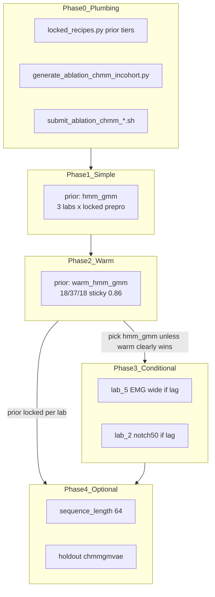

# cHMM-GMVAE incohort ablation plan

## Context and starting point

**cGMVAE locked incohort (best-of-3 prior NMI, scratch, `sequence_length: 1`):**

| Lab | Recipe | NMI |
|-----|--------|-----|
| lab_2 | `rem_emg_wide_eeg4` | **0.593** |
| lab_3 | `baseline_long` + `wide_mlp` | **0.737** |
| lab_5 | `long` + `wide_mlp` | **0.534** |

Source: [`scripts/cv4fold/locked_recipes.py`](scripts/cv4fold/locked_recipes.py), [`docs/cv4fold/lab_preprocessing_review_20260607.md`](docs/cv4fold/lab_preprocessing_review_20260607.md).

**What exists today:** All 48 `ablation_*` YAMLs use `prior: gmm`. Holdout configs currently default cHMM to `warm_hmm_gmm` via `CHMMGMVAE_PRIOR_OVERRIDES`, but **no incohort cHMM ablations have been run** — holdout prior tier will be updated after this sweep. [`generate_configs.py`](scripts/cv4fold/generate_configs.py) `per_lab_incohort` emits **cGMVAE only**.

## No checkpoint hotstart (hard rule)

**Out of scope everywhere in this program:** loading a pretrained VAE checkpoint (`cvae.model_checkpoint_path` → baseline `.pth`). That was Phase 1 decoder-only job **B** (hotstart) and is **not** comparable to cv4fold incohort scratch ablations — you are right to treat it as cheating for recipe lock.

| Mechanism | What it is | In this program? |
|-----------|------------|------------------|
| **`model_checkpoint_path: null`** | Train encoder+decoder+subject emb from scratch | **Yes — always** |
| **`prior: hmm_gmm`** | HMM-GMM KL from epoch 0; random emission init | **Yes — preferred default to lock** |
| **`prior: warm_hmm_gmm`** | Training curriculum: standard KL → KMeans emissions → GMM seq → HMM ramp | **Yes — comparison only; adopt if it clearly wins** |
| **Baseline `.pth` hotstart** | Load weights from decoder-only / full VAE run | **No — never** |

`warm_hmm_gmm` is **not** checkpoint hotstart — it is an in-training prior schedule (see `warm_hmm_gmm_prior` in [`src/models/vae.py`](src/models/vae.py)). Phase 1 vs 2 tests whether that schedule is worth the complexity vs plain `hmm_gmm`.

**Decoder-only context (informational only):** Scratch warm cHMM (**C**, ~0.612) vs hotstart (**B**, ~0.650) showed hotstart helps, but we deliberately **ignore B** for cv4fold. At `seq_len=1`, HMM transitions are inactive; the warm vs simple comparison is mainly about **emission initialization curriculum**, not temporal HMM dynamics.

**Selection metric (unchanged):** best-of-3 **HMM-GMM prior NMI** from `plots/{1,2,3}/metrics.txt`; reject configs with **≥2 collapsed seeds** (~0.0–0.1). Keep **`no_beta_epochs: 10`** (cGMVAE showed `0` collapses).



---

## Phase 0 — Plumbing (one session, no GPU)

Extend [`scripts/cv4fold/locked_recipes.py`](scripts/cv4fold/locked_recipes.py):

```python
CHMMGMVAE_SIMPLE_OVERRIDES = {
    "prior": "hmm_gmm",
    "num_gmm_states": 3,
    "hmm_sticky_kappa": 0.86,
    "hmm_estimate_transitions": True,
}

CHMMGMVAE_PRIOR_OVERRIDES = {  # existing warm schedule
    "prior": "warm_hmm_gmm",
    ...
}
```

Refactor `apply_model_variant(cfg, model, *, prior_tier="warm"|"simple")` so `chmmgmvae` + `prior_tier="simple"` strips warmup keys (`gmm_warmup_epochs`, `hmm_warmup_epochs`, `hmm_transition_ramp_epochs`).

Add [`scripts/cv4fold/generate_ablation_chmm_incohort.py`](scripts/cv4fold/generate_ablation_chmm_incohort.py):

- Base: `load_locked_recipe(lab)` → same datasets/prepro/arch as cGMVAE lock
- Phases via `--phase`:
  - `baseline_simple` → `hmm_gmm` on locked recipe
  - `baseline_warm` → `warm_hmm_gmm` on locked recipe
  - `prepro_delta` → copy cGMVAE-proven YAML overrides only (see Phase 3)
- Output tree: `src/config/run/cvaemarhmm/cv4fold/ablation_chmm/{lab}/{variant}.yaml`
- `results_dir`: `results/cv4fold/ablation_chmm/{lab}`
- `run_name`: `abl_chmm_{lab}_{variant}` (e.g. `abl_chmm_lab_3_hmm_gmm_locked`)
- Shared knobs: `runs: 3`, `seed: 123`, **`model_checkpoint_path: null`** (assert in generator), `save_results_npz: false`, `no_beta_epochs: 10`, 200 ep

Add submit scripts (pattern from [`hpc/submit/cv4fold/submit_ablation_prepro.sh`](hpc/submit/cv4fold/submit_ablation_prepro.sh)):

- [`hpc/submit/cv4fold/submit_ablation_chmm_baseline.sh`](hpc/submit/cv4fold/submit_ablation_chmm_baseline.sh) — Phase 1 + 2 (6 jobs)
- Later: `submit_ablation_chmm_prepro_delta.sh` — Phase 3 only

Document in [`docs/cv4fold/ablations/ablation_chmm_incohort.md`](docs/cv4fold/ablations/ablation_chmm_incohort.md) + one-line link from [`docs/cv4fold/README.md`](docs/cv4fold/README.md).

**Do not** re-run cGMVAE prepro/arch grids under cHMM — transplant winners only.

---

## Phase 1 — Simple cHMM (P0, submit first) — **preferred lock candidate**

**Variant:** `hmm_gmm_locked` — `prior: hmm_gmm` from epoch 0 (random emission init + sticky transitions; **no** standard/KMeans warmup, **no** checkpoint load).

| Lab | Locked input (from cGMVAE) |
|-----|---------------------------|
| lab_2 | `rem_emg_wide_eeg4` |
| lab_3 | `baseline_long` + `wide_mlp` |
| lab_5 | `long` + `wide_mlp` |

**3 jobs**, `gpuv100`, `6:00`, logs `hpc/output/cv4fold/ablation_chmm/{lab}_hmm_gmm_%J.out`.

**Gate:** Record best-of-3 NMI per lab; note seed stability. If healthy and competitive with cGMVAE, **lock `hmm_gmm` here** and skip warm unless Phase 2 beats it.

```bash
PYTHONPATH=. python3 scripts/cv4fold/generate_ablation_chmm_incohort.py --phase baseline_simple
bash hpc/submit/cv4fold/submit_ablation_chmm_baseline.sh --phase simple
```

---

## Phase 2 — Warm curriculum comparison (P0, parallel or right after Phase 1)

**Variant:** `warm_hmm_gmm_locked` — same locked prepro/arch, scratch, but [`CHMMGMVAE_PRIOR_OVERRIDES`](scripts/cv4fold/locked_recipes.py) (18 / 37 / 18 ramp, sticky 0.86).

Same 3 labs. **Purpose:** answer “is the warm schedule worth it?” — not assumed to win.

**Prior lock rule (simplicity first):**

| Outcome | Lock |
|---------|------|
| `hmm_gmm` best-of-3 **≥ warm** (or within **+0.01** tie band) and seeds healthy | **`hmm_gmm`** — simpler wins |
| warm best-of-3 **> hmm_gmm + 0.01** and ≥2/3 seeds healthy | **`warm_hmm_gmm`** — complexity justified |
| Both weak vs cGMVAE | Lock whichever prior scored higher; run **Phase 3** prepro for that lab |

Do **not** default to warm for holdout or thesis tables without beating simple on the metric above.

```bash
PYTHONPATH=. python3 scripts/cv4fold/generate_ablation_chmm_incohort.py --phase baseline_warm
bash hpc/submit/cv4fold/submit_ablation_chmm_baseline.sh --phase warm
```

---

## Phase 3 — Targeted prepro (P1, conditional per lab)

Only run where the **locked prior from Phase 1/2** (usually `hmm_gmm`) **still trails cGMVAE NMI**. Reuse cGMVAE ablation YAMLs as override sources — **keep the winning prior tier** from Phase 1/2 (generate both `hmm_gmm_*` and `warm_hmm_gmm_*` variants only if prior choice is still ambiguous).

| Lab | cGMVAE delta to try | Source generator / YAML | When |
|-----|---------------------|-------------------------|------|
| **lab_5** | EMG 3–100 Hz | [`generate_ablation_lab5_emg.py`](scripts/cv4fold/generate_ablation_lab5_emg.py) → `wide_mlp_emg_wide` | Locked prior NMI < **0.534** |
| **lab_5** | + 50 Hz notch | `wide_mlp_emg_wide_notch50` | EMG wide helps but unstable / sub-089 spike |
| **lab_2** | 50 Hz notch | [`generate_ablation_lab2_notch.py`](scripts/cv4fold/generate_ablation_lab2_notch.py) → `rem_emg_wide_eeg4_notch50` | Locked prior NMI < **0.593** |
| **lab_3** | — | **Skip** — prepro+arch already optimal for cGMVAE | — |

**Skip entirely:** postnorm sweeps, bp25, paper_robust, montage grid, arch sweep — all settled for cGMVAE ([`docs/cv4fold/ablations/ablation_lab2_findings_20260607.md`](docs/cv4fold/ablations/ablation_lab2_findings_20260607.md)).

**Coordination:** If lab_5 cGMVAE EMG jobs (`wide_mlp_emg_wide*`) finish first, use their winner to pick **one** cHMM variant instead of running both blindly.

---

## Phase 4 — Optional: `sequence_length: 64` (P2, after incohort lock at seq1)

Current incohort + holdout pilot use **`sequence_length: 1`** for parity with cGMVAE ablations. True HMM temporal structure needs **T > 1**.

After Phase 2/3 lock per lab at seq1:

- One variant per lab: locked recipe + **winning prior** (`hmm_gmm` unless warm adopted) + `dataloader.sequence_length: 64`
- Compare to seq1 locked NMI; cross-lab fold4 data suggests seq64 helps population generalization but may hurt lab_3 ([`docs/cv4fold/cross_lab_cv4fold.md`](docs/cv4fold/cross_lab_cv4fold.md))

Treat as **separate thesis decision** — do not block holdout on seq64 unless you explicitly want temporal prior in holdout.

---

## Phase 5 — Lock recipes + holdout

When each lab has a stable winner (prior + optional prepro):

1. Add per-lab `prior_tier: simple|warm` in [`locked_recipes.py`](scripts/cv4fold/locked_recipes.py) — **default `simple` (`hmm_gmm`)** unless Phase 2 adopted warm
2. Update `apply_model_variant(..., chmmgmvae)` to use locked tier, not hard-coded warm
3. Regenerate holdout: `PYTHONPATH=. python3 scripts/cv4fold/generate_configs.py --phase per_lab_holdout --fold 4 --models chmmgmvae`
4. Submit holdout cHMM **after** incohort lock — scratch only, same prior tier as incohort winner

Postprocess: same loop as [`docs/cv4fold/postprocess.md`](docs/cv4fold/postprocess.md) under `results/cv4fold/ablation_chmm/`.

---

## What we explicitly skip (learned from cGMVAE)

- Full prepro grid per lab under cHMM
- `no_beta_epochs: 0`
- Re-testing rejected ideas: paper_robust, bp25, lab_2 postnorm, lab_3 no_postnorm
- **Checkpoint hotstart** (`model_checkpoint_path` → any `.pth`) — never; same scratch protocol as cGMVAE ablations
- Locking **`warm_hmm_gmm` by default** without beating `hmm_gmm` on best-of-3
- Prior hyperparam sweep (sticky, warmup lengths) **until** Phase 2 shows warm wins but plateaus below target — then at most 2–3 variants on **lab_3 only** using reliability YAML as anchor

---

## Job summary (first wave)

| Phase | Jobs | Config pattern | Walltime |
|-------|------|----------------|----------|
| 1 simple | 3 | `ablation_chmm/{lab}/hmm_gmm_locked.yaml` | 6h gpuv100 |
| 2 warm | 3 | `ablation_chmm/{lab}/warm_hmm_gmm_locked.yaml` | 6h gpuv100 |
| 3 conditional | 0–4 | prepro delta × locked prior (usually hmm_gmm) | 6h |
| 4 optional seq64 | 3 | locked + seq64 | 6h+ |

**Compare table after Phase 2** (fill from `scrape_experiment_results.py` or postprocess):

| Lab | cGMVAE lock | Phase1 hmm_gmm | Phase2 warm | Prior lock | Next |
|-----|-------------|----------------|-------------|------------|------|
| lab_2 | 0.593 | TBD | TBD | **hmm_gmm unless warm +0.01** | notch if lag |
| lab_3 | 0.737 | TBD | TBD | **hmm_gmm unless warm +0.01** | prepro unlikely |
| lab_5 | 0.534 | TBD | TBD | **hmm_gmm unless warm +0.01** | EMG wide if lag |

---

## Implementation order

1. `locked_recipes.py` — simple vs warm prior tiers
2. `generate_ablation_chmm_incohort.py` + baseline submit script
3. `docs/cv4fold/ablations/ablation_chmm_incohort.md`
4. User submits Phase 1 → scrape → Phase 2 → conditional Phase 3
5. Lock + holdout regen when ready
