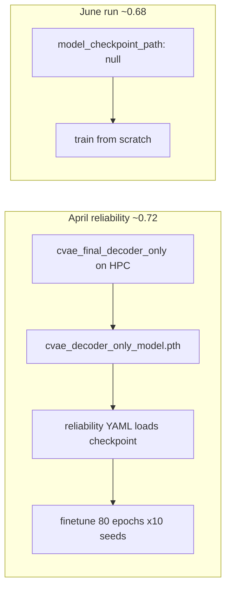

# Checkpoint tracing + minimal cHMMGMVAE port plan

## Part 1: How to know which checkpoint a run used

There are **five places** to check, in order of reliability:

### 1. WandB run config (best for April runs)

For [yklyqlsh](https://wandb.ai/dtu_projects/SPA/runs/yklyqlsh) and [cme0uc0e](https://wandb.ai/dtu_projects/SPA/runs/cme0uc0e):

- **Config field:** `cvae.model_checkpoint_path`
- **Value (both runs):** `results/decoder_only/cvae_final_decoder_only/cvae_decoder_only_model.pth`
- **Git commit:** `b3e0f2d` (April 22, on `vae_decoder`-era code)
- **Metric logged:** `val/cvae_latent_kmeans_nmi` ≈ 0.721–0.726

In the UI: run → **Overview** → **Config** → expand `cvae`.

### 2. HPC stdout (every `train_vae` job)

Search the `.out` log for:

```text
Loading CVAE model from checkpoint: <path>
```

If missing → trained **from scratch** (`model_checkpoint_path: null` or file not found).

Your recent runs:
- `28603490` — crashed loading (subject_emb mismatch)
- `28603502` — **no load** (null path) → explains ~0.68 vs ~0.72

### 3. Saved run config on disk

Each run writes [`config.json`](results/decoder_only/reliability/cgmvae_decoder_only/) under the timestamped results dir, e.g.:

`results/decoder_only/reliability/cgmvae_decoder_only/reliability_cgmvae_decoder_only_mssv_frequency_<timestamp>/config.json`

Check `cvae.model_checkpoint_path`.

### 4. `validation_info.json` (vae_decoder orchestrator)

[`src/orchestrator/orchestrator.py`](src/orchestrator/orchestrator.py) writes `checkpoint_path`, `checkpoint_size`, and `checkpoint_mtime` when validation runs—useful to confirm **which file on disk** was referenced (not just YAML intent).

### 5. Inspect the `.pth` itself (architecture sanity)

On HPC with venv:

```python
import torch
st = torch.load("results/decoder_only/cvae_final_decoder_only/cvae_decoder_only_model.pth", map_location="cpu")
cvae = {k: v for k, v in st.items() if k.startswith("cvae.")}
print(cvae["cvae.encoder_mlp.0.weight"].shape)  # decoder-only: [256, 2176]
print(cvae["cvae.subject_emb.weight"].shape)    # vae_decoder: [92, 4] NOT [10, 4]
```

**April ~0.72 runs used:** HPC-trained `cvae_decoder_only_model.pth` with **vae_decoder subject indexing** (92-row table, legacy sub-NNN indices). Your locally uploaded file had `[10, 4]` embeddings (newer compact indexing)—incompatible with `vae_decoder`.



---

## Part 2: Minimal port strategy (vae_decoder base → cHMMGMVAE reliability)

**Base branch:** stay on [`vae_decoder`](.) / your current `vae_decoder_chmm` tip (`0e9c4c4`). **Do not** merge all of `chmmgmm_fold` (~1,400 lines across core files).

**Goal:** Add cHMMGMVAE lab_3 reliability for:
- `decoder_only_conditioning: true` (thesis-style)
- `decoder_only_conditioning: false` (encoder+decoder conditioning)

**Keep unchanged (critical for cGMVAE ~0.72):**
- [`src/data/data_loader_collection.py`](src/data/data_loader_collection.py) — **keep** `get_num_subjects() -> 92` and legacy `sub-038 → 38` mapping
- Single [`cvae.model_checkpoint_path`](src/config/run/cvaemarhmm/decoder_only/reliability/reliability_cgmvae_decoder_only_mssv_frequency.yaml) load pattern (no `pretrained_checkpoint_path` split unless you later need it)
- Existing cGMVAE reliability YAML + submit script behavior

**Do NOT port from chmmgmm_fold (yet):**
- cv4fold manifests / tune sweeps / `subject_lab` conditioning
- Compact 0..N-1 subject indexing
- `training_pipeline` rename / checkpoint-score sweep plumbing
- `raw_cnn`, lab conditioning, orchestrator refactors unrelated to HMM prior

---

## Part 3: Files to add or patch (minimal set)

| Priority | File | Action |
|----------|------|--------|
| 1 | [`src/models/hmm_gmm_prior.py`](src/models/hmm_gmm_prior.py) | **Copy whole file** from `chmmgmm_fold` (~224 lines) |
| 2 | [`src/models/vae.py`](src/models/vae.py) | **Surgical patch:** import hmm helpers; add `hmm_gmm` / `warm_hmm_gmm` prior params; `hmm_gmm_prior`, `warm_hmm_gmm_prior`, `predict_hmm_labels`; extend `predict_gmm_labels` for HMM emission prior. **Do not** replace entire file. |
| 3 | [`src/models/cvae_mar_hmm.py`](src/models/cvae_mar_hmm.py) | Small patch if `predict()` / `predict_gmm()` need to route HMM labels (check diff on `chmmgmm_fold`) |
| 4 | [`src/validation/validator.py`](src/validation/validator.py) | Add `validate_cvae_hmm()` (mirror of `validate_cvae_gmm`, Viterbi labels + NMI). Optional: skip per-epoch `Prior val` / checkpoint-score logging for v1. |
| 5 | [`src/orchestrator/orchestrator.py`](src/orchestrator/orchestrator.py) | In `predict_cvae()`: if `prior in (hmm_gmm, warm_hmm_gmm)` call `validate_cvae_hmm()`, else existing `validate_cvae_gmm()`. **Do not** change `train_cvae` load/save semantics. |
| 6 | New YAMLs under [`src/config/run/cvaemarhmm/decoder_only/reliability/`](src/config/run/cvaemarhmm/decoder_only/reliability/) | See Part 4 |
| 7 | [`hpc/submit/run_vae_decoder_only_reliability_chmm.sh`](hpc/submit/) | New submit script (mirror existing reliability script) |
| 8 | Tests | Port [`tests/test_hmm_gmm_prior.py`](tests/test_hmm_gmm_prior.py) from `chmmgmm_fold`; add one smoke test that `prior: warm_hmm_gmm` + `seq_len=1` runs forward |

**Reference source on `chmmgmm_fold`:**
- Reliability YAML: `src/config/run/cvaeprior/decoder_only/reliability/reliability_chmmgmvae_decoder_only_lab3_thesis_style.yaml`
- Key model settings: `prior: warm_hmm_gmm`, `latent_dim: 8`, `emb_dim: 4`, `decoder_only_conditioning: true`, `conditioning_source: subject`

---

## Part 4: New configs (lab_3 reliability matrix)

Create **two** YAMLs (copy lab_3 mouse lists from existing [`reliability_cgmvae_decoder_only_mssv_frequency.yaml`](src/config/run/cvaemarhmm/decoder_only/reliability/reliability_cgmvae_decoder_only_mssv_frequency.yaml)):

### A. Decoder-only cHMMGMVAE (thesis-style)

`reliability_chmmgmvae_decoder_only_mssv_frequency.yaml`
- `decoder_only_conditioning: true`
- `prior: warm_hmm_gmm` (+ `gmm_warmup_epochs`, `hmm_warmup_epochs` from chmmgmm_fold yaml)
- `model_checkpoint_path: results/decoder_only/cvae_final_decoder_only/cvae_decoder_only_model.pth`
- `runs: 1` for now (or 10 when time allows)

### B. Encoder+decoder cHMMGMVAE

`reliability_chmmgmvae_encoder_decoder_mssv_frequency.yaml`
- `decoder_only_conditioning: false`
- `prior: warm_hmm_gmm`
- `model_checkpoint_path: results/decoder_only/cvae_baseline/cvae_baseline_model.pth` (encoder+decoder weights, `[256, 2180]` encoder)
- Same mice / seq1 / batch 128

**Baseline training (one-time, before reliability):**

| Conditioning | Train YAML | Checkpoint output |
|--------------|------------|-------------------|
| Decoder-only | [`cvae_final_decoder_only.yaml`](src/config/run/cvaemarhmm/final/cvae_final_decoder_only.yaml) | `results/decoder_only/cvae_final_decoder_only/cvae_decoder_only_model.pth` |
| Encoder+decoder | [`cvae_final.yaml`](src/config/run/cvaemarhmm/final/cvae_final.yaml) | `results/decoder_only/cvae_baseline/cvae_baseline_model.pth` |

Train each **once on HPC** (`runs: 1`) on `vae_decoder` so `subject_emb` matches.

---

## Part 5: Verification workflow (don’t break cGMVAE)

After each code patch, run in order:

1. **pytest on compute** (`bsub < hpc/submit/run_pytest.sh`) — at least `test_hmm_gmm_prior.py`
2. **Regression:** re-run cGMVAE reliability with checkpoint loaded — expect KMeans NMI back in **0.70–0.73** band (seed-dependent)
3. **New:** cHMMGMVAE decoder-only reliability, 1 seed — check log for successful load + `validate_cvae_hmm` / GMM marginal metrics
4. **Compare** encoder+decoder variant only after `cvae_baseline` checkpoint exists on HPC

**Success criteria for port:**
- cGMVAE decoder-only reliability unchanged (within seed noise) vs April
- cHMMGMVAE runs complete without collapse at epoch 11 (if collapse, soften `no_beta_epochs` / add `beta_warmup_epochs` in YAML only—no code change)

---

## Part 6: Suggested git workflow

```text
vae_decoder (or vae_decoder_chmm)
  └─ branch: vae_decoder_chmm_port
       commit 1: add hmm_gmm_prior.py + tests
       commit 2: vae.py HMM prior hooks (no data_loader changes)
       commit 3: validator + orchestrator predict branch
       commit 4: YAMLs + HPC submit scripts
       commit 5: docs note in docs/ (optional, one short md)
```

Cherry-pick **individual commits** from `chmmgmm_fold` only if they touch the files above; otherwise **manual copy** of functions to avoid dragging cv4fold changes.

**Commits on `chmmgmm_fold` most relevant** (inspect with `git show <hash> -- <file>`):
- `9529526` — dataset handling (skip unless needed)
- `3ad7f59` — `training_pipeline` typo fix (optional; vae_decoder uses `traning_pipeline` in pydantic—leave as-is for compatibility)
- `d4c3d60` / `882e2b4` — validation/checkpoint (take only HMM validation pieces, not full orchestrator rewrite)
