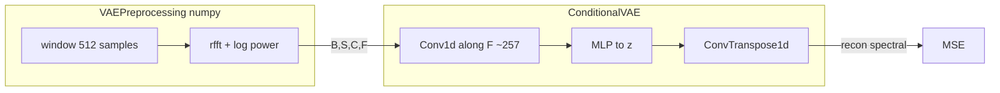
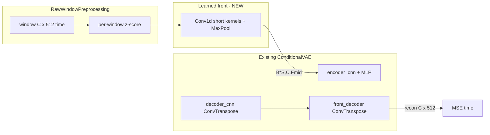

# CNN front-end VAE (simplest path)

## Recommendation (your question)

Use **reconstruction in raw time** `(C, 512)` per 4 s window. That is what “erstatte FFT” and “verificer rekonstruktioner” mean in practice. The extra work is modest because [`ConditionalVAE`](src/models/vae.py) already uses **Conv1d on the last axis** and **ConvTranspose1d** on decode—you only add a thin front/back pair and a preprocessing branch without FFT.

## What you have today



- FFT is fixed in [`vae_preprocessing.py`](src/preprocessing/vae_preprocessing.py) (`__perform_fft`, `band_pass_filter_fft`).
- Conv1d in the VAE runs along the **last dimension** (`F`), which today is **frequency bins**, not time inside the window.

## Target architecture (minimal)



**Per channel:** front operates on `(B*S, C, 512)` with grouped/parallel convs across channels (same pattern as today: tensor `(B*S, C, L)`).

**“Data-driven FFT”:** the front-end maps each 512-sample window to a shorter learned feature map `Fmid` (e.g. 128 bins after pooling—hyperparameter). That plays the role of a **learned spectral-ish representation** without `np.fft`.

**HMM-GMM later:** temporal dynamics are **not** inside the 512 samples; they are across **consecutive 4 s windows** when `sequence_length > 1` and `prior: warm_hmm_gmm` (already implemented in [`vae.py`](src/models/vae.py)). Flow:

- CNN front: rich **per-window** latent inputs.
- Dataloader `sequence_length: 64`: sequence of windows → `z_{1:T}`.
- HMM-GMM prior: transitions between sleep states over that sequence (same as [`hmmgmm` POC](src/config/run/cvaeprior/hmmgmm/poc/sub039_chmmgmvae_poc.yaml)).

Phase 1 can use `sequence_length: 1` for stable AE training; phase 2 copies hmmgmm yaml with `feature_pipeline: raw_cnn` and `sequence_length: 64`.

---

## Implementation steps (smallest diff)

### 1. Config flag

In [`src/config/config.py`](src/config/config.py) `CVAE` block add:

- `feature_pipeline: "fft" | "raw_cnn"` (default `"fft"` for all existing yaml)

In `model.params` add optional front-end knobs (defaults sensible):

- `front_channels`, `front_kernels`, `front_strides`, `front_pools` (e.g. 2 blocks: k=15,s=2 + k=7,s=2 + MaxPool1d(2) → `Fmid` ≈ 128)

### 2. Preprocessing: raw windows only

Add [`src/preprocessing/raw_window_preprocessing.py`](src/preprocessing/raw_window_preprocessing.py) (or branch in `VAEPreprocessing`):

- Reuse: `__reshape_input`, `__downsample_by_majority_voting`, `__apply_sequence_length` from [`vae_preprocessing.py`](src/preprocessing/vae_preprocessing.py).
- **Skip:** FFT, Hanning (optional), frequency band-pass.
- **Do:** per-window per-channel normalization (z-score on `(C, 512)`).
- Output: `(n_seq, S, C, 512)` — same rank as today but `F = window_size`.

Wire in [`src/data/data_loader.py`](src/data/data_loader.py) `process_data()`:

```python
if global_config.cvae.feature_pipeline == "raw_cnn":
    preprocessor = RawWindowPreprocessing(...)
else:
    preprocessor = VAEPreprocessing(...)
```

`get_vae_dims()` in [`data_loader_collection.py`](src/data/data_loader_collection.py) unchanged: last dim becomes 512 when raw.

### 3. Model: thin `TemporalFrontEnd` in VAE

In [`src/models/vae.py`](src/models/vae.py) (or small `src/models/temporal_front.py` imported by vae):

- If `params.get("feature_pipeline") == "raw_cnn"` (or read from `global_config.cvae`):
  - `self.front_end`: `Conv1d` stack + `MaxPool1d` on `(B*S, C, 512)` → `(B*S, C, Fmid)`.
  - `self.front_decoder`: mirror with `ConvTranspose1d` + stored `_front_lens` (copy the `_conv1d_out_len` / `output_padding` pattern already used for `decoder_cnn` lines 97–170).
- In `encode`: `x_flat` → `front_end` → `encoder_cnn` → MLP → `mu, logvar`.
- In `decode`: MLP → `decoder_cnn` → `front_decoder` → `(C, 512)`.
- Loss: existing `F.mse_loss(x_recon, x)` — `x` is now raw time when pipeline is raw.

**Do not** change `CVAEMARHMM` — it already wraps `ConditionalVAE`.

### 4. Configs under `cnn_cgmvae/`

Create (mirror one working decoder-only smoke):

| File | Purpose |
|------|---------|
| [`src/config/run/cvaeprior/cnn_cgmvae/smoke_sub039_ae.yaml`](src/config/run/cvaeprior/cnn_cgmvae/smoke_sub039_ae.yaml) | sub-039, 20–40 epochs, `feature_pipeline: raw_cnn`, `prior: standard`, `max_beta: 0` or `no_beta_epochs: 40` |
| [`src/config/run/cvaeprior/cnn_cgmvae/sub039_cgmvae_gmm.yaml`](src/config/run/cvaeprior/cnn_cgmvae/sub039_cgmvae_gmm.yaml) | same + `prior: gmm`, `no_beta_epochs: 10` |
| [`src/config/run/cvaeprior/cnn_cgmvae/sub039_chmmgmvae.yaml`](src/config/run/cvaeprior/cnn_cgmvae/sub039_chmmgmvae.yaml) | copy hmmgmm POC schedule + `sequence_length: 64`, `prior: warm_hmm_gmm` |

Set in all cnn yaml:

```yaml
cvae:
  feature_pipeline: raw_cnn
  band_pass_filter_fft: false
  perform_hanning_window: false
```

### 5. HPC smoke (login: bsub only)

[`hpc/submit/cnn_cgmvae/run_smoke_sub039_ae.sh`](hpc/submit/cnn_cgmvae/run_smoke_sub039_ae.sh) — single job, `train_vae` + `validate_cvae_gmm`.

### 6. Tests (compute node / `bsub < hpc/submit/run_pytest.sh`)

- Shape test: `(B,S,C,512)` through encode/decode → same shape.
- One training step: loss finite, backward OK.
- Optional: raw preprocessor output length vs FFT path.

---

## Training ladder (stability)

| Step | Config | Goal |
|------|--------|------|
| 1 | smoke AE, `seq_len: 1`, β=0 | Recon loss down; plot 1 window true vs recon |
| 2 | sub039 GMM, `seq_len: 1` | Same hyperparams as FFT cGMVAE |
| 3 | sub039 `warm_hmm_gmm`, `seq_len: 64` | HMM has sequences to model; compare to [`sub039_chmmgmvae_poc.yaml`](src/config/run/cvaeprior/hmmgmm/poc/sub039_chmmgmvae_poc.yaml) with `feature_pipeline: fft` ablation |

**Front-end defaults (starting point):**

- `window_size: 512`, `stride: 512` (unchanged).
- Front: `Conv1d(C→32,k=15,s=2)`, `Conv1d(32→32,k=7,s=2)`, `MaxPool1d(2)` → ~128 length; then existing `conv_channels: [32,64,128,128]` on that axis.
- `grad_clip: 0.5`, `lr: 3e-4` (unchanged).

---

## Verification checklist

1. **Time-domain overlay** per channel (EEG1, EEG2, EMG) for one 4 s window.
2. **FFT of recon vs true** (sanity—not required to match hand-crafted FFT).
3. **Val KMeans NMI** via existing validator (after GMM phase).
4. For HMM phase: **switch rate** / tripanel from existing hmmgmm metrics (not flat single state).

---

## What we explicitly avoid in v1

- Differentiable `torch.stft` (add later if needed).
- New model class parallel to `CVAEMARHMM` (unnecessary).
- Changing all decoder_only / lab yaml (only new `cnn_cgmvae/` tree).
- Training on login node.

---

## Files touched (summary)

| Action | Path |
|--------|------|
| Add | `raw_window_preprocessing.py`, `cnn_cgmvae/*.yaml`, `hpc/submit/cnn_cgmvae/*.sh` |
| Edit | `config.py`, `data_loader.py`, `vae.py` |
| Reuse | `cvae_mar_hmm.py`, `main.py`, transpose decoder logic in `vae.py`, hmmgmm prior code |
