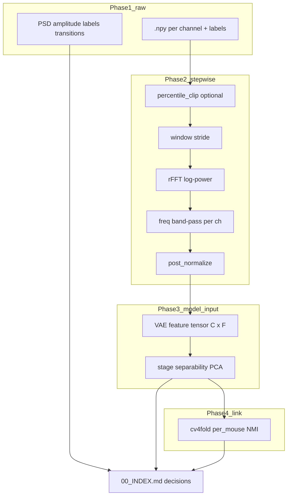

# Cross-lab preprocessing verification plan

## Meeting notes alignment (thesis partner)

| Partner note | Covered in plan? | Where |
|--------------|------------------|--------|
| **Plot data that goes into the model**; preprocessing may work for lab 3 but not other labs | **Yes** — make this the headline of Phase 2 | [`after/`](#phase-2--model-input-plots-production-pipeline) + lab contrast panels |
| **Preprocessing is run-level; check if normalization is lab-level** | **Partially** — was implicit; now explicit in [Normalization scope audit](#normalization-scope-audit-run-vs-lab-vs-train) | Phase 0 table + dedicated CSV/plots |

---

## Problem framing

You observe **good validation NMI within lab 3** but **worse NMI on labs 2 and 5** for cGMVAE / cHMMGMMVAE. That can come from (a) **preprocessing / features** not transferring across montages and amplitude regimes, (b) **label / cohort** differences, or (c) **model conditioning** (subject-only training does not explain away lab shift). This plan separates (a) and (b) with plots and markdown **before** more HPC training; (c) stays a follow-up branch once features look comparable.

**Locked baseline** (what cv4fold actually runs today):

| Knob | cv4fold value | Thesis / exploration often assumes |
|------|---------------|-------------------------------------|
| Signals | lab_2: EEG1+EEG3+EMG; lab_3/5: EEG1+EEG2+EMG ([`cv_quality_cohort_v1.yaml`](data/manifests/cv_quality_cohort_v1.yaml)) | Same montage story in §2.2.2 |
| `window_size` / `stride` | 512 / 512 (~4 s, non-overlap) | 4 s grid |
| `sequence_length` | 64 (cgmvae template) | Long temporal batches |
| `percentile_clip_channels` | **false** | 0.5–99.5 clip per recording (thesis §2.4.1) |
| `pre_normalize` | **false** | Per-subject/channel norm (thesis §2.4.3) |
| `post_normalize` | **true** on FFT tensor | Different statistic (batch over seq dims in [`VAEPreprocessing.__normalize`](src/preprocessing/vae_preprocessing.py)) |
| `band_pass_filter_fft` | freq-domain; `[[null,20],[null,20],[5,60]]` | EEG 0.5–30 Hz, EMG broadband |
| `perform_hanning_window` | **false** | Hanning mentioned in some docs |
| `remove_artifact` | **true** in manifest | **No-op on lab_2** (3 stages only) vs strips Artifact on lab_3/5 ([`MSSVDataset.load_config`](src/data/mssv_dataset.py)) |

**Highest-priority confound:** artifact handling is **not equivalent across labs** even with the same YAML flag.

**Second confound:** band-pass is applied by **channel index** (0,1,2), not by **anatomy** (P vs F). Lab 2’s ch0/ch1 are both parietal (EEG1, EEG3); lab 3/5 are P+F—same numeric filters, different physiology.

### Normalization scope audit (run vs lab vs train)

Your partner’s question is answered in code today — **not lab-level** for the cv4fold FFT path:

| Step | Where in code | Statistics computed over | Scope (cv4fold baseline) |
|------|---------------|--------------------------|---------------------------|
| Windowing, FFT, band-pass, label vote | [`VAEPreprocessing.__call__`](src/preprocessing/vae_preprocessing.py) per `DataLoader` | One continuous recording | **Per mouse × run** |
| `pre_normalize` (if enabled) | Same, before windowing | Time axis per channel | **Per mouse × run** |
| `post_normalize` (enabled) | After sequences shaped `(n_seq, S, C, F)` | `axis=(0, 1)` = all sequences × positions in that recording | **Per mouse × run** (not per lab) |
| `normalize_global` (disabled in cv4fold) | [`DataLoaderCollection.prepare_data`](src/data/data_loader_collection.py) | All train mice concatenated | **Train split / all labs in joint scope** — only if flag is true |
| Batching | Trainer | Shuffled windows from above | No extra norm |

**Audit deliverable (new):** `tables/normalization_scope.csv` + `after/normalization_scope/` plots:

1. **Document** the table above in `00_INDEX.md` (one paragraph your partner can cite).
2. **Counterfactual plots:** for the same mice, recompute `post_normalize` stats as if they were pooled **per lab** and **per train cohort**; show how much the resulting feature distributions shift (KL or mean/std delta per lab). This answers “what if we had normalized at lab level?” without changing training yet.
3. **Run vs run:** overlay run 1 vs run 2 post-norm scale factors per mouse (preprocessing is run-level; training uses both runs — check inconsistency).

Phase 3 already includes `global_norm` and `no_post_normalize` ablations; the counterfactual in (2) is **diagnostic only** (no code change until Phase 5 gate).



---

## Deliverable layout (new top-level tree)

Keep this **separate** from [`results/data_exploration`](scripts/data_exploration/main.py) so cv4fold cohort rules stay explicit.

```
results/preprocessing_audit/
├── README.md                    # how to regenerate + links to configs
├── 00_INDEX.md                  # executive summary + go/no-go table per lab
├── config/
│   └── cv4fold_fft_baseline.yaml   # copy of cgmvae preprocessing block
├── tables/
│   ├── cohort_inventory.csv     # from manifest
│   ├── per_mouse_summary.csv    # hours, %stages, artifact %, RMS, 50Hz
│   └── feature_stats_by_lab.csv
├── raw/                         # BEFORE VAEPreprocessing
│   ├── lab_2/ lab_3/ lab_5/
│   │   ├── psd_by_stage.png
│   │   ├── band_power_by_lab.png
│   │   ├── amplitude_distributions.png
│   │   └── label_composition.png
│   └── SUMMARY_raw.md
├── after/                       # Model input = what the VAE encoder sees
│   ├── lab_2/ lab_3/ lab_5/
│   │   ├── model_input_examples.png     # example (seq, ch, feat) heatmaps + stage labels
│   │   ├── model_input_lab_contrast.png # same plot type: lab_3 vs lab_2/5 side-by-side
│   │   ├── fft_logpower_by_stage.png
│   │   ├── feature_pca_triple.png       # k-means separability without VAE
│   │   ├── per_channel_spectrum.png
│   │   └── window_count_diagnostics.png
│   ├── normalization_scope/
│   │   ├── postnorm_scale_by_run.png
│   │   └── counterfactual_lab_vs_run_norm.png
│   └── SUMMARY_after.md
├── deltas/                      # before vs after + lab contrasts
│   ├── lab_pairwise_effect_sizes.csv
│   ├── preprocessing_step_ablation/   # one knob at a time
│   └── SUMMARY_deltas.md
└── linkage/
    ├── nmi_vs_feature_separability.csv  # join audit metrics to cv4fold
    └── SUMMARY_linkage.md
```

**Reuse (do not rewrite from scratch):**

- Cohort list: [`data/manifests/cv_quality_cohort_v1.yaml`](data/manifests/cv_quality_cohort_v1.yaml)
- Raw loaders: [`scripts/data_exploration/helpers.py`](scripts/data_exploration/helpers.py)
- Lab PSD / band-power ideas: [`scripts/data_exploration/lab_differences.py`](scripts/data_exploration/lab_differences.py), [`scripts/data_exploration_report/produce_report.py`](scripts/data_exploration_report/produce_report.py) (`figure_inter_individual_variability`, band-power panels)
- 50 Hz: [`scripts/data_exploration/interference_50hz.py`](scripts/data_exploration/interference_50hz.py)
- Placement narrative: [`scripts/data_exploration/eeg_placement_differences.py`](scripts/data_exploration/eeg_placement_differences.py)
- Production path: instantiate [`VAEPreprocessing`](src/preprocessing/vae_preprocessing.py) via a minimal `GlobalConfig` built from [`cgmvae_base.yaml`](src/config/run/cvaeprior/cv4fold/templates/cgmvae_base.yaml) — **same code path as training** ([`DataLoader.process_data`](src/data/data_loader.py))

**New code (recommended location):** `scripts/preprocessing_audit/` with a single entrypoint:

```bash
PYTHONPATH=. python -m scripts.preprocessing_audit.run \
  --manifest data/manifests/cv_quality_cohort_v1.yaml \
  --config src/config/run/cvaeprior/cv4fold/templates/cgmvae_base.yaml \
  --out results/preprocessing_audit
```

---

## Phase 0 — Freeze the baseline (0.5 day, login-safe)

1. Snapshot preprocessing + dataloader fields into `results/preprocessing_audit/config/cv4fold_fft_baseline.yaml`.
2. Export `cohort_inventory.csv` from manifest (mouse, lab, runs, signals, hours).
3. Write `00_INDEX.md` skeleton with **hypothesis checklist** (see Phase 5 gates).

No training runs in this phase.

---

## Phase 1 — Raw data audit (“before preprocessing”) (1–2 days)

**Scope:** all mice in manifest, both runs where present; **lab_1 excluded**.

| Analysis | What it tests | Output |
|----------|---------------|--------|
| Stage composition | Class imbalance / REM rarity differs by lab | `%Awake/NREM/REM/Artifact` bars per mouse |
| Artifact prevalence | lab_2 has no Artifact label but may have contamination in Wake | Artifact % lab_3/5 only + “high-variance Wake” proxy on lab_2 |
| Amplitude / impedance | Scale differences driving post_norm | per-channel RMS, percentiles |
| PSD by stage | Spectral separability **before** FFT pipeline | mean PSD ± CI per lab × stage |
| Band power (δ, θ, α, β, γ) | Thesis discriminants (θ/δ, EMG power) | tables + barplots with lab hue |
| 50 Hz line noise | Site electrical environment | relative 50 Hz power by lab |
| Montage sanity | EEG1/EEG3 vs EEG1/EEG2 | placement script restricted to cohort |
| Bout / transitions | HMM prior stress | reuse `stage_durations`, `stage_transitions` on cohort filter |

**Implementation:** thin wrapper that filters metadata to manifest mice and calls existing analyzers with `output_dir=results/preprocessing_audit/raw` and `lab_include` loops.

**Deliverable:** [`SUMMARY_raw.md`](results/preprocessing_audit/raw/SUMMARY_raw.md) with:
- 3–5 bullet **findings per lab**
- 1 table “likely hurts VAE if unchanged” (ranked)

---

## Phase 2 — Model-input plots (production pipeline) (2–3 days)

**Primary goal (partner request):** plot the **exact tensors the model trains on** — not only raw EEG. After `DataLoader.process_data()`, the encoder sees `x` with shape `(n_sequences, sequence_length, n_channels, n_features)` (e.g. `(N, 64, 3, F_fft)` for cv4fold cgmvae).

For each (mouse, run):

1. Load signals per manifest `lab_signals`.
2. Apply `MSSVDataset` + `remove_artifact` **exactly as training** (document effective mask length change).
3. Run `VAEPreprocessing` once for features, once with `for_raw=True` for magnitudes — **same code path as training**.
4. Store **compact** `.npz` per mouse: subsampled sequences (e.g. max 500 windows), not full nights.

**Mandatory “data into model” figures:**

| Plot | Interprets |
|------|------------|
| **`model_input_examples.png`** | 2–3 example sequences: heatmap per channel of log-power features; label strip for stages; caption with shape `(S, C, F)` |
| **`model_input_lab_contrast.png`** | Same visualization for **lab_3 vs lab_2 and lab_5** (fixed stage / comparable clock time or matched %NREM) — direct answer to “works in lab 3 but not elsewhere?” |
| Mean log-power spectrum per stage × channel | Spectral content after BP |
| Feature PCA (2D/3D) colored by stage | “Can k-means see stages?” without VAE |
| Within-mouse θ/δ and EMG band features vs labels | Thesis discriminants on **model features** |
| **Normalization scope** (see table above) | `postnorm_scale_by_run.png`; counterfactual lab-pooled vs run-level post-norm |
| Sequence count / effective hours after artifact strip | Training volume fairness |

**Deliverable:** `SUMMARY_after.md` with explicit yes/no per lab: *Would you expect a subject-only VAE to generalize from lab_3-looking inputs to this lab’s inputs?*

---

## Phase 3 — Stepwise ablations (the “effects of choices”) (2–4 days)

Hold mouse subset fixed (e.g. 2 mice × lab × run) for speed, then confirm on full cohort for **winning** changes only.

Run a grid mirroring config knobs (each → subfolder under `deltas/preprocessing_step_ablation/`):

| Variant | Config change | Hypothesis |
|---------|---------------|------------|
| `baseline` | cv4fold template | Reference |
| `+percentile_clip` | `percentile_clip_channels: true` | Reduces lab amplitude tails (thesis) |
| `+pre_normalize` | `pre_normalize: true` | Per-window norm before FFT; may harmonize labs |
| `hanning_on` | `perform_hanning_window: true` | Spectral leakage / edge effects |
| `bp_time_domain` | `band_pass_filter_type: time_domain` + 0.5–30 EEG | Closer to thesis filtering |
| `bp_placement_aware` | **new mapping** P channels ≤20 Hz, F channel ≤20 Hz, EMG 5–60 | Fixes lab_2 double-parietal vs P+F |
| `no_post_normalize` | `post_normalize: false` | Tests whether FFT norm hides lab shift |
| `global_norm` | `normalize_global: true` in collection | Batch norm across mice (usually bad for LOLO; document anyway) |
| `artifact_harmonized` | **proposed:** map lab_2 high-variance epochs OR unified artifact policy | Fair cross-lab labels |

For each variant, log scalar metrics into `feature_stats_by_lab.csv`:

- silhouette score (k=3) on flattened features
- mean between-stage Mahalanobis distance (EEG vs EMG channels)
- % variance first 2 PCs explained
- EMG REM vs Wake separation (AUC proxy)

**Deliverable:** `SUMMARY_deltas.md` with a **decision matrix**: variant × lab × metric.

---

## Phase 4 — Link audit to validation NMI (1 day)

1. Collect existing cv4fold outputs: `results/cv4fold/{cgmvae,chmmgmvae}/per_lab/.../per_mouse/*/metrics.json` and run-level `validations.json`.
2. Join on `participant_id` / lab to `feature_stats_by_lab.csv` and separability metrics.
3. Scatter: **latent k-means NMI vs pre-VAE silhouette** per mouse — if preprocessing separability is high but NMI low, suspect **model/conditioning**; if both low, suspect **features**.

**Deliverable:** `linkage/SUMMARY_linkage.md` with recommended next training config (not full re-grid yet).

---

## Phase 5 — Decision gates (when to change preprocessing vs conditioning)

| Gate | Evidence | Action |
|------|----------|--------|
| G1 Raw separability OK, FFT separability poor | Phase 1 good, Phase 2 bad | Tune FFT/BP/post_norm (Phase 3) before touching VAE arch |
| G2 lab_2 artifact proxy high | Raw high-var Wake, no Artifact label | Add harmonized artifact policy or manual QC list |
| G3 Placement-aware BP lifts lab_2/5 silhouette only | Ablation row `bp_placement_aware` | Update `band_pass_freqs` or channel-order convention in manifest |
| G4 Features comparable, NMI still lab-skewed | Phase 2–3 flat across labs, linkage shows gap | Prioritize **cHMMGMMVAE + `conditioning_source: lab` or `subject_lab`** ([`docs/conditioning_story_map.md`](docs/conditioning_story_map.md)); keep preprocessing fixed |
| G5 Only joint training fails | per_lab OK, joint bad | Check `normalize_global`, subject count, GMM states |

**Success criterion (preprocessing side):** For each lab, cohort-median **pre-VAE silhouette ≥ 0.15** and θ/δ REM vs NREM effect same sign as lab_3; then re-run **smoke80** on worst lab (`hpc/submit/cv4fold/submit_smoke_80.sh`) before full cv4fold.

---

## Phase 6 — Config / training follow-up (after audit, not part of exploration folder)

1. Encode winning preprocessing in [`cv_quality_cohort_v1.yaml`](data/manifests/cv_quality_cohort_v1.yaml) `hyperparams` or template YAML.
2. `python -m scripts.cv4fold.generate_configs --phase full`
3. Optional: per-lab tune sweeps already scaffolded in [`generate_configs.py`](scripts/cv4fold/generate_configs.py) (`tune_sweep_base` per lab) — only after audit picks which knobs vary.

For **cross-lab generalization** specifically, plan two training tracks in parallel (small smoke first):

- **Track A (fixed preprocessing):** joint scope + `chmmgmvae` with `conditioning_source: subject_lab`
- **Track B (audit winner preprocessing):** same, compare per_lab NMI spread

---

## HPC / execution notes

| Workload | Where |
|----------|--------|
| Manifest export, markdown, plotting on ≤20 mice | Login node OK (light numpy/matplotlib) |
| Full-cohort FFT feature dump for all runs | `linuxsh` or small `bsub` job (no pytest on login) |
| Re-train VAE | Existing [`hpc/submit/cv4fold/`](hpc/submit/cv4fold/) only after Phase 5 gate |

Suggested batch script: `hpc/submit/preprocessing_audit/run_cohort.sh` — loops manifest mice, writes only aggregated PNG/CSV (avoid multi-GB per-mouse dumps).

---

## Suggested implementation order (todos)

1. **scaffold** — `scripts/preprocessing_audit/` + output tree + baseline config snapshot  
2. **cohort_raw** — Phase 1 via filtered wrappers on existing exploration modules  
3. **vae_features** — Phase 2 using real `VAEPreprocessing` + manifest signals  
4. **ablations** — Phase 3 grid + `feature_stats_by_lab.csv`  
5. **nmi_link** — Phase 4 join to cv4fold `per_mouse` metrics  
6. **summaries** — auto-generate `00_INDEX.md` from CSV templates  
7. **decide** — Phase 5 gate → YAML change + smoke80 on worst lab  

---

## Out of scope (explicit)

- Retuning full 50-trial W&B sweeps per lab before audit completes  
- `raw_cnn` path (different pipeline; audit FFT/cv4fold first)  
- lab_4 / lab_1 (not in cv4fold cohort)  
- Commits / PR unless you ask
