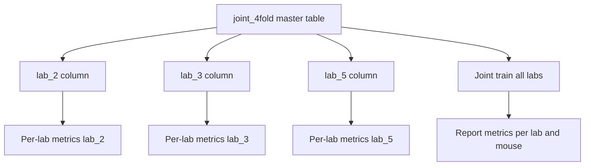
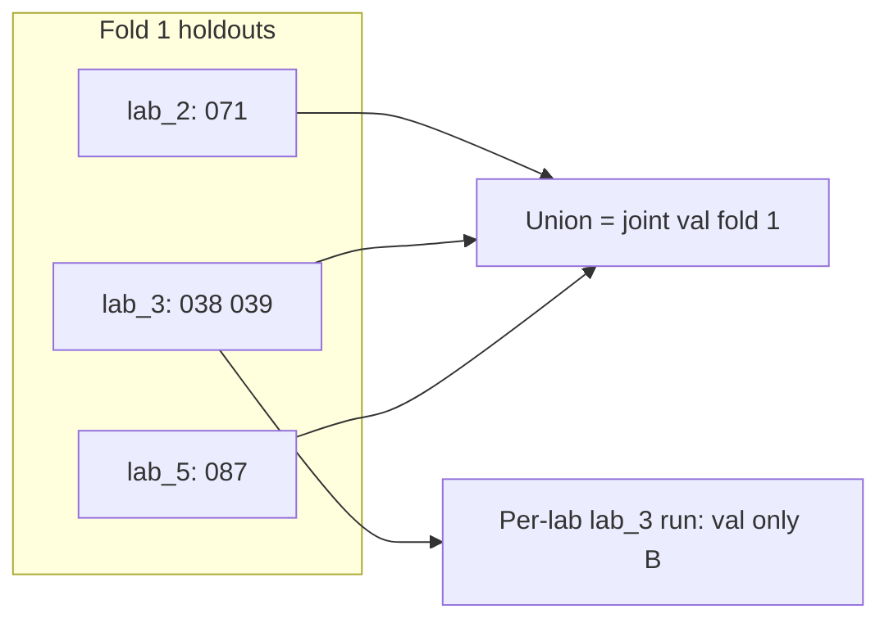
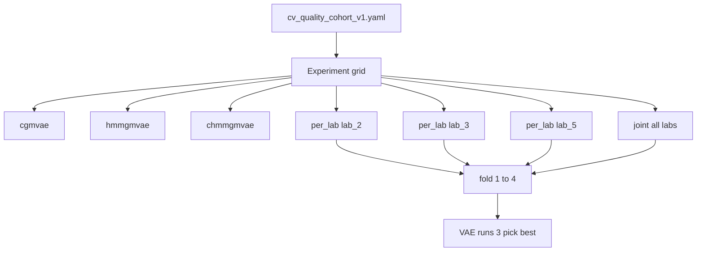

# CV fold planning: quality mice (labs 2, 3, 5)

## Scope (this plan only)

**In scope:** Decide which mice enter CV, tabulate runs/hours/epochs per mouse, and assign **concrete fold holdout lists** for:

1. **Per-lab** analysis (labs 2, 3, 5 separately)
2. **Joint cross-lab** analysis (same fold index aligns holdouts across labs)

**Out of scope for this study:**

- **CNN / `raw_cnn` path** — not used for cv4fold or ablations (FFT/MSSV frequency only for all VAE runs).
- **Lab conditioning** — dropped; subject conditioning only (`conditioning_source: subject`).
**In scope:** Manifest, 3 VAE variants, thesis **HMM raw** baseline, **phased smoke → tune → full grid**, per-mouse metrics, HPC grid.

---

## Quality cohort (canonical allowlist)

Source: `[lab_conditioning_not_subject_LOLO/README.md](src/config/run/cvaeprior/lab_conditioning/lab_conditioning_not_subject_LOLO/README.md)` and `quality_filter` expansion in `[orchestrator.py](src/orchestrator/orchestrator.py)` against `[data/ds006366_processed/metadata.csv](data/ds006366_processed/metadata.csv)`.


| Lab       | Quality mice                                         | Channels        | Mice   | Runs   | Hours (sum) |
| --------- | ---------------------------------------------------- | --------------- | ------ | ------ | ----------- |
| lab_2     | sub-071, 072, 076, 077, 080, 081                     | EEG1, EEG3, EMG | 6      | 12     | ~73         |
| lab_3     | sub-038, 039, 041, 043, 048, 054, 056, 059, 060, 069 | EEG1, EEG2, EMG | 10     | 18     | ~236        |
| lab_5     | sub-087, 088, 089, 092                               | EEG1, EEG2, EMG | 4      | 12     | ~144        |
| **Total** |                                                      |                 | **20** | **42** | **~453**    |


**Excluded** (not in allowlist): lab_2 subs 070, 073–075, 078–079, 082–086; lab_3 subs 040–042, 044–047, 049–053, 055, 057–058, 061–068; lab_5 subs 090–091.

### Per-mouse inventory (from `metadata.csv`)

Hours = `sum(seconds)/3600`. Epochs = annotation 4 s grid: `sum(seconds)/4` (matches `MSSVDataset` `epoch_length: 4`).

**Lab 3 (10 mice — 4-fold: 2–3 holdouts per fold)**


| Mouse   | Runs | Hours | Epochs (4 s) |
| ------- | ---- | ----- | ------------ |
| sub-038 | 2    | 48.0  | 43,201       |
| sub-039 | 3    | 12.0  | 10,836       |
| sub-041 | 3    | 12.0  | 10,803       |
| sub-043 | 1    | 24.0  | 21,600       |
| sub-048 | 3    | 12.0  | 10,803       |
| sub-054 | 2    | 48.0  | 43,194       |
| sub-056 | 1    | 23.6  | 21,196       |
| sub-059 | 1    | 24.0  | 21,600       |
| sub-060 | 1    | 8.0   | 7,212        |
| sub-069 | 1    | 24.0  | 21,600       |


**Lab 2 (6 mice — 4-fold: 1–2 holdouts per fold)**


| Mouse   | Runs | Hours | Epochs (4 s) |
| ------- | ---- | ----- | ------------ |
| sub-071 | 2    | 12.0  | 10,800       |
| sub-072 | 2    | 12.0  | 10,800       |
| sub-076 | 2    | 12.0  | 10,800       |
| sub-077 | 2    | 13.0  | 11,700       |
| sub-080 | 2    | 12.0  | 10,800       |
| sub-081 | 2    | 12.0  | 10,800       |


**Lab 5 (4 mice — 4-fold: exactly 1 holdout per fold)**


| Mouse   | Runs | Hours | Epochs (4 s) |
| ------- | ---- | ----- | ------------ |
| sub-087 | 6    | 72.0  | 64,788       |
| sub-088 | 2    | 24.0  | 21,595       |
| sub-089 | 2    | 24.0  | 21,596       |
| sub-092 | 2    | 24.0  | 21,596       |


**Imbalance note:** sub-087 dominates lab 5 (72 h vs 24 h per other mouse). sub-038/sub-054 dominate lab 3 (48 h). Fold design should **balance holdout hours**, not only mouse counts.

---

## Decision: 4-fold everywhere (consistent protocol)

**Recommendation: yes — use 4-fold for per-lab and joint CV.**


| Lab   | Mice | 4-fold holdout pattern | Why not 5-fold?                                                  |
| ----- | ---- | ---------------------- | ---------------------------------------------------------------- |
| lab_5 | 4    | 1 mouse / fold         | 5-fold impossible at mouse level (only 4 mice)                   |
| lab_2 | 6    | 2+2+1+1 mice / fold    | 5-fold forces one fold with 2 mice, one awkward empty slot       |
| lab_3 | 10   | 2+3+2+3 mice / fold (rebalanced) | 5-fold is possible (2/fold) but **inconsistent** with other labs |


**Benefits of one protocol:**

- Same fold index `k` means the same mice in per-lab runs and in joint runs (per-lab table = projection of joint table).
- HPC submit scripts, manifest, and thesis text use one numbering (fold 1–4).
- Lab 5: 1 holdout/fold; lab 2: 1–2 holdouts/fold; lab 3: 2–3 holdouts/fold (no fold with 4 lab-3 mice).

Professor’s 5-fold examples (e.g. lab 3: 38+39, then 40+41) can be cited as **illustrative**; the locked protocol is **4-fold** unless Morten explicitly requires 5-fold for lab 3 only.

---

## CV design rules




- **Single source of truth:** the joint 4-fold table below; per-lab splits are **columns** of that table (not separate assignments).
- **Unit of holdout:** whole mouse (all runs), matching LOMO yaml under `decoder_only_lab_2_subject_conditioning/generalization/`.
- **Fold index `k`:** always means the same subjects across per-lab and joint experiments.

### Per-lab vs joint — do you already have this?

**In the plan: yes.** **In the repo (manifest + configs + eval hooks): not yet.**

| Run type | Train on | Validate / predict on (fold `k`) |
|----------|----------|-------------------------------------|
| **Per-lab** (e.g. lab_3 only) | All lab_3 mice **except** lab_3 fold-`k` holdouts | Exactly those held-out lab_3 mice → **per-mouse predictions** for each |
| **Joint** (all labs) | All 20 mice **except** union of fold-`k` holdouts from lab_2 + lab_3 + lab_5 | That union (5 mice) → predict per mouse, then **aggregate metrics per lab** |

**Joint fold `k` is not three separate per-lab training runs concatenated.** It is **one** training run whose holdout set is the **union** of the per-lab fold-`k` holdouts:

```
joint_fold_k_val = lab2_fold_k_holdout ∪ lab3_fold_k_holdout ∪ lab5_fold_k_holdout
joint_fold_k_train = all_quality_mice \ joint_fold_k_val
```

So fold 1 joint val = {071} ∪ {038, 039} ∪ {087} — same mice as “fold 1” in each per-lab table, combined into one val split. Per-lab fold 1 only uses {038, 039} when training lab_3 alone.



### Per-mouse predictions (required at lab level)

For **each per-lab fold `k`** you must save and report predictions **separately for each held-out mouse** (not only one pooled NMI across the fold). Minimum outputs per fold:

- `mouse_id`, `run`(s), epoch-level predicted stage / latent cluster
- Per-mouse NMI; VAE: keep all 3 runs, **select best** for tables (see retry policy)

Joint runs use the same fold-`k` mice but add a **lab** column when splitting results (same holdout mice as per-lab fold `k` within each lab).

**Manifest / validator todo (later):** `eval.report_per_mouse: true` and paths like `results/.../fold_k/sub-038/`.

With 20 mice, **4-fold joint → 5 holdout mice per fold** (after lab_3 rebalance: 2+3+2+3 lab-3 mice across folds).

---

## Master 4-fold table (per-lab + joint)

Fold 1 aligns with professor-style example (**038, 039, 071**, plus **087**). Fold 1 is the heaviest (~132 h holdout) because of sub-087 (72 h) and sub-038 (48 h).


| Fold  | lab_2 holdout    | lab_3 holdout                      | lab_5 holdout | Holdout runs | Holdout hours |
| ----- | ---------------- | ---------------------------------- | ------------- | ------------ | ------------- |
| **1** | sub-071          | sub-038, sub-039                   | sub-087       | 11           | 132.0         |
| **2** | sub-072, sub-076 | sub-041, sub-048, **sub-069**        | sub-088       | 10           | 84.0          |
| **3** | sub-077          | sub-043, sub-054                   | sub-089       | 7            | 85.0          |
| **4** | sub-080, sub-081 | sub-056, sub-059, sub-060          | sub-092       | 9            | 67.6          |


**Every quality mouse appears in exactly one holdout fold.**  
**Train pool per joint fold:** 15 mice (~280–368 h train depending on fold).

### Per-lab view (projection of master table)

**Lab 2 — 4-fold**


| Fold | Holdout          | Runs | Hours |
| ---- | ---------------- | ---- | ----- |
| 1    | sub-071          | 2    | 12.0  |
| 2    | sub-072, sub-076 | 4    | 24.0  |
| 3    | sub-077          | 2    | 13.0  |
| 4    | sub-080, sub-081 | 4    | 24.0  |


**Lab 3 — 4-fold**


| Fold | Holdout                            | Runs | Hours |
| ---- | ---------------------------------- | ---- | ----- |
| 1    | sub-038, sub-039                   | 5    | 60.0  |
| 2    | sub-041, sub-048, sub-069          | 7    | 48.0  |
| 3    | sub-043, sub-054                   | 3    | 72.0  |
| 4    | sub-056, sub-059, sub-060          | 3    | 55.6  |


**Lab 5 — 4-fold**


| Fold | Holdout | Runs | Hours |
| ---- | ------- | ---- | ----- |
| 1    | sub-087 | 6    | 72.0  |
| 2    | sub-088 | 2    | 24.0  |
| 3    | sub-089 | 2    | 24.0  |
| 4    | sub-092 | 2    | 24.0  |


### Lab 3 rebalance (locked in plan)

**sub-069** moved from fold 4 → fold 2 so no lab-3 fold holds 4 mice. Fold 2 goes from 24 h → 48 h (still lighter than fold 3’s 72 h). Alternative was **sub-060** (8 h only); 069 chosen to balance hours across folds 2 and 4.

### Optional rebalance (only if fold 1 still too heavy)

Swap **sub-087** (fold 1 → fold 4) and **sub-054** (fold 3 → fold 1). Document in manifest `changelog`.

---

## Deliverable: fold manifest (Phase 1 artifact)

Add a single machine-readable manifest (not training yaml yet):

**Suggested path:** `[data/manifests/cv_quality_cohort_v1.yaml](data/manifests/cv_quality_cohort_v1.yaml)`

Structure:

```yaml
cohort:
  lab_2: [sub-071, ...]
  lab_3: [...]
  lab_5: [...]
inventory:  # from metadata.csv
  sub-038: {lab: lab_3, runs: [1,2], hours: 48.0, epochs_4s: 43201}
cv_protocol: 4fold
runs_policy:
  vae: {runs: 3, select: best_val_gmm_pred_nmi}
  hmm_raw: {runs: 1}
splits:
  fold_1: {lab_2: [sub-071], lab_3: [sub-038, sub-039], lab_5: [sub-087]}
  fold_2: {lab_2: [sub-072, sub-076], lab_3: [sub-041, sub-048, sub-069], lab_5: [sub-088]}
  fold_3: {lab_2: [sub-077], lab_3: [sub-043, sub-054], lab_5: [sub-089]}
  fold_4: {lab_2: [sub-080, sub-081], lab_3: [sub-056, sub-059, sub-060], lab_5: [sub-092]}
```

**Generator script (read-only, login-node safe):** small script under `scripts/data_exploration/build_cv_fold_manifest.py` that:

1. Reads `metadata.csv`
2. Filters to the 20 quality IDs
3. Writes inventory + fold tables + a CSV summary for your thesis supplement

Run once on login node (pandas only, no training).

---

## Three-model ablation grid (same 4-fold CV)

Morten’s two comparisons map to **three VAE variants** on **identical** `train_datasets` / `val_datasets` from the manifest:

| Name (thesis) | Config key | Conditioning | Prior (`model.params`) | What it tests |
|---------------|------------|--------------|------------------------|---------------|
| **cGMVAE** | `cgmvae` | `conditioning_source: subject`, `emb_dim: 4`, `decoder_only_conditioning: true` | `prior: gmm` | Static mixture prior (no temporal HMM in ELBO) |
| **cHMMGMVAE** | `chmmgmvae` | same as cGMVAE | `prior: warm_hmm_gmm` | Subject-conditioned + temporal HMM-GMM prior |
| **HMMGMVAE** | `hmmgmvae` | `emb_dim: 0` (no subject/lab embeddings) | `prior: warm_hmm_gmm` | Temporal prior **without** conditioning |

**Ablation A (conditioning):** `hmmgmvae` vs `chmmgmvae` — same `warm_hmm_gmm` schedule, only `emb_dim` / conditioning differs.

**Ablation B (prior):** `cgmvae` vs `chmmgmvae` — same subject conditioning, only `gmm` vs `warm_hmm_gmm` differs.

**Not in repo yet:** `hmmgmvae` (unconditioned + `warm_hmm_gmm`). POC/reliability only cover `cgmvae` and `chmmgmvae` ([`hmmgmm/README.md`](src/config/run/cvaeprior/hmmgmm/README.md)). Add template from [`sub039_chmmgmvae_poc.yaml`](src/config/run/cvaeprior/hmmgmm/poc/sub039_chmmgmvae_poc.yaml) with `emb_dim: 0` (pattern: [`cvaemarhmm/no_conditioning/`](src/config/run/cvaemarhmm/no_conditioning/)).

### Fair-comparison locks (all three models)

Keep these **identical** across variants so differences are only conditioning / prior:

| Knob | Locked value | Notes |
|------|--------------|-------|
| `dataloader.sequence_length` | **64** | Required for HMM prior; cGMVAE must use seq64 too (not seq1 from old reliability yaml) |
| `max_beta` | **1.0** | Morten: warmup ladder OK if you end at β=1 |
| `no_beta_epochs` | **10** | Reconstruction-only phase |
| `gmm_warmup_epochs` / HMM schedule | From successful POC | `gmm_warmup_epochs: 10`, `hmm_warmup_epochs: 25`, `hmm_transition_ramp_epochs: 8` for both HMM variants |
| `num_gmm_states` | **3** | With `remove_artifact: true` |
| Architecture | `latent_dim: 8`, `emb_dim: 4` (or 0), conv stack | Match [`lab3_chmmgmvae_decoder_only_subject_conditioning.yaml`](src/config/run/cvaeprior/hmmgmm/reliability/lab3_chmmgmvae_decoder_only_subject_conditioning.yaml) |
| Front-end | **FFT / MSSV frequency only** | `band_pass_filter_fft`, `use_legacy: false` — same as decoder-only reliability; **no** `feature_pipeline: raw_cnn` |
| `training_pipeline` | `cvae` | MAR-HMM stage off; dynamics in VAE prior only |
| Lab conditioning | **Off** | `conditioning_source: subject` only |
| `trainer.validate_per_epoch` | **10** (VAE); **1000** (HMM raw) | See phased rollout section |

For **cGMVAE** at `sequence_length: 64`, use [`poc/sub039_cgmvae_gmm_seq64_baseline.yaml`](src/config/run/cvaeprior/hmmgmm/poc/sub039_cgmvae_gmm_seq64_baseline.yaml) as template (`prior: gmm`), not the old seq1 reliability decoder-only yaml.

**Explicitly excluded:** `docs/CNN_data_preprocessing.md` / `cnn_cgmvae/` configs are not part of this experiment matrix.

### Experiment dimensions



| Dimension | Values | Count |
|-----------|--------|-------|
| `model_variant` | cgmvae, hmmgmvae, chmmgmvae | 3 |
| `scope` | per_lab_{2,3,5}, joint | 4 |
| `fold` | 1–4 | 4 |
| VAE `runs` | **3** per config (`runs: 3` in yaml); report **best** run | 3 |
| HMM raw `runs` | **1** per config (`runs: 1`) — too costly to repeat | 1 |

### Retry policy (initialization robustness)

| Family | `runs` in yaml | Analysis |
|--------|----------------|----------|
| **cGMVAE, HMMGMVAE, cHMMGMVAE** | `runs: 3` | Train 3 times (different seeds / init). **Pick the best run** per `(model, scope, fold)` for thesis tables and per-mouse predictions. Store all 3 under `.../run_{1,2,3}/`; symlink or manifest field `selected_run: 2` for the winner. |
| **HMM raw** | `runs: 1` | Single run only — full training is too slow to triple. No best-of selection. |

**Best-run metric (VAE, locked unless you change manifest):** highest **validation GMM Pred NMI** at end of training (same metric you already track for population comparison). Tie-break: higher validation accuracy, then lower final ELBO.

**SEM / error bars:** compute over **folds and mice** (and labs), not over the 3 VAE seeds — because only the selected best run enters the aggregate. Optionally report min–max across the 3 seeds in supplementary.

**VAE training jobs:** 3 × 4 × 4 × **3 runs** = **144** (`train_vae`).

**Plus thesis baseline (non-VAE):** standalone **HMM on raw time-domain** epochs — same folds and quality mice. See below.

### Config layout (generated from manifest)

```
src/config/run/cvaeprior/cv4fold/
  templates/
    cgmvae_base.yaml
    hmmgmvae_base.yaml      # NEW: emb_dim 0 + warm_hmm_gmm
    chmmgmvae_base.yaml
  per_lab/lab_2/fold_{1..4}/cgmvae.yaml  (+ hmmgmvae, chmmgmvae)
  per_lab/lab_3/fold_{1..4}/...
  per_lab/lab_5/fold_{1..4}/...
  joint/fold_{1..4}/...

src/config/run/hmm/cv4fold/
  templates/hmm_raw_thesis_base.yaml   # from experiment_mssv_raw.yaml
  per_lab/lab_{2,3,5}/fold_{1..4}/hmm_raw.yaml
  joint/fold_{1..4}/hmm_raw.yaml

hpc/submit/cv4fold/
  run_cv4fold_vae.sh        # MODEL=cgmvae|hmmgmvae|chmmgmvae  → train_vae
  run_cv4fold_hmm_raw.sh    # → main.py --method train
  submit_all_cv4fold.sh     # VAE grid + HMM raw grid
```

Each yaml:
- `train_datasets` / `val_datasets` from manifest for that `scope` + `fold`
- `run_name: cv4fold_{model}_{scope}_fold{k}` with `runs: 3` (VAE) or `runs: 1` (HMM raw)
- `results_dir: results/cv4fold/{model}/{scope}/fold_{k}/` → subdirs `run_1/`, `run_2/`, `run_3/` when `runs: 3`

### Per-mouse predictions (all models)

Same requirement for **every** model and scope:

- After `train_vae` + validation, write **per held-out mouse** under `results/cv4fold/.../fold_k/sub-038/` (predictions, NMI, confusion matrix).
- Per-lab scope: only mice from that lab in fold `k`.
- Joint scope: all fold-`k` holdouts; aggregate tables split by `lab` and `mouse_id`.

Thesis tables:

| Table | Rows | Columns |
|-------|------|---------|
| Ablation A | fold × scope | HMMGMVAE vs cHMMGMVAE NMI (best-of-3 VAE; mean ± SEM over mice & folds) |
| Ablation B | fold × scope | cGMVAE vs cHMMGMVAE NMI (same) |
| Thesis uplift | fold × scope | HMM raw (baseline) vs cGMVAE vs cHMMGMVAE (and ablation pairs) |

---

## Thesis baseline: HMM on raw (no VAE)

This is your **original thesis comparator** — not a VAE variant. It must use the **same 4-fold manifest** (same mice held out per fold) so you can quantify how much cGMVAE / cHMMGMVAE / special-course extensions improved over the starting point.

### Which window? (`null` vs `512`)

You used **different yaml fields**, but with **only `percentile_clipping`** transforms both configs use the **legacy loader** (`use_legacy: true` default). In that path, `window_size` / `stride` are **not used** by `PercentileClipping` — only postprocessing transforms (RMS, FFT, etc.) read them via `WindowBatcher`.

| Config | `window_size` | What actually happens (legacy + clip only) |
|--------|---------------|---------------------------------------------|
| [`experiment_mssv_raw.yaml`](src/config/run/hmm/experiments/experiment_mssv_raw.yaml) | `null` | Full recording → reshaped into HMM sequences of **`batch_size` consecutive samples** (120 samples ≈ 0.94 s at 128 Hz) |
| [`subjectwise_raw/sub038_hmm_mssv_raw.yaml`](src/config/run/hmm/subjectwise_raw/sub038_hmm_mssv_raw.yaml) | `512` | **Same mechanism** — `512` is inert here; chunks are **`batch_size` samples** (128 ≈ 1.0 s) |

So the difference between your two files is mainly **`batch_size` (120 vs 128)**, learning rate, and epochs — **not** 4 s epochs vs 512-sample windows.

Thesis text ([§2.4.1](Master Thesis.md)): time-domain recordings were “segmented into shorter sequences” for training stability; feature-domain used **512 samples = 4 s** windows. That matches `experiment_mssv_raw` (short contiguous chunks), not the unused `512` field in subjectwise_raw.

**Recommendation for cv4fold HMM raw (locked):**

Use **`experiment_mssv_raw` as the template**, not subjectwise_raw:

```yaml
dataloader:
  window_size: null
  stride: null
  use_legacy: true          # explicit (default anyway)
  batch_size: 120           # thesis population experiment
  transforms:
    - type: percentile_clipping  # EEG + EMG only
```

**Do not** copy `window_size: 512` from subjectwise_raw unless you also add **postprocessing** transforms (RMS, band_pass, etc.) — that would switch you to **feature-domain** HMM (`reliability_hmm_mssv_features`), not thesis raw time-domain.

**Optional fidelity tweak (thesis §2.4.1):** add EEG `band_pass_filter` 0.5–30 Hz before clipping (thesis mentions bandpass for time-domain; `experiment_mssv_raw` yaml omits it). EMG stays broadband. Document if you add this so uplift comparisons stay interpretable.

**Comparing to VAE:** VAE uses one **4 s** FFT feature vector per step; HMM raw uses **~1 s** raw-sample blocks — different observation rate by design. For the uplift story (“thesis baseline vs extensions”), matching **`experiment_mssv_raw`** is correct; you are not required to force 512-sample HMM observations unless you want a secondary sensitivity run.

### Template (existing)

| Setting | Thesis HMM raw (`experiment_mssv_raw`) | VAE trio (contrast) |
|---------|----------------------------------------|---------------------|
| Entrypoint | `python3 main.py --method train` | `--method train_vae` |
| `model.type` | `hmm` | `cvae_marhmm` (ConditionalVAE only) |
| `dataloader` | `window_size: null`, legacy, percentile clip | `window_size: 512`, `stride: 512`, FFT in `cvae` |
| Conditioning | none (`emb_dim: 0` or default) | subject or none per variant |
| Prior | HMM transitions only | GMM or HMM-GMM in ELBO |

Per-lab **`signals:`** in dataset entries: lab_2 EEG1+EEG3+EMG; lab_3/5 EEG1+EEG2+EMG (explicit, aligned with VAE quality cohort).

### Same folds, same eval

| Scope | HMM raw train | HMM raw val (predict per mouse) |
|-------|---------------|----------------------------------|
| per_lab lab_3 fold 2 | other 7 lab_3 mice | sub-041, 048, 069 |
| joint fold 2 | other 15 mice all labs | union of per-lab fold-2 holdouts |

**Per-mouse predictions** required for HMM raw as well (epoch-level state assignments → NMI per `sub-XXX`).

**Results path:** `results/cv4fold/hmm_raw/{scope}/fold_{k}/sub-XXX/`

### Run count

| Family | Configs | `runs` each | Total `train` / `train_vae` jobs |
|--------|---------|-------------|-------------------------------------|
| VAE (3 models × 4 scopes × 4 folds) | 48 | 3 | **144** |
| HMM raw (4 scopes × 4 folds) | 16 | 1 | **16** |
| **Total** | 64 yaml | — | **160** |

No CNN jobs. No lab-conditioning jobs.

### Comparison narrative (thesis)

1. **Uplift vs baseline:** HMM raw (1 run) → cGMVAE best-of-3.
2. **Temporal prior:** cGMVAE → cHMMGMVAE (best-of-3 each).
3. **Conditioning value:** HMMGMVAE → cHMMGMVAE (best-of-3 each).

Aggregate **mean ± SEM** over folds and mice (per-lab and joint scopes). VAE contributes one selected run per cell; HMM raw contributes its single run.

---

### What you have today vs what to build

| Piece | Status |
|-------|--------|
| Fold design (4-fold, aligned) | In this plan |
| `cGMVAE` subject + GMM | Exists (decoder_only reliability; **must clone to seq64 + cv4fold**) |
| `cHMMGMVAE` subject + warm_hmm_gmm | Exists (hmmgmm POC + lab3 reliability; **no cv4fold yaml yet**) |
| `HMMGMVAE` no conditioning + warm_hmm_gmm | **Missing** — add template |
| Manifest-driven fold yaml | **Missing** |
| Per-mouse result paths | **Missing** — extend validator or post-process |
| HMM raw thesis baseline on same folds | **Missing** — `hmm/cv4fold/` from `experiment_mssv_raw` template |
| CNN / raw_cnn in this matrix | **Excluded by design** |

Existing LOLO / partial LOMO / `cnn_cgmvae/` configs **do not** use this fold table.

---

## Phased rollout (smoke → tune → full grid)

**Yes — do preliminary runs.** Do not launch the 160-job grid until Phase 0 passes. Phase 1 locks global hyperparameters before Phase 2 burns GPU days.


### Phase 0 — Smoke (must pass)

**Goal:** Prove pipeline correctness, not peak NMI. Use **one** cheap cell: e.g. **joint fold 4** (lighter holdout than fold 1) or **lab_3 fold 2**, `runs: 1`, **reduced epochs** (smoke yaml override: 15–20 epochs VAE; HMM raw `num_batches` capped).

| Check | What to verify |
|-------|----------------|
| Manifest / yaml | `train_datasets` / `val_datasets` match fold table; lab_2 has `signals: [EEG1, EEG3, EMG]`; 20 quality mice only |
| **cGMVAE** | `train_vae` completes; seq64 + `prior: gmm`; validation runs at epoch 10, 20, … |
| **cHMMGMVAE** | Full warmup ladder without NaN: β=0 → Gaussian → KMeans → HMM ramp; crosses `hmm_warmup_epochs` in smoke |
| **HMMGMVAE** | `emb_dim: 0` trains (no conditioning crash); same prior schedule as cHMMGMVAE |
| **HMM raw** | `--method train` on same fold; legacy loader + percentile clip; finishes a short batch budget |
| Per-mouse outputs | Val holdout mice get predictions / NMI paths under `results/cv4fold/.../sub-XXX/` |
| Best-run script | Dry-run on 3 fake or short runs picks highest GMM Pred NMI |
| HPC | Submit scripts `cd` to repo, activate venv, correct `main.py` method per family |

**Existing shortcuts:** adapt [`sub039_chmmgmvae_smoke.yaml`](src/config/run/cvaeprior/hmmgmm/poc/sub039_chmmgmvae_smoke.yaml) (3 epochs, crosses HMM boundaries) for unit logic; cv4fold smoke uses **real fold splits** but **few epochs**.

**pytest (compute node only):** `tests/test_hmm_gmm_prior.py`, `tests/test_vae_hmmgmm_integration.py` via `bsub < hpc/submit/run_pytest.sh`.

### Phase 1 — Global hyperparameter tuning (VAE only)

**Goal:** One **fair** `(learning_rate, epochs)` pair for **all three VAE variants** on labs 2+3+5, applied in every fold/scope in Phase 2.

**Tuning scope (recommended):**

- **Split:** `joint` + **fold 4** train pool (15 mice, all three labs in train — maximally diverse).
- **Models:** Run grid on **cHMMGMVAE only** for tuning (slowest / most sensitive schedule); confirm winners with a single run each on cGMVAE and HMMGMVAE.
- **`runs: 1`** during tuning (not best-of-3).
- **`validate_per_epoch: 10`** (same as production).

**Search grid (starting point — align with lab 2 sweep v2):**

| Parameter | Candidates |
|-----------|------------|
| `learning_rate` | `0.0002`, `0.0003`, `0.0005` |
| `epochs` | `80`, `120` |

→ 6 configs × 1 run = **6 tuning jobs** (expand only if clearly underfitting/overfitting).

**Selection rule:** best validation **GMM Pred NMI** on joint fold-4 holdout mice (same metric as best-of-3 policy). Lock into `cv4fold/templates/*_base.yaml`.

**Do not tune on HMM raw** in this phase — keep [`experiment_mssv_raw`](src/config/run/hmm/experiments/experiment_mssv_raw.yaml) `learning_rate: 0.001`, `epochs: 30000`, `num_batches` as thesis (only add `validate_per_epoch` — see below).

**Optional:** fix `num_batches: 64` from decoder-only reliability unless tuning shows instability on lab_2.

### Phase 2 — Full cv4fold grid

- Locked `learning_rate` + `epochs` from Phase 1.
- VAE `runs: 3`, best-of-3; HMM raw `runs: 1`.
- All scopes × all folds × all models.

### `validate_per_epoch: 10` (all cv4fold yaml)

| Family | Setting | Rationale |
|--------|---------|-----------|
| **VAE trio** | `validate_per_epoch: 10` | User requirement; ~8–12 validation passes per 80–120 epochs vs 80–120 at `1` |
| **HMM raw** | **`validate_per_epoch: 1000`** | User-locked; ~30 validation passes over 30k epochs |

Lock in templates; generator copies into every emitted yaml.

---

## Results folder structure (intended)

Stable yaml `run_name` (orchestrator still appends `_YYYYMMDD-HHMMSS` once at job start). Base: `results/cv4fold/`.

```
results/cv4fold/
├── manifest_summary.csv              # fold inventory + hours per mouse
├── selection/
│   └── best_runs.json                # winning run index per model/scope/fold
│
├── cgmvae/
│   ├── joint/
│   │   └── fold_1/
│   │       ├── config.json             # full resolved config (repo root copy)
│   │       ├── 1/                      # run_number (runs: 3 → 1, 2, 3)
│   │       │   ├── losses.json
│   │       │   ├── validations.json    # metrics every 10 epochs
│   │       │   ├── predictions.json
│   │       │   ├── historic_values.json
│   │       │   ├── plots/
│   │       │   │   ├── losses.png
│   │       │   │   ├── confusion_matrices.png
│   │       │   │   ├── hmm_tripanel_pc1_pc2.png   # PC1 vs PC2 (primary)
│   │       │   │   ├── hmm_tripanel_pc2_pc3.png
│   │       │   │   └── hmm_tripanel_pc1_pc3.png
│   │       │   └── checkpoints/
│   │       │       ├── cvae_final_model_run1.pth
│   │       │       └── cvae_best_kmeans_nmi.pth    # best latent-KMeans epoch
│   │       ├── 2/ …
│   │       ├── 3/ …
│   │       ├── plots/                    # post-train GMM validation (shared path today)
│   │       │   ├── hmm_tripanel_pc1_pc2.png
│   │       │   ├── metrics.txt           # final GMM Pred NMI, likelihood
│   │       │   ├── results.npz           # y_hat, y_true, x_latent, sub_ids
│   │       │   └── hmmgmm_trajectory.png # cHMMGMVAE only (if prior is HMM-GMM)
│   │       └── per_mouse/                # **to add** — split val by holdout subject
│   │           ├── sub-038/
│   │           │   ├── metrics.json
│   │           │   ├── predictions.npz
│   │           │   └── pca_pc1_pc2.png
│   │           └── sub-039/ …
│   ├── per_lab/
│   │   ├── lab_2/fold_1/ …
│   │   ├── lab_3/fold_2/ …
│   │   └── lab_5/fold_4/ …
│
├── hmmgmvae/          # same tree
├── chmmgmvae/         # same tree (+ hmmgmm_trajectory.png)
└── hmm_raw/
    ├── joint/fold_1/
    │   ├── config.json
    │   ├── 1/                          # runs: 1 only
    │   │   ├── losses.json
    │   │   ├── validations.json
    │   │   ├── predictions.json
    │   │   ├── plots/
    │   │   │   ├── losses.png
    │   │   │   ├── confusion_matrices.png
    │   │   │   └── hmm_tripanel_pc1_pc2.png
    │   └── per_mouse/ …
    └── per_lab/ …
```

**Config yaml paths (generated, not results):**

```
src/config/run/cvaeprior/cv4fold/{cgmvae,hmmgmvae,chmmgmvae}/{joint,per_lab/lab_*}/fold_*/train.yaml
src/config/run/hmm/cv4fold/hmm_raw/{joint,per_lab/lab_*}/fold_*/train.yaml
```

### Checkpoints and metrics (what the repo does today)

| Artifact | When | Path (per VAE run `N`) |
|----------|------|-------------------------|
| **Training metrics** | Every `validate_per_epoch` (10) | `{results_dir}/{run_name}/{N}/validations.json` — keys per epoch: `cvae_latent_kmeans_nmi`, `latent_autocorr_lag1` (seq64), `hmm_switch_rate_per100` (HMM priors) |
| **Training loss** | Each epoch | `{N}/losses.json` |
| **Best KMeans checkpoint** | When latent KMeans NMI improves | `{run_name}/cvae_best_kmeans_nmi.pth` (run-level, may overwrite across runs — prefer copying into `{N}/checkpoints/` in cv4fold wrapper) |
| **Final weights** | End of train | `{run_name}/cvae_final_model_run{N}.pth` |
| **Post-train GMM/HMM validation** | After `train_vae` | `{run_name}/plots/metrics.txt`, `results.npz`, PCA tripanels |
| **HMM raw** | Every 1000 epochs + end | `{run_name}/{1}/validations.json` (standard `train()` path) |

**Best-of-3 selection (today, no code change):** compare **`plots/metrics.txt`** final **GMM Pred NMI** (or `validate_cvae_hmm` NMI for HMM-GMM prior) across `1/`, `2/`, `3/`. Optional: peak `cvae_latent_kmeans_nmi` from `validations.json` if you prefer in-training signal.

### Code changes required (blocked until Agent mode)

1. **`src/visuals/visualizer.py`:** `_plots_path(run_number)`; pass `run_number` into `visualize_cvae`, `visualize_cvae_gmm`, `visualize_cvae_hmm`.
2. **`src/orchestrator/orchestrator.py`:** checkpoints → `{run_name}/{N}/checkpoints/`; pass `run_number` to visualizer calls.
3. **`src/training/trainer.py`:** `results_run_subdir`; best KMeans ckpt under `{N}/checkpoints/`.
4. **`scripts/cv4fold/split_per_mouse.py`:** read `{N}/plots/results.npz`, write `per_mouse/sub-XXX/{metrics.json,predictions.npz,pca_pc1_pc2.png}`.
5. **`scripts/cv4fold/select_best_vae_run.py`:** parse `metrics.txt` across runs 1–3.
6. **`scripts/cv4fold/generate_configs.py`** + **`data/manifests/cv_quality_cohort_v1.yaml`**.

**Per-mouse:** run after each job: `python -m scripts.cv4fold.split_per_mouse --results-dir results/cv4fold/chmmgmvae/joint/fold_1/<run_name>/1/plots`

### Smoke / sanity plots (everything running correctly)

Use these **during Phase 0** before the 160-job grid:

| Plot / file | What a healthy run looks like | Red flag |
|-------------|------------------------------|----------|
| **`losses.png`** | Reconstruction loss decreases in β=0 phase; no explosion at HMM ramp | NaN, flat line from epoch 0, spike at `hmm_warmup_epochs` |
| **`validations.json` → `cvae_latent_kmeans_nmi`** | Rises in early epochs, not stuck at ~0 | Random ~0.33 for 3 classes = collapsed |
| **`hmm_tripanel_pc1_pc2.png`** (post-train) | Coloured clusters partially separated by true stage | Single blob, all one colour |
| **`confusion_matrices.png`** | Non-trivial off-diagonal structure | Identity-only or one row dominant |
| **`metrics.txt` final NMI** | >0.4 lab 3, lower lab 2/5 acceptable | <0.25 on lab 3 smoke |
| **`hmmgmm_trajectory.png`** (cHMMGMVAE) | State path not pure noise | Missing file = prior/plot failure |
| **`results.npz` `sub_ids`** | Holdout subject IDs present, lengths match `y_true` | All zeros / wrong length |
| **HMM raw `validations.json`** | NMI improves over first few val points | Flat or decreasing from start |

**After Phase 0 passes:** `reliability_plot.png` across 3 seeds (same fold) shows init variance — wide spread means you need best-of-3.

**Optional quick numeric checks (no new plots):** print `hmm_switch_rate_per100` (not 0 for seq64 HMM prior); `latent_autocorr_lag1` > 0 for temporal models.

### Visualizer toggles (all cv4fold templates)

```yaml
visualizer:
  losses: true
  learning_rate: true
  pca_tripanel: true      # → hmm_tripanel_pc1_pc2.png etc.
  confusion_matrix: true
  state_distinctness: true
  summary_statistics: true
  historic_values: true
validator:
  nmi: true
  accuracy: true
  cross_nmi: true         # VAE: use for multi-run reliability plot
  state_distinctness: true
  summary_statistics: true
  log_likelihood: true
```

### Other metrics/plots worth having

| Priority | Metric / plot | Why |
|----------|----------------|-----|
| **Must** | `validations.json` time series | Pick best run; see collapse before GMM phase |
| **Must** | PC1 vs PC2 tripanel (`pca_tripanel`) | Your request; stage separation in latent/obs space |
| **Must** | Confusion matrix (Hungarian-aligned) | Sleep-stage agreement vs expert labels |
| **Must** | Final GMM or HMM Viterbi NMI (`metrics.txt`) | Primary thesis metric for best-of-3 |
| **Must** | `results.npz` (`y_hat`, `y_true`, `sub_ids`) | Enables per-mouse breakdown |
| **High** | `losses.png` | Training stability, β phases |
| **High** | `hmmgmm_trajectory.png` | cHMMGMVAE / HMMGMVAE — Viterbi state path in PCA space |
| **High** | `hmm_switch_rate_per100` in validations | Temporal plausibility vs i.i.d. GMM |
| **High** | Per-mouse NMI table (CSV from `per_mouse/`) | Morten: predictions per lab/mouse |
| **Medium** | `latent_autocorr_lag1` | Seq64 temporal structure in encoder means |
| **Medium** | Transition matrix (if exported from HMM prior) | Substages / sleep dynamics story |
| **Medium** | `reliability_plot.png` (3 VAE seeds) | Spread across inits for same fold |
| **Low** | Feature statistics / separability plots | More relevant for feature-HMM than VAE |
| **Skip for cv4fold** | CNN-specific, lab-conditioning plots | Out of scope |

**Thesis comparison table inputs:** per fold × scope × model: best-run GMM/HMM Pred NMI, mean per-mouse NMI, optional switch rate, path to `hmm_tripanel_pc1_pc2.png` for supplement.

---

## Recommended next action after you approve

1. Lock manifest + fold table.
2. Implement templates + generator (`validate_per_epoch: 10`).
3. **Phase 0 smoke** on one fold (all 4 families).
4. **Phase 1 tune** joint fold 4 → lock `lr` + `epochs`.
5. **Phase 2** full grid (160 jobs) + best-of-3 selection + analysis.

No training or pytest on login node per [HPC rules](.cursor/rules/hpc-dtu.mdc).