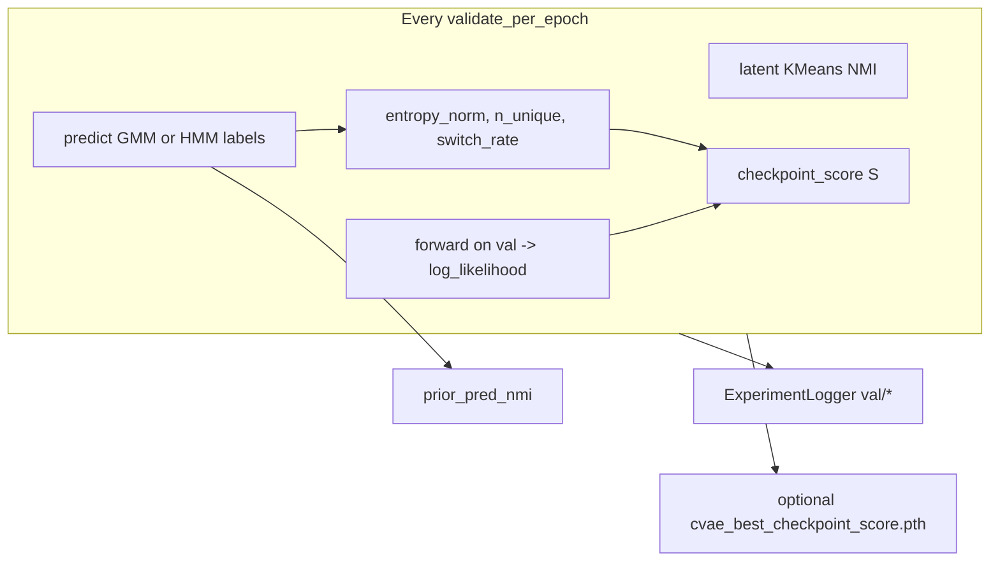

# CVAE / cHMM-GMVAE W&B metrics (minimal, thesis-aligned)

## Goal

Track what you need on W&B during `train_vae` without per-epoch distinctness or silhouette. Align the **collapse-aware checkpoint score** with your report (Eq. 3.49–3.50): normalized entropy plus validation log-likelihood, not the older MARHMM `nlpp` (log-space mix of `likelihood` and `perplexity/K` in [`validator.py`](src/validation/validator.py) lines 126–131).



## Curated metric set (4 tiers, trimmed)

| W&B key | Tier | Source | Purpose |
|---------|------|--------|---------|
| `val/prior_pred_nmi` | 1 | Prior labels vs scored stages (GMM marginal / HMM Viterbi) | **Primary** CV metric; currently only at end of run |
| `val/cvae_latent_kmeans_nmi` | 1 | Existing KMeans on latents | Collapse / overfit probe (keep) |
| `val/log_likelihood` | 1 | `forward` on val set, same as MARHMM path (`-nll`) | ω in your report |
| `val/entropy_norm` | 2 | `H / log(K_pred)` from prior preds | H_norm; 0 = collapse, 1 = uniform |
| `val/checkpoint_score` | 2 | `β * log_likelihood + (1-β) * entropy_norm` | S(ε); thesis checkpoint objective |
| `val/n_unique_pred_states` | 2 | `len(unique(prior_preds))` | Simple collapse alarm |
| `val/prior_switch_rate_per100` | 3 | [`state_switch_rate`](src/validation/hmmgmm_metrics.py) on prior labels | chmm + cgmvae (GMM marginal) |
| `train/reg_loss`, `train/data_loss` | 3 | Already logged | β/HMM warmup health |

**Omit:** silhouette, per-epoch distinctness, `val/latent_autocorr_lag1` can stay as-is (already cheap; no new work). **Do not** add redundant `val/perplexity` if `entropy_norm` is logged (perplexity = exp(H)).

**End of run (`wandb.summary`):** `val/prior_pred_nmi` (final), `val/best_checkpoint_score`, `val/best_checkpoint_score_epoch`, `val/best_kmeans_nmi_epoch` (for comparison).

## Implementation (small, focused)

### 1. Shared helpers — [`src/validation/hmmgmm_metrics.py`](src/validation/hmmgmm_metrics.py)

Add ~15 lines:

- `entropy_norm(predictions: np.ndarray, k_pred: int) -> float` — `H / log(k_pred)` with `H` from existing [`__compute_state_entropy`](src/validation/validator.py) logic (move or call shared).
- `checkpoint_score(log_likelihood: float, entropy_norm: float, beta: float = 0.9) -> float` — thesis S(ε).

Keep MARHMM `nlpp` unchanged (backward compatible for non-CVAE runs).

### 2. Extend [`validate_cvae_epoch`](src/validation/validator.py) (~40 lines)

After existing latent KMeans block:

1. **Val log-likelihood:** `val_nll, _ = model.forward(x, sub_ids, epoch)` → `log_likelihood = -val_nll.item()` (same as `validate_epoch` for `CVAEMARHMM`).
2. **Prior predictions** (one path by prior):
   - `gmm` / `warm_gmm`: `predict_gmm` → `y_hat`, use returned likelihood only if needed; preds for entropy/NMI/switch.
   - `hmm_gmm` / `warm_hmm_gmm`: `predict_hmm_labels` → `y_hat` (reuse existing HMM switch block; unify under `prior_switch_rate_per100`).
3. **Scalars:** `prior_pred_nmi`, `entropy_norm`, `checkpoint_score`, `n_unique_pred_states`, `prior_switch_rate_per100`, `log_likelihood`.

Refactor the duplicate HMM-only switch block into this unified prior pass (no extra HMM forward for switch alone).

### 3. Trainer checkpoint (optional, default off) — [`src/training/trainer.py`](src/training/trainer.py)

Add to [`TrainerConfig`](src/config/config.py) (3 fields, defaults match thesis):

```yaml
checkpoint_score:
  enabled: false      # do not change in-flight subject_lab behavior
  beta: 0.9
  warmup_frac: 0.05
```

- `_maybe_save_best_checkpoint_score(epoch)` — after warmup, if `checkpoint_score` improves, save `cvae_best_checkpoint_score.pth` (mirror KMeans pattern).
- Keep `_maybe_save_best_kmeans_checkpoint` unchanged.

### 4. Orchestrator selection — [`src/orchestrator/orchestrator.py`](src/orchestrator/orchestrator.py)

When `trainer.checkpoint_score.enabled`:

```text
validation_ckpt = best_score_ckpt or best_kmeans_ckpt or final
```

Else current behavior (KMeans → final). Write which file was used in `validation_checkpoint.txt`.

### 5. W&B summary at end — [`src/training/trainer.py`](src/training/trainer.py) `train()` after loop

If logger enabled, `wandb.summary.update({...})` with best S epoch/score and best KMeans epoch (read trainer trackers). **Do not** require sweep runner changes.

Post-train `prior_pred_nmi` already computed in orchestrator; also log to summary when available (pass back from `predict_cvae` or read `train_details`).

### 6. Docs only (no new markdown file unless you want)

One short subsection in [`docs/cv4fold/README.md`](docs/cv4fold/README.md): W&B keys + how to enable `checkpoint_score` for thesis-aligned ckpt on **next** submit.

**No** changes to `generate_configs.py` / running YAMLs unless you opt in later (`checkpoint_score.enabled: true` in template or manifest).

## Cost / risk

- One extra val `forward` + one prior predict per validation epoch (every 5 epochs with current configs). Acceptable vs 240–257 epoch runs.
- **Running jobs:** unchanged checkpoint policy (`enabled: false`).
- **Next experiments:** set `checkpoint_score.enabled: true` in YAML to match report checkpoint selection; compare W&B curves `val/checkpoint_score` vs `val/cvae_latent_kmeans_nmi`.

## Testing (login-safe)

- Unit test `entropy_norm` + `checkpoint_score` on synthetic label histograms (collapse vs uniform).
- No full training on login node; optional smoke on `linuxsh` with `validate_per_epoch: 1`, few epochs.

## Out of scope

- Silhouette, per-epoch `compute_state_distinctness`, changing sweep metric defaults, retroactive W&B for jobs already queued.
