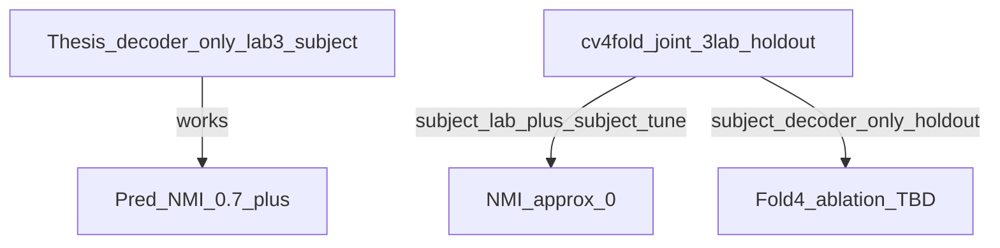

# Decoder-only fold 4 roadmap (KISS)

## What is going wrong (one paragraph)

Your thesis table is **not broken** — it measures **decoder-only cGMVAE**, mostly **lab_3**, **subject** conditioning, **reliability / subject scope** (easier than cv4fold). Recent cv4fold work is a **harder problem**: train on **17 mice / 3 labs**, predict **fold-4 holdout** (labs 2, 3, and 5), often with **subject_lab** and hyperparams tuned for **subject only**. That batch ([`results/cv4fold/subject_lab_tune_winners/analysis_report.md`](results/cv4fold/subject_lab_tune_winners/analysis_report.md)) got **prior NMI ≈ 0** → **prior collapse / wrong transfer**, not “FFT preprocessing failed.” Weak preprocessing audit silhouettes only say raw FFT is not linearly separable; the VAE still learned well on lab_3 (`cvae_final`). **You are comparing different experiments and over-interpreting audit vs latent plots.**



**Fold 4 holdout** ([`data/manifests/cv_quality_cohort_v1.yaml`](data/manifests/cv_quality_cohort_v1.yaml)): lab_2 sub-080/081, lab_3 sub-056/059/060, lab_5 sub-092.

---

## What you will do (3 comparisons, same fold, same metric)

Only **cgmvae** + **`decoder_only_conditioning: true`** (matches “cGMVAE Prior Decoder” row). Same tune-winner hyperparams from manifest; only change **sequence_length** and **conditioning_source**.

| Step | Phase (already in [`generate_configs.py`](scripts/cv4fold/generate_configs.py)) | `sequence_length` | `conditioning_source` | Result dir |
|------|----------------------------------------------------------------------------------|-------------------|----------------------|------------|
| **A** | `subject_tune_winners_seq1` | **1** | `subject` | `results/cv4fold/subject_tune_winners_seq1/cgmvae/joint/fold_4/` |
| **B** | `subject_tune_winners` | **64** (default) | `subject` | `results/cv4fold/subject_tune_winners/cgmvae/joint/fold_4/` |
| **C** | `subject_lab_tune_winners` | **64** | `subject_lab` | `results/cv4fold/subject_lab_tune_winners/cgmvae/joint/fold_4/` |

Optional later: `subject_lab_tune_winners_seq1` if C fails but you still want lab conditioning at seq1.

**Do not use** `cgmvae_cvae_final` for this roadmap — that phase sets `decoder_only_conditioning: false` ([`CGMVAE_CVAE_FINAL_OVERRIDES`](scripts/cv4fold/generate_configs.py)) and is not your thesis decoder-only model.

---

## Commands (fold 4 only, 3 GPU jobs)

```bash
cd /work3/s204070/SPA
source .venv/bin/activate
export PYTHONPATH=.

# Generate YAMLs
python3 scripts/cv4fold/generate_configs.py --phase subject_tune_winners_seq1 --folds 4
python3 scripts/cv4fold/generate_configs.py --phase subject_tune_winners --folds 4
python3 scripts/cv4fold/generate_configs.py --phase subject_lab_tune_winners --folds 4

# Submit (one job each — cgmvae only)
bash hpc/submit/cv4fold/submit_subject_tune_winners_fold4.sh   # step B — edit script to cgmvae-only OR submit yaml manually
# For A and C: submit the single cgmvae yaml from each experiment folder (or extend a tiny 3-job submit script)
```

Existing helpers:
- Step B: [`hpc/submit/cv4fold/submit_subject_tune_winners_fold4.sh`](hpc/submit/cv4fold/submit_subject_tune_winners_fold4.sh) (today runs cgmvae + chmmgmvae — **restrict to cgmvae** for KISS).
- Steps A/C: configs under `subject_tune_winners_seq1/...` and `subject_lab_tune_winners/...`; [`submit_fold4_sanity_checks.sh`](hpc/submit/cv4fold/submit_fold4_sanity_checks.sh) submits all 5 including chmm — **do not use as-is** if you want only these 3.

**Logs:** `hpc/output/cv4fold/vae/%J.out`  
**Walltime:** 4h per job (same as existing fold-4 scripts).

---

## How to read results (one table, three numbers)

After each run finishes:

```bash
python3 scripts/cv4fold/postprocess_fold.py --result-root results/cv4fold/<experiment>/cgmvae/joint/fold_4/<timestamped_run_dir>
```

Fill one comparison sheet:

| Step | Pooled val NMI | lab_2 | lab_3 | lab_5 | Collapse? (`n_unique_pred_states` in W&B or `metrics.txt`) |
|------|----------------|-------|-------|-------|-----------------------------------------------------------|
| A seq1 subject | | | | | |
| B seq64 subject | | | | | |
| C seq64 subject_lab | | | | | |

**Primary metric:** `prior_pred_nmi` / `plots/metrics.txt` NMI — **not** latent KMeans alone ([`docs/cvae_wandb_checkpoint_metrics.md`](docs/cvae_wandb_checkpoint_metrics.md)).

**Separability check (optional):** latent PCA in `plots/` — stages should separate **within each lab** on holdout mice.

**Interpretation guide:**
- **A vs B:** Does seq1 (thesis-like) beat seq64 on **cross-lab holdout**? (Opposite of in-lab lab_3 reliability is possible.)
- **B vs C:** Does adding **lab** conditioning help or hurt vs subject-only on same seq64?
- If **B ≈ 0.5+** and **C ≈ 0:** subject_lab needs **re-tune**, not more preprocessing.
- If **A,B,C all ≈ 0:** tune hyperparams may not transfer to holdout — revisit checkpoint / β schedule before expanding to 4 folds.

---

## Deliverable: simple roadmap doc

Add **[`docs/cv4fold/decoder_only_roadmap.md`](docs/cv4fold/decoder_only_roadmap.md)** (~1 page) containing:

1. **Story in 3 lines** — thesis win → cv4fold is harder → three fold-4 tests.
2. **Table above** (steps A/B/C) with commands copy-paste block.
3. **Fold-4 holdout mouse list** (from manifest).
4. **“Done when”** — one filled comparison table + short bullet: which setting to take to full 4-fold / thesis cross-lab paragraph.

Link from [`docs/cv4fold/README.md`](docs/cv4fold/README.md) in one line.

---

## Optional small code tidy (only if you want one submit button)

New script [`hpc/submit/cv4fold/submit_decoder_only_fold4_cgmvae.sh`](hpc/submit/cv4fold/submit_decoder_only_fold4_cgmvae.sh): generate 3 phases + submit **3 cgmvae YAMLs only**. Avoids editing sanity-check script and accidental chmm/cvae_final jobs.

---

## What to stop doing (reduces noise)

- Do not treat preprocessing audit silhouette as “model will fail.”
- Do not re-run full 8-fold `subject_lab_tune_winners` until fold-4 **B vs C** is understood.
- Do not mix `cvae_final` (encoder+decoder, seq1, 80 ep, different lr) into this A/B/C comparison.
