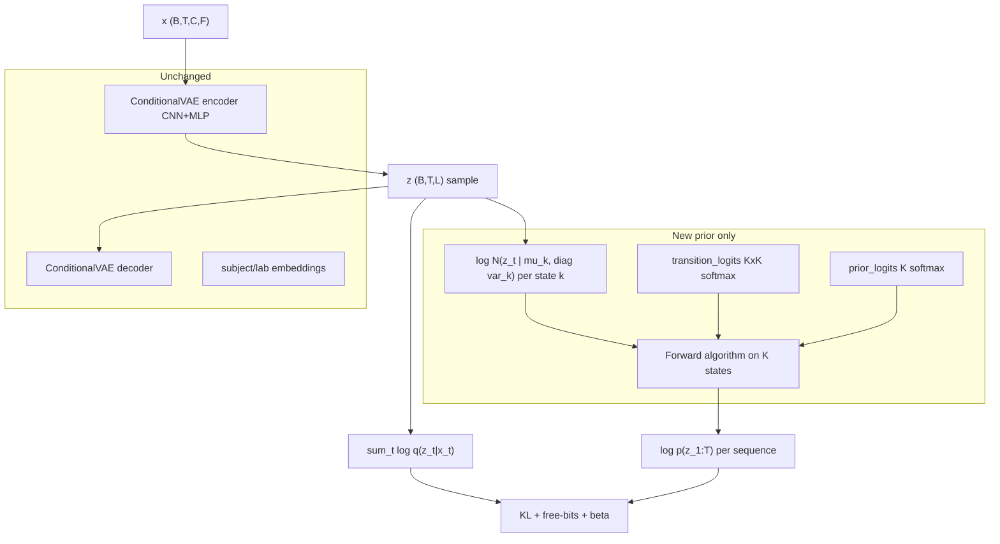

# HMM-GMM-VAE (cHMMGMVAE) — Full Implementation Plan

Branch: **`hmmgmm`**. Goal: replace static GMM prior KL with **sequence** prior \(\log p(z_{1:T})\) via forward algorithm; keep encoder/decoder/conditioning unchanged; deliver first working POC then ablations.

---

## Architecture (what changes vs today)



**Not in scope v1:** MAR-HMM stage, autoregressive \(\Phi\), full-night HMM (chunks only), new model wrapper class.

**Wrapper:** Keep [`CVAEMARHMM`](src/models/cvae_mar_hmm.py) with `training_pipeline: cvae`; MAR-HMM params unused. No orchestrator fork.

---

## Conditioning strategy (simplified, two phases)

**Prior is always global** (not per subject/lab). Only the **decoder** is conditioned.

| Phase | When | YAML settings | Data / splits |
|-------|------|---------------|---------------|
| **1 — POC & dynamics** | First: debug HMM-GMM prior | `decoder_only_conditioning: true`, `conditioning_source: subject` (default if omitted), `emb_dim: 4` | sub-039 runs 1–3; compare `warm_hmm_gmm` vs `gmm` baseline, `sequence_length: 64` |
| **2 — LOLO generalization** | After POC stable | Same decoder flags + **`conditioning_source: subject_lab`** | Clone splits from [`lab_and_subject_conditioning_LOLO`](src/config/run/cvaeprior/lab_conditioning/lab_and_subject_conditioning_LOLO/) |

No re-run of lab-only vs subject-only ablations for HMM-GMM — static cGMVAE ablations already justify **`subject_lab`** for LOLO.

```yaml
# Phase 1 (POC) — model block
decoder_only_conditioning: true
# conditioning_source: subject   # default in config.py

# Phase 2 (LOLO) — add at model level (not inside params)
conditioning_source: subject_lab
decoder_only_conditioning: true
emb_dim: 4
```

---

## 1. Core code changes

### 1.1 Shared HMM-GMM math module (new)

Add [`src/models/hmm_gmm_prior.py`](src/models/hmm_gmm_prior.py) — pure functions + small helpers, reused by VAE and tests:

| Function | Purpose |
|----------|---------|
| `gaussian_log_prob_diag(z, means, logvars)` | `(B,T,K)` emissions; same formula as [`gmm_prior`](src/models/vae.py) lines 410–414 |
| `forward_log_marginal(log_emit, log_pi, log_A)` | Port from [`HMM.__forward_algorithm`](src/models/hmm.py) (log-sum-exp, scaled alpha) |
| `viterbi_decode(log_emit, log_pi, log_A)` | Port from [`HMM.__decode_viterbi`](src/models/hmm.py) for labels + metrics |
| `init_sticky_transition_logits(K, kappa, device)` | Near-identity \(A\) before learning |
| `estimate_transition_logits_from_paths(assign, K)` | Reuse logic from [`set_transition_params`](src/initializations/kmeans.py) lines 137–155 |

Keeps [`vae.py`](src/models/vae.py) readable; tests import module without full VAE.

### 1.2 Extend `ConditionalVAE` ([`src/models/vae.py`](src/models/vae.py))

**New parameters** (when `prior in ("hmm_gmm", "warm_hmm_gmm")`):

- `prior_transition_logits`: `nn.Parameter(K, K)` — same softmax pattern as standalone HMM
- Reuse existing: `prior_means`, `prior_logvars`, `prior_logits` (as \(\pi\), not per-step mixture weights)

**New YAML params** under `model.params`:

```yaml
prior: warm_hmm_gmm          # also: hmm_gmm | gmm | warm_gmm | standard
gmm_warmup_epochs: 10        # standard KL before KMeans (0 = skip)
hmm_warmup_epochs: 25        # GMM KL only until this epoch; then HMM
hmm_transition_ramp_epochs: 8   # optional alpha: 0->1 blending GMM-seq vs HMM-seq KL
hmm_sticky_kappa: 0.9        # init diagonal of A
hmm_estimate_transitions: true    # after KMeans, estimate A from mu paths
num_gmm_states: 4            # K HMM states (= sleep stages default)
```

**New methods:**

- `hmm_gmm_prior(logvar, mu, z)` — reshape `z` to `(B,T,L)`; per-seq `sum_t log_q - log_p_seq`; free-bits on **total** KL per sequence (`free_nats_per_dim * L` or `* T * L` — pick one, document, match GMM scale); mean over B
- `gmm_sequence_prior(...)` — optional helper: \(\sum_t \log\sum_k \pi_k \mathcal{N}(z_t)\) for ramp phase (i.i.d. GMM along time, comparable scale)
- `warm_hmm_gmm_prior(..., epoch)` — epoch gate:
  1. `epoch < gmm_warmup_epochs` → `standard_prior`
  2. else if not `gmm_warmup_initialized` → `__get_kmeans_centroids()` + optional `__init_hmm_transitions(mu)`
  3. `epoch < hmm_warmup_epochs` → `gmm_prior` (flattened B*T, current behavior)
  4. else → `hmm_gmm_prior` with optional ramp: `kl = (1-α)*kl_gmm_seq + α*kl_hmm`
- `__init_hmm_transitions(mu)` — Viterbi/argmax component on flattened μ, reshape `(B,T)`, call `estimate_transition_logits_from_paths`; fallback `init_sticky_transition_logits`
- `predict_hmm_labels(...)` — Viterbi on μ or z; mirror [`predict_gmm_labels`](src/models/vae.py)
- Update `calculate_loss` branches for `hmm_gmm` / `warm_hmm_gmm`

**Gradient / stability:** single `loss.backward()`; log-domain forward only; no detaching \(z\) for prior term.

### 1.3 Validation & metrics ([`src/validation/validator.py`](src/validation/validator.py))

Add helpers (new file ok: [`src/validation/hmmgmm_metrics.py`](src/validation/hmmgmm_metrics.py)):

- `state_switch_rate(labels, T_dim)` — flips per 100 steps on `(B,T)` paths
- `latent_autocorr(mu, lag=1)` — mean autocorrelation across dims

Extend training validation:

- `validate_cvae_epoch`: if `prior` is hmm*, also log `hmm_switch_rate`, `gmm_switch_rate` (static marginal assignment per step)
- `validate_cvae_hmm()` — parallel to `validate_cvae_gmm`: NMI from HMM-Viterbi labels + switch rate

Wire in [`orchestrator.train_cvae`](src/orchestrator/orchestrator.py) after training (optional flag in yaml `validator.hmm_trajectory: true`).

### 1.4 Visualizer (minimal)

In [`src/visuals/visualizer.py`](src/visuals/visualizer.py): one plot for POC — μ PCA colored by time index or Viterbi state for first val sequence; saved under `results/.../hmmgmm_trajectory.png`.

---

## 2. Training schedule (default for all POC/production hmmgmm configs)

Single loss: `recon + regularization_loss(kl, epoch)` — same [`Trainer`](src/training/trainer.py) loop.

| Epoch range | Reg term | Notes |
|-------------|----------|-------|
| `0 … no_beta_epochs-1` | 0 (existing) | recon only |
| `no_beta_epochs … gmm_warmup_epochs-1` | `standard_prior` | VAE warmup |
| `gmm_warmup_epochs` (once) | KMeans init emissions + π | reuse `__get_kmeans_centroids` |
| `gmm_warmup_epochs … hmm_warmup_epochs-1` | `gmm_prior` (i.i.d.) | static mixture |
| `hmm_warmup_epochs …` | `hmm_gmm_prior` (+ optional ramp) | sticky A init at `hmm_warmup_epochs` |

**POC hyperdefaults** (sub-039, fast feedback):

- `sequence_length: 64`
- `trainer.epochs: 60`, `validate_per_epoch: 5`
- `no_beta_epochs: 5`, `gmm_warmup_epochs: 10`, `hmm_warmup_epochs: 25`, `hmm_transition_ramp_epochs: 8`
- `min_beta: 0.01`, `max_beta: 0.5` (lower cap when HMM on), `beta_warmup_epochs: 15`
- `batch_size: 64`, `num_batches: 32` (smaller than prod for memory)

**Success criteria POC:** recon decreases; KL finite; HMM switch rate **&lt;** GMM switch rate on same μ; NMI not worse than GMM baseline by &gt;5 pts.

---

## 3. Config layout (mirror `cvaeprior/`)

```
src/config/run/cvaeprior/hmmgmm/
  poc/
    sub039_chmmgmvae_poc.yaml              # warm_hmm_gmm, seq 64, subject conditioning
    sub039_cgmvae_gmm_seq64_baseline.yaml  # prior: gmm, same (fair static compare)
    sub039_chmmgmvae_smoke.yaml            # 3 epochs, local/HPC smoke
  lolo_subject_lab/
    generalization_lab_holdout_lab2.yaml   # train lab_3+lab_5, val lab_2
    generalization_lab_holdout_lab3.yaml   # train lab_2+lab_5, val lab_3
    generalization_lab_holdout_lab5.yaml   # train lab_2+lab_3, val lab_5
    generalization_lab_holdout_lab2_gmm_baseline.yaml  # optional: gmm prior, same splits
  ablations/                               # optional, post-POC
    sub039_hmmgmm_cold.yaml
    sub039_hmmgmm_no_ramp.yaml
  README.md
```

### Phase 1 — POC templates

Copy [`sub039_cgmvae_decoder_only.yaml`](src/config/run/cvaeprior/decoder_only/subjectwise/sub039_cgmvae_decoder_only.yaml):

- `decoder_only_conditioning: true` (no `conditioning_source` → **subject**)
- `sequence_length: 64`, `prior: warm_hmm_gmm` (+ hmm warmup keys)
- `results_dir: results/hmmgmm/poc`, `run_name: sub039_chmmgmvae_poc`
- `training_pipeline: cvae`, `model_checkpoint_path: null`

### Phase 2 — LOLO templates

Copy each file from [`lab_and_subject_conditioning_LOLO/`](src/config/run/cvaeprior/lab_conditioning/lab_and_subject_conditioning_LOLO/) (e.g. [`generalization_lab_holdout_lab3.yaml`](src/config/run/cvaeprior/lab_conditioning/lab_and_subject_conditioning_LOLO/generalization_lab_holdout_lab3.yaml)):

- Set `conditioning_source: subject_lab` at `model:` level (same as existing GMM LOLO)
- `sequence_length: 64`, `prior: warm_hmm_gmm`, same hmm warmup hyperparams as POC (or `epochs: 80` for production)
- `results_dir: results/hmmgmm/lolo_subject_lab/holdout_lab{N}`
- `run_name: chmmgmvae_lolo_subject_lab_holdout_lab{N}`
- Keep **identical** `train_datasets` / `val_datasets` / `quality_filter` / `cvae` preprocessing blocks as the GMM LOLO yaml
- Optional paired `*_gmm_baseline.yaml` per holdout for “same conditioning, static prior” comparison

---

## 4. HPC submit scripts (match [`run_lab_conditioning_lab_only_LOLO.sh`](hpc/submit/lab_conditioning/run_lab_conditioning_lab_only_LOLO.sh) style)

```
hpc/submit/hmmgmm/
  run_poc_sub039.sh                  # warm_hmm_gmm POC (subject conditioning)
  run_poc_sub039_baseline_gmm.sh     # GMM seq64 baseline
  submit_all_poc.sh                  # POC + baseline
  run_lolo_subject_lab.sh            # loop lab2, lab3, lab5 holdouts (subject_lab)
  submit_all_lolo_subject_lab.sh     # optional wrapper
```

**`run_poc_sub039.sh` pattern:**

- `set -euo pipefail`, `mkdir -p hpc/output/hmmgmm/poc/sub039`
- `bsub` heredoc: `gpuv100`, `W 2:00`, `mem=5GB`, logs to `hpc/output/hmmgmm/poc/sub039/%J.{out,err}`
- `module load cuda/12.8.1` + `source .venv/bin/activate`
- **`python3 main.py --method train_vae --config_path src/config/run/cvaeprior/hmmgmm/poc/sub039_chmmgmvae_poc.yaml`**

Post-train validation (same job or second line):

- `python3 main.py --method validate_cvae_gmm --config_path ...` (GMM labels)
- extend orchestrator later with `--method validate_cvae_hmm` or call validator from train end

Local smoke (no GPU queue): document in README:

```bash
python3 main.py --method train_vae -c src/config/run/cvaeprior/hmmgmm/poc/sub039_chmmgmvae_poc.yaml
```

with `trainer.epochs: 3` override via a `sub039_chmmgmvae_smoke.yaml` duplicate.

**`run_lolo_subject_lab.sh` pattern** (mirror [`run_lab_conditioning_lab_only_LOLO.sh`](hpc/submit/lab_conditioning/run_lab_conditioning_lab_only_LOLO.sh)):

```bash
LABS=("lab2" "lab3" "lab5")
for lab in "${LABS[@]}"; do
  CONFIG="src/config/run/cvaeprior/hmmgmm/lolo_subject_lab/generalization_lab_holdout_${lab}.yaml"
  OUTPUT_DIR="hpc/output/hmmgmm/lolo_subject_lab/${lab}"
  # bsub ... python3 main.py --method train_vae --config_path ${CONFIG}
done
```

---

## 5. Tests (new; repo has no pytest today)

Add dev dependency in [`pyproject.toml`](pyproject.toml): optional `[project.optional-dependencies] dev = ["pytest"]`.

```
tests/
  conftest.py                    # device fixture, seed
  test_hmm_gmm_prior.py          # core math
  test_vae_hmmgmm_integration.py # ConditionalVAE forward + backward
  test_warm_schedule.py          # epoch gating without data
```

### 5.1 `test_hmm_gmm_prior.py` (fast, CPU)

- Forward algorithm: random `log_emit` → finite `log_p`; matches brute-force on small K,T
- **T=1:** `log p(z_{1:T})` equals log-sum-exp of emissions + log π (no transition term)
- **Gradients:** `log_p_seq.sum().backward()` flows to `means`, `logvars`, `transition_logits`, `z`
- **Sticky init:** diagonal of `softmax(transition_logits)` ≈ κ
- **Viterbi:** constant-emission toy → known path

### 5.2 `test_vae_hmmgmm_integration.py`

- Build tiny `ConditionalVAE` with mocked dims or minimal config (B=2, T=8, L=4, K=3)
- `prior: hmm_gmm`: one `forward` + `calculate_loss` → finite loss, `loss.backward()` no NaN
- `prior: warm_hmm_gmm`: mock epochs cross phase boundaries (patch centroids init)

### 5.3 `test_warm_schedule.py`

- Table-driven: epoch → expected prior branch (`standard` / `gmm` / `hmm`)

**CI / local run:**

```bash
pytest tests/ -q
```

**Pre-HPC gate:** `pytest tests/test_hmm_gmm_prior.py` + 3-epoch smoke config.

---

## 6. Experiment matrix

| Stage | Config | Conditioning | Prior | seq_len |
|-------|--------|--------------|-------|---------|
| POC | `poc/sub039_chmmgmvae_poc` | subject, decoder_only | warm_hmm_gmm | 64 |
| POC baseline | `poc/sub039_cgmvae_gmm_seq64_baseline` | subject, decoder_only | gmm | 64 |
| LOLO ×3 | `lolo_subject_lab/generalization_lab_holdout_lab{2,3,5}` | **subject_lab**, decoder_only | warm_hmm_gmm | 64 |
| LOLO baseline (opt.) | `*_gmm_baseline.yaml` | subject_lab | gmm | 64 |

Do **not** change existing `sequence_length: 1` GMM configs until hmmgmm LOLO is validated.

---

## 7. Course timeline (16 Mar – 8 Jun 2026)

| Weeks | Milestone |
|-------|-----------|
| 1–2 | Module + unit tests; smoke train |
| 3 | POC sub-039 (subject conditioning); vs GMM baseline |
| 4–5 | Stabilize warm_hmm_gmm; optional cold/ramp ablations |
| 6–7 | LOLO ×3 with **subject_lab** + optional GMM baselines |
| 8–10 | Figures: NMI, switch rate, LOLO holdout comparison to static cGMVAE |
| 11 | Article draft |

---

## 8. Implementation order (PR-sized chunks)

1. `hmm_gmm_prior.py` + unit tests (no VAE yet)
2. `ConditionalVAE` parameters + `hmm_gmm_prior` + `calculate_loss` for `hmm_gmm` only
3. `warm_hmm_gmm_prior` + transition init + `predict_hmm_labels`
4. POC YAMLs (subject) + `run_poc_sub039.sh`
5. LOLO YAMLs (subject_lab ×3) + `run_lolo_subject_lab.sh`
6. Validator metrics + trajectory plot
7. Integration test + smoke config
8. (Optional) `validate_cvae_hmm` CLI method

---

## 9. Risks and mitigations

| Risk | Mitigation |
|------|------------|
| KL scale shock when enabling HMM | GMM phase + transition ramp + `max_beta: 0.5` |
| OOM at seq 64 | reduce `batch_size` / `num_batches` in POC yaml |
| Chunk boundary breaks HMM | document; later `sequence_length` 128 or overlap |
| KMeans stale after encoder moves | init once at `gmm_warmup_epochs`; optional re-KMeans at `hmm_warmup_epochs` (v2) |
| MAR-HMM confusion | configs use `training_pipeline: cvae` only; README states prior replaces MAR stage |

---

## Key files touched

| File | Change |
|------|--------|
| [`src/models/hmm_gmm_prior.py`](src/models/hmm_gmm_prior.py) | **new** |
| [`src/models/vae.py`](src/models/vae.py) | prior types, warm schedule, predict |
| [`src/validation/validator.py`](src/validation/validator.py) | HMM metrics |
| [`src/config/run/cvaeprior/hmmgmm/`](src/config/run/cvaeprior/hmmgmm/) | **new** configs |
| [`hpc/submit/hmmgmm/`](hpc/submit/hmmgmm/) | **new** scripts |
| [`tests/`](tests/) | **new** |
| [`pyproject.toml`](pyproject.toml) | optional pytest dev dep |

No changes to [`cvae_mar_hmm.py`](src/models/cvae_mar_hmm.py) required beyond ensuring `training_pipeline: cvae` path unchanged.
