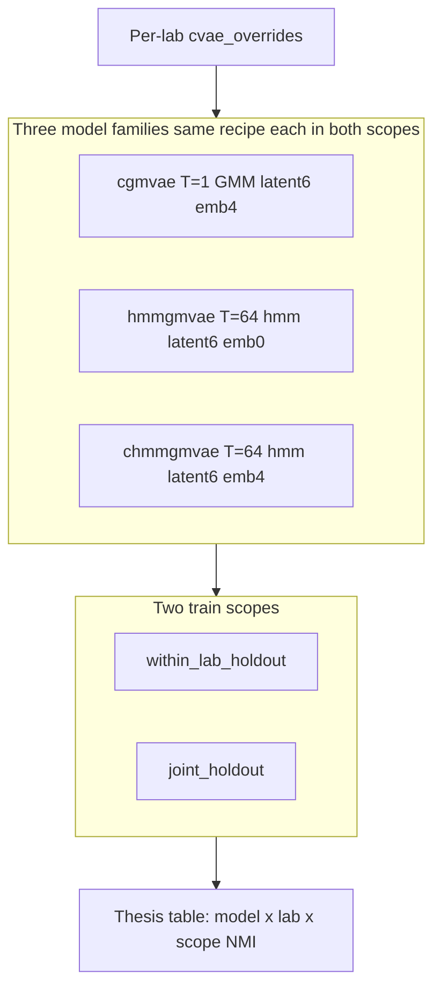
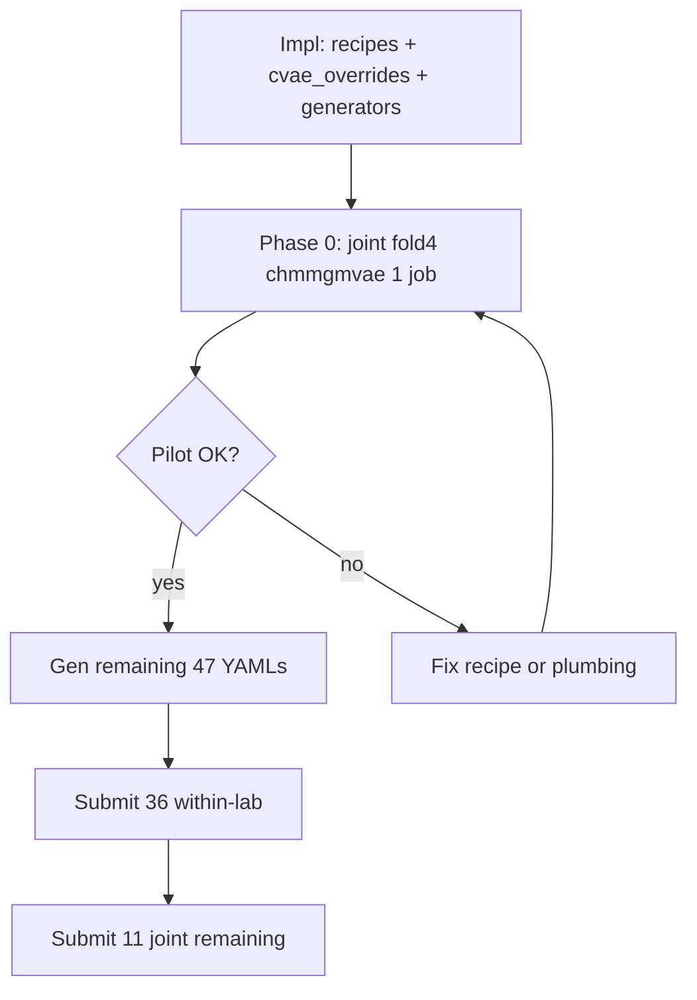

# Paper main line: 3 models × 2 train scopes (unified recipes)

## Paper framing

| Layer | Content |
|-------|---------|
| **Incohort ablations** | Per-lab **ceiling** NMI per model family (best recipe that lab could reach) | Supplementary |
| **Main line** | **Three model families**, each with **one fixed recipe**, × **two train scopes** | Primary results |
| **Models** | `cgmvae` (static GMM) · `hmmgmvae` (HMM, **no subject embedding**) · `chmmgmvae` (HMM + subject) |
| **Setting 1 — within-lab** | Train on mice in one lab only; val = fold holdout | |
| **Setting 2 — joint** | Train on all labs' train mice; val = **same** holdout mice per lab | |

**Same hyperparams** means: for each model family, **within-lab and joint use identical YAML** (trainer, arch, prior, T) — only `train_datasets` scope changes. **Across models**, prior and T differ by design (GMM vs HMM; static vs temporal).

**Shared across all models and both scopes:** per-mouse **`cvae_overrides`** (incohort prepro per lab), `runs: 3`, `decoder_only` subject path where `emb_dim > 0`, scratch checkpoints.



**Holdout targets (generalisation):** lab_2 & lab_5 ≥ **0.50**, lab_3 ≥ **0.63**. Compare models on **same holdout mice** per fold.

---

## Three unified recipes (fixed per family, both scopes)

Shared trainer defaults where possible: `epochs=200`, `batch_size=128`, `num_batches=64`, `lr` per model below, `no_beta_epochs=10`.

### `UNIFIED_CGMVAE_RECIPE`

| Knob | Value | Source |
|------|-------|--------|
| `sequence_length` | **1** | Static GMM; incohort locks |
| `prior` | **gmm** | All labs |
| `latent_dim` / `emb_dim` | **6 / 4** | **Locked paper line** — between sweep (4) and incohort (8); same across all 3 models |
| `learning_rate` | **3e-4** | Ablation convention |
| Arch | **wide_mlp** `[512,256]` | lab_3/5 essential (+lab_2 compromise vs peak default MLP) |
| Conditioning | `decoder_only_conditioning: true` | Ablation |

**Incohort ceilings:** lab_2 **0.593**, lab_3 **0.737**, lab_5 **0.534**.

### `UNIFIED_CHMMGMVAE_RECIPE` (full param block)

Cross-lab / joint needs **capacity** — use **`wide_mlp`** (lab_3 +0.024, lab_5 +0.026 incohort cGMVAE). **Locked dims:** `latent_dim=6`, `emb_dim=4` (user choice — compromise between lab_2 sweep stability at 4 and incohort/wide_mlp geometry at 8; not directly ablated). Training from sweep: **lr 1.3e-3**, T=64. Arch from [`ablation_arch/lab_3/wide_mlp.yaml`](src/config/run/cvaemarhmm/cv4fold/ablation_arch/lab_3/wide_mlp.yaml).

| Group | Param | Value |
|-------|-------|-------|
| **Dataloader** | `sequence_length` | **64** |
| | `window_size` / `stride` | 512 / 512 |
| | `batch_size` / `num_batches` | 128 / 64 |
| **Trainer** | `epochs` | 200 |
| | `learning_rate` | **0.0013** |
| | `optimizer` / `grad_clip` | adam / 0.5 |
| | `validate_per_epoch` | 1 |
| **Prior** | `prior` | **hmm_gmm** |
| | `num_gmm_states` | 3 |
| | `hmm_sticky_kappa` | 0.86 |
| | `hmm_estimate_transitions` | true |
| **β** | `min_beta` / `max_beta` | 0.01 / 1.0 |
| | `no_beta_epochs` | 10 |
| | `beta_schedule` | anneal (from locked base) |
| **Arch** | `latent_dim` | **6** (paper lock; between sweep 4 and incohort 8) |
| | `emb_dim` | **4** (subject decoder-only; ~20 mice) |
| | `enc_hidden_dims` | **[512, 256, 128]** |
| | `dec_hidden_dims` | **[128, 256, 512]** |
| | `conv_channels` | [32, 64, 128, 128] |
| | `kernel_sizes` / `strides` / `paddings` | [7,5,5,3] / [2,2,2,2] / [3,2,2,1] |
| | `decoder_only_conditioning` | true |
| **MAR** | `lags` / `ridge` / `var_reg` / `sticky_coef` | [1,2,4] / 0.1 / 0.05 / 0.1 |
| **Prepro** | per-lab `cvae_overrides` | from `LOCKED_SOURCES` |

**Tradeoff vs lab_2 seq64 sweep:** sweep winner used default MLP `[256,128]` (0.576, 3/3). **wide_mlp not yet run for lab_2 cHMM T=64** — chosen for joint/cross-lab capacity (user + lab_3/5 evidence). Document in thesis.

**Incohort ceilings:** lab_2 cHMM **0.576** (sweep, default MLP), lab_3 **0.734**, lab_5 **0.640** @ T=32.

### `UNIFIED_HMMGMVAE_RECIPE` (port from [`chmmgmm_fold`](chmmgmm_fold) `hmmgmvae_base.yaml`)

Unconditioned HMM-GMVAE baseline: **`emb_dim=0`** (no subject embedding — [`vae.py`](src/models/vae.py) skips conditioning). **Same wide_mlp + trainer/prior as chmmgmvae** for fair HMM comparison.

| Knob | Value |
|------|-------|
| `sequence_length` | **64** |
| `prior` | **hmm_gmm** |
| `latent_dim` / `emb_dim` | **6 / 0** |
| `learning_rate` | **0.0013** |
| `enc_hidden_dims` / `dec_hidden_dims` | **[512,256,128]** / **[128,256,512]** |
| `hmm_estimate_transitions` | true |

**Note:** No incohort hmmgmvae ablations on current branch — treat as **HMM prior ablation vs chmmgmvae** (conditioning on/off). Optional follow-up: 3-lab incohort smoke if holdout collapses.

### Code: extend [`locked_recipes.py`](scripts/cv4fold/locked_recipes.py)

- `apply_model_variant(..., "hmmgmvae")` — `hmm_gmm`, strip warmup keys, `emb_dim=0`
- `apply_unified_recipe(cfg, model)` — dispatches to `UNIFIED_*` blocks + `apply_locked_sequence_length`
- `PAPER_MODELS = ("cgmvae", "hmmgmvae", "chmmgmvae")`

---

## Implementation

### Schema + runtime (unchanged)

- [`config.py`](src/config/config.py): `DatasetConfig.cvae_overrides`
- [`data_loader.py`](src/data/data_loader.py): merge on train **and** val loaders

### Generator [`generate_configs.py`](scripts/cv4fold/generate_configs.py)

| Phase | Models | Output |
|-------|--------|--------|
| `within_lab_holdout` | all 3 | `unified_holdout/{lab}/fold_{k}/{model}.yaml` |
| `joint_holdout` | all 3 | `joint_holdout/fold_{k}/{model}.yaml` |

- `--fold all` · `--models cgmvae hmmgmvae chmmgmvae` (default: all three)
- `dataset_entries_with_lab_prepro` on train + val
- Deprecate old `per_lab_holdout` per-lab-lock YAMLs for paper line

### Submit

```bash
# Within-lab: 3 labs × 4 folds × 3 models = 36 jobs
bash hpc/submit/cv4fold/submit_unified_within_lab_holdout.sh --fold all

# Joint: 4 folds × 3 models = 12 jobs
bash hpc/submit/cv4fold/submit_joint_holdout.sh --fold all
```

| Model | Walltime | Queue |
|-------|----------|-------|
| `cgmvae` | **4:00** | `gpuv100` |
| `hmmgmvae`, `chmmgmvae` | **6:00** | `gpuv100` |

**Total: 48 jobs** (~240 GPU-hours). Stagger or priority if queue busy.

Logs:
- `hpc/output/cv4fold/unified_holdout/f{k}_{lab}_{model}_%J.out`
- `hpc/output/cv4fold/joint_holdout/f{k}_{model}_%J.out`

### Phase 0 — Joint pilot ablation (gate before 48 jobs)

**One job** exercising the full paper stack: **joint cross-lab**, **fold 4**, **`chmmgmvae` only**, **`UNIFIED_CHMMGMVAE_RECIPE`** (wide_mlp, latent **6**, emb **4**, lr **1.3e-3**, T **64**, `hmm_gmm`, per-lab `cvae_overrides`).

Purpose: validate `cvae_overrides` plumbing, mixed-lab loaders, and locked dims **before** within-lab × 3 models × 4 folds + joint × 3 models × 4 folds.

**Generate:**

```bash
PYTHONPATH=. python3 scripts/cv4fold/generate_configs.py \
  --phase joint_holdout --fold 4 --models chmmgmvae
```

**Output:** `src/config/run/cvaemarhmm/cv4fold/joint_holdout/fold_4/chmmgmvae.yaml`  
**Results:** `results/cv4fold/joint_holdout/fold_4/chmmgmvae/`  
**Log:** `hpc/output/cv4fold/joint_holdout/pilot_f4_chmmgmvae_%J.out`

**Submit** (after impl; user confirms):

```bash
bash hpc/submit/cv4fold/submit_joint_holdout.sh --fold 4 --models chmmgmvae
```

| Field | Value |
|-------|--------|
| Queue / walltime | `gpuv100` **6:00** |
| Train mice | 15 (all labs minus fold-4 holdout) |
| Val mice | 5 holdout (lab_2: 080+081, lab_3: 056+059+060, lab_5: 092) |
| `runs` | 3 (full recipe — not a 2-epoch smoke) |

**Pass criteria** (before launching 47 remaining jobs):

1. Job **RUN** completes without dataloader / concat / shape errors.
2. **≥2/3 seeds** with prior NMI **> 0.1** (no full collapse).
3. Quick postprocess: `val_nmi_by_lab.csv` exists; per-lab NMI not all NaN.
4. Optional sanity: `plots/<best>/feature_amplitude_per_state.png` shows non-degenerate latent dims.

**If pilot fails:** fix plumbing or recipe on login/compute; **do not** submit the 48-job wave until pilot passes.

**Doc:** note pilot result in [`unified_holdout_paper_line.md`](docs/cv4fold/unified_holdout_paper_line.md) § Phase 0.

### Docs

- [`docs/cv4fold/unified_holdout_paper_line.md`](docs/cv4fold/unified_holdout_paper_line.md) — 3×2 design, recipe tables, ceiling vs main line, thesis table layout
- Update [`docs/cv4fold/README.md`](docs/cv4fold/README.md), [`incohort_to_cross_lab_strategy.md`](docs/cv4fold/incohort_to_cross_lab_strategy.md)
- [`ablation_chmm_lab2_seq64.md`](docs/cv4fold/ablations/ablation_chmm_lab2_seq64.md) — ceiling 0.576 locked

---

## Thesis tables (primary outputs)

### Table A — Model comparison (per fold, per lab, per scope)

| Scope | Lab | cGMVAE | HMMGMVAE | cHMMGMVAE | Best | Target |
|-------|-----|--------|----------|-----------|------|--------|
| within-lab | lab_2 | | | | | ≥0.50 |
| within-lab | lab_3 | | | | | ≥0.63 |
| joint | lab_3 | | | | | ≥0.63 |
| … | | | | | | |

### Table B — Scope comparison (per model, macro avg over labs)

| Model | Within-lab macro | Joint macro | Δ joint − within |

### Table C — Incohort ceilings (supplementary)

Per lab × model family: best incohort NMI from ablations (not used as train config for main line).

**Latent quality:** `state_distinctness`, PCA tripanel per best seed — compare whether chmmgmvae beats hmmgmvae on geometry when NMI is similar.

---

## Submit order today



**Phase 0 commands (after impl):**

```bash
source .venv/bin/activate
PYTHONPATH=. python3 scripts/cv4fold/generate_configs.py \
  --phase joint_holdout --fold 4 --models chmmgmvae
bash hpc/submit/cv4fold/submit_joint_holdout.sh --fold 4 --models chmmgmvae
# Monitor: tail -f hpc/output/cv4fold/joint_holdout/pilot_f4_chmmgmvae_<JOBID>.out
# After pass — full wave:
PYTHONPATH=. python3 scripts/cv4fold/generate_configs.py --phase within_lab_holdout --fold all
PYTHONPATH=. python3 scripts/cv4fold/generate_configs.py --phase joint_holdout --fold all
bash hpc/submit/cv4fold/submit_unified_within_lab_holdout.sh --fold all
bash hpc/submit/cv4fold/submit_joint_holdout.sh --fold all --models cgmvae hmmgmvae
# joint chmmgmvae fold 4 already done — skip or exclude in submit script
```

**Invalidate:** existing fold-4 `per_lab_holdout` runs with old per-lab model locks — not on paper line.

**Defer:** per-dataset T overrides; warm-prior unified variant; `hmm_raw` baseline.
