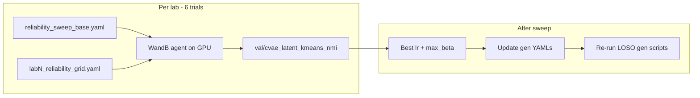

# Small W&B grid sweeps for labs 2 and 5 (reliability)

## Goal

Tune **lab 2** and **lab 5** decoder-only subject-conditioning models on **population reliability** (same cohort as today’s reliability YAMLs), without per-mouse sweeps. Rank trials by **`val/cvae_latent_kmeans_nmi`** (peak latent KMeans NMI — your choice). Apply the winning settings once to the lab’s **generalization** YAMLs afterward (manual copy; not part of the sweep).

Lab 3 stays fixed as the reference “middle” hyperparameters (`lr=0.0003`, `max_beta=1.0`, `num_batches=64`).

## Blocker to fix first

[`src/training/wandb_sweep_runner.py`](src/training/wandb_sweep_runner.py) currently calls `Orchestrator.run()`, which **raises** for `cvae.training_pipeline: cvae` (see [`src/orchestrator/orchestrator.py`](src/orchestrator/orchestrator.py) L78–82). Reliability jobs use `train_vae` → `train_cvae()` (which already runs GMM validation per internal run).

**Minimal change** in `_train()` / `run_agent_only()`:

```python
if base_cfg.cvae.training_pipeline == "cvae":
    orch.train_cvae()
else:
    orch.run()
```

Also:

- Set sweep metric to **`val/cvae_latent_kmeans_nmi`** (key in `get_trained_validations()`, logged as `val/cvae_latent_kmeans_nmi` in W&B).
- After `wandb.init`, suffix **`results_dir`** and **`run_name`** with `wandb.run.id` so parallel agents do not overwrite `cvae_final_model.pth` / `cvae_best_kmeans_nmi.pth`.
- Extend `_apply_wandb_config` parsers (small dict addition):
  - `model.params.max_beta` → `float`
  - `dataloader.num_batches` → `int` (optional; can omit from grid if you want zero parser work — recommend including `max_beta` only for a 2×3 = **6** trial grid)

## Files to add

### 1. Sweep base configs (clone reliability, sweep-friendly)

| Lab | Source | New base |
|-----|--------|----------|
| 2 | [`reliability_cgmvae_decoder_only_subject_conditioning.yaml`](src/config/run/cvaeprior/decoder_only_lab_2_subject_conditioning/reliability/reliability_cgmvae_decoder_only_subject_conditioning.yaml) | `src/config/run/cvaeprior/decoder_only_lab_2_subject_conditioning/sweep/reliability_sweep_base.yaml` |
| 5 | [`reliability_cgmvae_decoder_only_subject_conditioning.yaml`](src/config/run/cvaeprior/decoder_only_lab_5_subject_conditioning/reliability/reliability_cgmvae_decoder_only_subject_conditioning.yaml) | `src/config/run/cvaeprior/decoder_only_lab_5_subject_conditioning/sweep/reliability_sweep_base.yaml` |

Edits vs production reliability (only these):

- `runs: 3` (not 10 — keeps sweep cheap; still aggregates best-of-3 in runner)
- `results_dir`: `results/decoder_only/sweep/cgmvae_decoder_only_lab_{2,5}_reliability`
- `wandb:` block with `enabled: true`, `group: decoder_only_lab{N}_reliability_sweep`, `tags: [decoder_only, lab{N}, reliability, sweep]`
- Leave **train/val datasets identical** to reliability (population, all quality subjects in lab)

### 2. W&B grid sweep YAMLs

Under [`src/config/sweep/decoder_only/`](src/config/sweep/decoder_only/) (new folder):

**[`lab2_reliability_grid.yaml`](src/config/sweep/decoder_only/lab2_reliability_grid.yaml)**

```yaml
method: grid
metric:
  name: val/cvae_latent_kmeans_nmi
  goal: maximize
parameters:
  trainer.learning_rate:
    values: [0.0002, 0.0003, 0.0005]
  model.params.max_beta:
    values: [0.5, 1.0]
base_config: src/config/run/cvaeprior/decoder_only_lab_2_subject_conditioning/sweep/reliability_sweep_base.yaml
```

**[`lab5_reliability_grid.yaml`](src/config/sweep/decoder_only/lab5_reliability_grid.yaml)** — same grid, `base_config` → lab 5 sweep base.

**Grid size:** 3 × 2 = **6 trials per lab** (12 GPU jobs total if you run both labs).

### 3. Optional HPC one-liners (thin wrappers)

[`hpc/submit/decoder_only_lab_2/run_reliability_sweep.sh`](hpc/submit/decoder_only_lab_2/run_reliability_sweep.sh) and lab 5 twin — only `cd` repo + call launcher (no new LSF logic).

## What to run (from repo root on login node)

Prereqs: `.env` with `WANDB_API_KEY`; venv active not required for `bsub`.

**Lab 2** (6 agents, 1 trial each, ~4–6 h walltime depending on lab size):

```bash
cd /work3/s204070/SPA
bash hpc/submit/launch_wandb_sweep.sh \
  src/config/sweep/decoder_only/lab2_reliability_grid.yaml \
  6 1 08:00 gpuv100
```

**Lab 5:**

```bash
bash hpc/submit/launch_wandb_sweep.sh \
  src/config/sweep/decoder_only/lab5_reliability_grid.yaml \
  6 1 08:00 gpuv100
```

Monitor: `bjobs`, logs under `hpc/output/sweep_<SWEEP_ID>/`, W&B project `SPA` (or `WANDB_PROJECT` from `.env`).

Pick best trial in W&B (max `val/cvae_latent_kmeans_nmi`), copy `trainer.learning_rate` and `model.params.max_beta` into:

- lab 2/5 **reliability** + **subjectwise** YAMLs (optional confirm)
- lab 2/5 **generalization** / **generalization_subject** YAMLs (the runs that matter for LOSO Pred NMI)

Then re-submit existing scripts only for generalization (not a second sweep):

- [`hpc/submit/decoder_only_lab_2/run_decoder_only_lab_2_generalization.sh`](hpc/submit/decoder_only_lab_2/run_decoder_only_lab_2_generalization.sh)
- [`hpc/submit/decoder_only_lab_5/run_decoder_only_lab_5_generalization.sh`](hpc/submit/decoder_only_lab_5/run_decoder_only_lab_5_generalization.sh)

## Flow



## Out of scope (keeps diff small)

- No sweep over generalization hold-out mice (6× LOSO configs per lab).
- No `num_batches` / band-pass grid unless you want a second pass (needs parser + 12 more trials).
- No change to lab 3 configs.
- No CSV summary script.

## Effort estimate

- Runner fix + parsers + 4 YAMLs + 2 optional submit wrappers: **~1 small PR**, **12 GPU-hours** (2×6 trials × ~1h each, rough).
