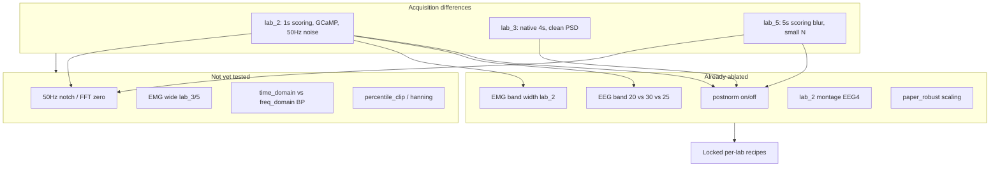

# Lab-difference review & preprocessing ablation roadmap

## What the existing data already shows

### Acquisition context ([`docs/lab_measurement_preprocessing_2_3_5.md`](docs/lab_measurement_preprocessing_2_3_5.md))

| Axis | lab_2 (Bern) | lab_3 (Copenhagen) | lab_5 (Lyon) |
|------|--------------|--------------------|--------------|
| Montage | 2P + 2F + EMG | 1P + 1F + EMG | 1P + 1F + EMG |
| Scoring | 1 s → 4 s rebin | native 4 s | 5 s sliding → rebin |
| Artifact stage | none (3-class) | scored, dropped | scored, dropped |
| Extra hardware | GCaMP6 + fiber | none | none |
| Cohort size | 17 mice | 32 mice | 6 mice |

These acquisition differences explain **why per-lab preprocessing is required** — not a single paper-style front-end.

### Data exploration CSVs ([`results/data_exploration/`](results/data_exploration))

**Already strong evidence (no new plots strictly required):**

1. **50 Hz line noise — lab_2 is extreme** ([`interference_50hz/interference_50hz_summary_by_lab.csv`](results/data_exploration/interference_50hz/interference_50hz_summary_by_lab.csv))
   - lab_2: mean ratio **231**, **60/136** channel-rows flagged; lab_3: **~0.95**, 0 outliers; lab_5: mean **15.5**, 2 outliers
   - **HQ cohort (cv_quality_cohort_v1):** **9/12 lab_2 recordings** have any-channel 50 Hz outlier; worst mice **sub-072 (1548×)**, **sub-080 (987×)**, **sub-071 (570×)**. lab_3 HQ: **0/18**; lab_5 HQ: **2/12** (sub-089 spike)
   - **Not mitigated anywhere in the pipeline** — no notch / line-noise config in [`src/preprocessing/vae_preprocessing.py`](src/preprocessing/vae_preprocessing.py)

2. **Spectral shape differs by lab** ([`results/noise/lab_*/relative_power_lab*.csv`](results/noise))
   - EEG1 low-frequency fraction (0.5–2 Hz / 0.5–30 Hz): lab_2 HQ **0.017** vs lab_3 **0.112** vs lab_5 **0.176**
   - Confirms lab_2 is **relatively high-frequency / low-delta** → consistent with ablation win for **EEG 0–30 Hz** and **no postnorm**

3. **Amplitude scale / CV** ([`lab_differences/lab_differences_detailed.csv`](results/data_exploration/lab_differences/lab_differences_detailed.csv))
   - lab_2 EEG amplitudes ~1e-6 with CV ~10; lab_3 ~1e-6 with CV ~0.55; lab_5 EEG1 mean negative with CV ~−11
   - Frontal electrodes globally noisier: [`eeg_placement_differences_summary.csv`](results/data_exploration/eeg_placement_differences/eeg_placement_differences_summary.csv) — EEG F CV **3.6** vs EEG P **0.64**
   - Explains **post_normalize helps lab_3/5, hurts lab_2**

4. **Stage mix similar across training labs** ([`stage_counts_by_lab/plots_labs_2_3_5/stage_counts_by_lab_filtered.csv`](results/data_exploration/stage_counts_by_lab/plots_labs_2_3_5/stage_counts_by_lab_filtered.csv))
   - ~48% Awake, ~46% NREM, ~5–7% REM — lab differences in NMI are unlikely to be pure class-imbalance

5. **EMG awake/NREM contrast** ([`results/noise/lab_*/emg_rms_awake_over_nrem*.csv`](results/noise))
   - HQ medians: lab_2 **3.73**, lab_3 **2.69**, lab_5 **2.58** — lab_2 has usable EMG dynamics; wide EMG band (3–100 Hz) ablation win is physiologically plausible

### What ablations already settled ([`docs/cv4fold/ablation_lab2_findings_20260607.md`](docs/cv4fold/ablation_lab2_findings_20260607.md))

| Idea | lab_2 | lab_3 | lab_5 |
|------|-------|-------|-------|
| `post_normalize: false` | **win** | lose (0.616 vs 0.737) | lose (0.471) |
| EEG 0–30 Hz wide BP | **win** | not needed | not tested alone |
| EEG 0–25 Hz (bp25) | worse trend | below baseline | below baseline |
| paper_robust (median/IQR + 0.3–35) | **rejected** | rejected | rejected |
| EMG 3–100 Hz | **win (+0.025 NMI)** | not tested | not tested |
| EEG1+EEG4 montage | **win (0.593)** | N/A | N/A |
| `wide_mlp` arch | marginal | **essential (0.737)** | small gain (0.534) |
| `append_channel_rms` | no gain | not tested | not tested |

**Gap:** [`data/manifests/cv_quality_cohort_v1.yaml`](data/manifests/cv_quality_cohort_v1.yaml) still lists lab_2 signals **EEG1+EEG3** — winner uses **EEG1+EEG4** (manifest update pending, not a new ablation).

### Artifacts gaps (why new plots are warranted)

- **No PNGs** under `results/data_exploration/` — CSVs exist but visual review is hard
- [`lab_differences_summary.csv`](results/data_exploration/lab_differences/lab_differences_summary.csv) is **corrupt/empty** (re-run needed)
- Existing exploration uses **full lab pools**, not HQ-only — HQ-filtered views needed for thesis cohort
- [`scripts/preprocessing_audit/`](scripts/preprocessing_audit/) referenced in branch review but **not present** on this branch



---

## Phase 1 — Targeted plots (compute node, read-only)

Run on **`linuxsh`** (not login node). Extend [`scripts/data_exploration/`](scripts/data_exploration/) minimally or add one script `scripts/data_exploration/hq_lab_review.py` that reads existing CSVs + HQ manifest and writes to `results/data_exploration/hq_review/`.

| Plot | Source | Purpose |
|------|--------|---------|
| 50 Hz ratio boxplot by lab (HQ only) | `interference_50hz_with_outliers.csv` + manifest | Quantify #1 lab_2 issue for thesis |
| 50 Hz outlier rate per HQ mouse (lab_2) | same | Tie to sub-072 / sub-080 known bad channels |
| EEG1 low-freq fraction by lab (HQ) | `results/noise/relative_power_*` | Visual for “lab_2 is high-freq heavy” |
| EMG awake/NREM ratio by lab (HQ) | `results/noise/emg_rms_*` | Justify EMG-wide transfer test |
| Amplitude CV by lab × channel (HQ) | re-run `lab_differences` with `exclude_lab1=True`, HQ filter | Fix corrupt summary + postnorm rationale |
| Stage transition entropy lab_3 vs lab_5 | `stage_transitions/*.csv` filtered by lab | Check if lab_5 label blur shows as noisier transitions |

Optional (if quick): overlay **model-input PSD** from locked winner run (`input_emg_band_power_per_state.png` already in ablation plots) vs raw — compare lab_2 winner vs lab_3 baseline without retraining.

---

## Phase 2 — Write recommendation doc

Create [`docs/cv4fold/lab_preprocessing_review_20260607.md`](docs/cv4fold/lab_preprocessing_review_20260607.md) with:

- Data evidence table (above)
- Locked recipes recap
- **Prioritized ablation backlog** (below)
- **Deprioritized / do-not-repeat** list
- Link from [`docs/cv4fold/README.md`](docs/cv4fold/README.md)

---

## Recommended ablations (prioritized)

### P0 — lab_2: 50 Hz mitigation on locked winner (highest ROI)

**Why:** 75% of HQ lab_2 recordings show 50 Hz outliers; pipeline has zero line-noise handling; ablation gains so far are bandpass/normalization/montage — not interference.

**Implementation (minimal):** Add optional config e.g. `notch_freqs: [50]` (or `zero_fft_bins: [[49.5, 50.5]]`) in [`src/config/config.py`](src/config/config.py) + zero those bins in `band_pass_filter_fft` path in [`vae_preprocessing.py`](src/preprocessing/vae_preprocessing.py) after rFFT (consistent with existing frequency-domain BP).

**Ablation variant:** `rem_emg_wide_eeg4_notch50` — single YAML, 3 seeds, lab_2 incohort only.

**Success gate:** best-of-3 NMI **> 0.593** with stable seeds; inspect tripanel for less Awake/NREM smearing on sub-072-heavy val splits.

### P1 — lab_5: EMG wide + optional notch (weakest lab)

**Why:** lab_5 stuck at **0.534**; `no_postnorm_widebp` failed; postnorm required; but lab_2 showed **EMG 3–100 Hz** helps REM; sub-089 has 50 Hz spike.

| Variant | Knobs | Hypothesis |
|---------|-------|------------|
| `wide_mlp_emg_wide` | EMG 3–100 Hz, keep postnorm + EEG 0–20 | REM/atonia cue without breaking amplitude norm |
| `wide_mlp_emg_wide_notch50` | above + 50 Hz zero | Fix sub-089 outlier |

Do **not** transplant lab_2’s no-postnorm recipe — data + ablations show lab_5 needs postnorm.

### P2 — lab_3: EMG wide only (low urgency)

**Why:** Already **0.737**; marginal upside. One YAML if P0/P1 complete: `wide_mlp_emg_wide`. Skip if holdout pilot is time-critical.

### P3 — Secondary knobs (only if P0–P2 plateau)

| Knob | Config exists? | When worth testing |
|------|----------------|-------------------|
| `band_pass_filter_type: time_domain` | yes | If freq-domain BP + notch insufficient for lab_2 broadband noise |
| `percentile_clip_channels: true` | yes | If tripanels show spike artifacts after notch |
| `perform_hanning_window: true` | yes | Low priority; may interact badly with FFT log-power |
| Sex-stratified val (lab_3) | N/A | Diagnostic only — 12 F / 11 M; not preprocessing |
| Exclude sub-072 from HQ | manifest edit | **Diagnostic**, not default — tests whether one bad mouse drives lab_2 ceiling |

### Do not repeat

- **paper_robust** (median/IQR + 0.3–35) — rejected all labs
- **bp25 / no_postnorm_bp25** — trending worse
- **Global single recipe** across labs
- **LR / β / no_beta_epochs** retune (unless `no_beta_epochs_0` ablation finishes and surprises)
- **Architecture sweeps on lab_2** — prepro/montage/EMG dominate

---

## What is *not* a preprocessing fix

These are acquisition/modeling limits — document but don’t expect big NMI from front-end tweaks:

- **lab_5 5 s scoring blur** — may cap transition-sensitive metrics; holdout NMI is the honest test
- **lab_2 GCaMP/fiber hardware** — partial mitigation via montage (EEG4) and notch, not full removal
- **lab_3 mixed sex** — population shift; consider reporting sex-stratified holdout metrics, not a filter by default
- **Small lab_5 N (6 mice)** — high variance; best-of-3 helps but ceiling may stay ~0.55–0.60

---

## Suggested execution order (after plan approval)

1. **Plots** on compute → `results/data_exploration/hq_review/` (~30 min)
2. **Recommendation doc** (Phase 2)
3. **Implement P0 notch knob** + generator `generate_ablation_lab2_notch.py` + submit script (user confirms `bsub`)
4. **Wire locked lab_2 recipe** into manifest / `generate_configs.py` (separate small PR — EEG4 + EMG wide)
5. **Per-lab holdout pilot** with locked recipes ([`per_lab_holdout_pilot.md`](docs/cv4fold/per_lab_holdout_pilot.md)) — gate before joint cross-lab cv4fold
6. P1 lab_5 ablations only if holdout shows lab_5 still weakest

---

## HPC note (when user approves ablations)

Example submit (not to run until confirmed):

```bash
bsub < hpc/submit/cv4fold/submit_ablation_lab2_notch.sh
```

Log pattern: `hpc/output/cv4fold/ablation_rem/lab_2/notch50_%J.out`

For plots only (lightweight, still use compute):

```bash
linuxsh
cd /work3/s204070/SPA && source .venv/bin/activate
PYTHONPATH=. python3 scripts/data_exploration/hq_lab_review.py
```
