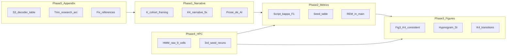

# Paper flaw remediation plan (report hand-in)

**Target:** [`docs/paper/plos_my_paper_report.pdf`](docs/paper/plos_my_paper_report.pdf) — no placeholders, defensible science, traceable numbers.  
**Source of truth for gaps:** [`docs/paper_professor_review.md`](docs/paper_professor_review.md)  
**Primary tex:** [`docs/paper/plos_my_paper.tex`](docs/paper/plos_my_paper.tex)  
**Rebuild:** `bash docs/paper/build/compile_report.sh`



---

## Phase 1 — Narrative and prose (no new experiments)

### 1.1 Cohort framing (20 vs 92 mice)

**Problem:** Data section does not lead with full MSSV scale before the quality subset.

**Edit** [`docs/paper/plos_my_paper.tex`](docs/paper/plos_my_paper.tex) Data section (~line 250):

- Open with: MSSV = 92 mice, 5 labs (cite Rose/ds006366).
- Then: quality screening → **20 mice** (6+10+4 in labs 2/3/5), ~453 h, 4-fold LOMO.
- One sentence on why labs 1/4 excluded (pathology / montage).

Mirror in Abstract sentence 2 (cohort + protocol before headline NMI).

### 1.2 K=4 vs K=13 — fix the central narrative inconsistency

**Recommended strategy (from [`report_improvement_plan.md`](docs/paper/notes/report_improvement_plan.md) §3.2):** **Honest macro+**

| Main text claim | Evidence |
|-----------------|----------|
| K-sweep peaks at K=4 on fold-4 holdout (NMI 0.643 vs 0.635 at K=3) | Fig 2 / [`k_sweep_metrics_table.csv`](docs/paper/figures/k_sweep/k_sweep_metrics_table.csv) |
| K=4 ≈ macro Wake + NREM + two rare REM-related states (0.3%/0.2% occupancy) | S3 Table — **do not claim a high-occupancy transition cluster at K=4** |
| Finer taxonomy (transitions, Stevner-style map) | Move to **SI at K=7 or K=13** with explicit caption: “illustrative finer resolution; holdout NMI lower (K=13: 0.525)” |

**Concrete figure changes:**

- **Replace main Fig 3 panel A** (currently K=13 placeholder from [`Fig3_taxonomy.pdf`](docs/paper/figures/main/Fig3_taxonomy.pdf)):
  - Option A (preferred): **K=4 transition schematic** — regenerate via [`scripts/paper/plot_taxonomy_schematic.py`](scripts/paper/plot_taxonomy_schematic.py) on `biology_meeting/K04/` NPZ.
  - Option B: drop panel A; single-panel physiology + cite K=13 taxonomy in SI only.
- Rewire [`S3_substage_summary.tex`](docs/paper/assets/tables/S3_substage_summary.tex): rename columns from “Provisional name” → **descriptive physiology labels** (Wake-dominant, NREM-dominant, REM-sparse A/B) until Birgitte curation; remove “pending curation”.
- Results substage subsection: one honest paragraph on K≥6 over-segmentation (`entropy_norm` from k-sweep CSV if available).

### 1.3 Remove internal / AI prose

| Location | Action |
|----------|--------|
| [`research_arc.tex`](docs/paper/assets/appendix/research_arc.tex) | **Cut Phases A–D + “Explored but not locked”** → 1 short paragraph: thesis → decoder-only + cross-lab holdout; point to S1–S4 appendices for detail |
| S6 Table caption | Remove `docs/cv4fold/...md` path → “9/16 cells complete as of [date]; remaining cells excluded from Table 1 mean” **or** update after HPC |
| Abstract / Intro / Conclusion | De-duplicate AccuSleep boilerplate; cut “threefold / offers a path / in the spirit of” stacking; sharpen gap sentence at end of Intro |
| Limitations | Add: REM recall ~3%, best-of-3 seeds, fold-4-only K selection, incomplete HMM(raw) if not finished |

### 1.4 Methods rigour sentences (text only)

Add to Methods (~80 words total):

- **μₜ vs zₜ:** lower-variance holdout assignments; cite Eq. holdout staging.
- **Leakage:** training mice never appear in validation folds (S9 Table).
- **NMI primary, κ complementary:** NMI for unsupervised cluster–label alignment; κ/F1 in SI for sleep-field readability.
- **Label switching:** Hungarian alignment at K=3; mixture components not guaranteed ordered across seeds.

### 1.5 Fig 1 typos

Fix in architecture source (likely [`scripts/paper/plot_fig1_schematic.py`](scripts/paper/plot_fig1_schematic.py) or SVG): “SIgnals” → “Signals”, “embeeder” → “embedder”; rebuild `Fig_architecture.pdf`.

---

## Phase 2 — Metrics and statistical reporting (existing NPZ, new script)

### 2.1 New script: κ, macro-F1, per-class recall

Create [`scripts/paper/compute_holdout_classification_metrics.py`](scripts/paper/compute_holdout_classification_metrics.py):

- Input: fold-4 (and optionally all folds) `results.npz` from locked `joint_holdout/` runs.
- Output: `docs/paper/assets/tables/S10_per_class_metrics.tex` + JSON for captions.
- Reuse alignment logic from [`plot_confusion_matrix.py`](scripts/paper/plot_confusion_matrix.py) (already has REM recall **0.034** in [`S3_confusion.json`](docs/paper/figures/supplementary/S3_confusion.json)).

**Main text:** one sentence in Results — “REM recall remained low (~3%) despite high Wake/NREM alignment (S3 Fig, S10 Table).”

### 2.2 Seed stability table (address best-of-3 concern)

Extend [`summarize_holdout_ladder.py`](scripts/paper/summarize_holdout_ladder.py) or add `summarize_holdout_seeds.py`:

- Report **mean ± SD across 3 seeds** per fold × model (cGMVAE, cHMM–GMVAE).
- Keep best-of-3 as secondary column (current headline) with explicit Methods note: “primary reporting uses best seed; seed variance in S11 Table.”
- Generate `S11_seed_stability.tex`.

**No paired significance tests** (n=4 folds too small) — state that explicitly in Limitations; per-mouse S2 Fig is the transparency substitute.

### 2.3 HMMGMVAE Lab 2 collapse (NMI 0.039)

Before rewriting Table 2 prose, inspect fold-level S2 Table + `results.npz` for lab_2 joint HMMGMVAE:

- If prior collapse / degenerate occupancy → explain in Results (“sequence prior without subject embedding failed on Bern montage under joint training”).
- If bad seed only → note in seed stability table.

### 2.4 Supervised reference paragraph

Populate stub **S1 Table** (literature comparison) from [`references.bib`](docs/paper/assets/references.bib) + Rose/SPINDLE/REST numbers cited in [`report_improvement_plan.md`](docs/paper/notes/report_improvement_plan.md) §2.

- One Results paragraph: unsupervised NMI 0.58 is **not** comparable to supervised κ, but frames expectation that multi-lab retraining is required for supervised tools.

---

## Phase 3 — Figures and tables wiring

Run full regeneration after tex/metric updates:

```bash
PYTHONPATH=. python3 scripts/paper/build_curated_figures.py
PYTHONPATH=. python3 scripts/paper/summarize_holdout_ladder.py
PYTHONPATH=. python3 scripts/paper/scrape_holdout_accuracy.py
PYTHONPATH=. python3 scripts/paper/build_holdout_scope_table.py
```

| Review gap | Action | Asset |
|------------|--------|-------|
| Hypnogram exemplar | Add **S5 Fig** (or extend S1): `biology_meeting/K04/transition_hypnogram.pdf` | [`run_biology_meeting_pack.py`](scripts/paper/run_biology_meeting_pack.py) output exists |
| K=4 transition matrix in text | Pull dominant edge from `K04/transition_matrix.csv`; quote one probability in Results | e.g. Wake→NREM |
| Latent PCA in main/SI | Add **S6 Fig** from `K04/latent_pca.png` or `build_latent_si_figure.py` | SI is fine for report |
| Per-mouse NMI in main text | Cite S2 Fig + 2 sentences (fold 4 mice sub-080/081 Bern difficulty) | already generated |
| Table 1 HMM(raw) mean | **If HPC incomplete:** drop HMM(raw) row from Table 1 mean; keep fold-4 only in SI with footnote | [`T1_joint_holdout_ladder.tex`](docs/paper/assets/tables/T1_joint_holdout_ladder.tex) |

**Word budget:** add ~400–600 words in Results/Discussion (interpretation, REM, lab-2, K honesty) per [`word_budget.md`](docs/paper/notes/word_budget.md); do not expand Methods.

---

## Phase 4 — HPC (finish incomplete baselines)

Only submit after user confirms (per HPC rules). Jobs already documented in [`FRIDAY_CHECKLIST.md`](docs/paper/notes/FRIDAY_CHECKLIST.md).

### 4.1 HMM (raw) — 9/16 cells remaining

```bash
bash hpc/submit/cv4fold/submit_hmm_raw_holdout.sh
```

After completion:

```bash
PYTHONPATH=. python3 scripts/cv4fold/collect_hmm_raw_holdout.py
PYTHONPATH=. python3 scripts/paper/build_holdout_scope_table.py
```

Update [`S6_hmm_raw_status.tex`](docs/paper/assets/tables/S6_hmm_raw_status.tex) → 16/16 or document exclusions.

### 4.2 Third seed reruns (7 PEND)

Finish `cv4_seed_rerun_*` jobs so seed stability table has 3/3 seeds for all locked holdout cells; then re-run Phase 2.2 scrapers.

### 4.3 Deferred (post-report, unless time permits)

| Item | Why defer |
|------|-----------|
| K-sweep on folds 1–3 | 39 GPU jobs; report can state limitation + fold-4 sweep |
| Holdout enc+dec ablation | No generator yet; **incohort** numbers suffice for report (Phase 5) |
| Warm-start / κ / d sensitivity ablations | Out of scope for special-course deadline |

---

## Phase 5 — Appendix and references

### 5.1 S3 decoder-only ablation (fill stub)

**No new runs for report.** Write [`docs/paper/assets/appendix/S3_decoder_ablation.tex`](docs/paper/assets/appendix/S3_decoder_ablation.tex) from [`ablation_enc_dec_conditioning.md`](docs/cv4fold/ablations/ablation_enc_dec_conditioning.md):

| Lab | Decoder-only | Encoder+decoder |
|-----|--------------|-----------------|
| 2 | 0.593 | 0.578 |
| 3 | 0.737 | 0.621 |
| 5 | 0.534 | 0.430 |

**Main text** (Results or Methods, 1 sentence): “Incohort ablations favoured decoder-only conditioning on all three laboratories (S3 Appendix); holdout fold tests are future work.”

### 5.2 Fill remaining appendix stubs

| Stub | Source |
|------|--------|
| S2 Appendix (raw HMM) | Thesis Ch.5 summary + fold-4 joint NMI 0.208 |
| S4 Appendix (prepro locks) | [`locked_recipes.py`](scripts/cv4fold/locked_recipes.py) + existing S7 incohort table |
| S1 Table (literature) | Bib + Rose/SPINDLE/REST κ ranges |

### 5.3 References cleanup

Fix in [`references.bib`](docs/paper/assets/references.bib):

- Somnotate: replace `authors S` with full author list from publisher
- REST, WUCSS, Grieger: complete author lists
- Rebuild bbl via `compile_report.sh`

---

## Phase 6 — Report build hygiene

| Issue | Fix for report PDF |
|-------|-------------------|
| Lineno artifacts in body | Acceptable for DTU report **or** set `\reportmodetrue` block to disable `\linenumbers` if leaking into PDF |
| Draft date on pages | Keep for report; strip for PLOS later |
| Author Summary | **Skip** for report (`\ifreportmode` already omits) — add post-Friday |
| Zenodo | Change to “code and processed features in SPA repository (commit/tag X)” for report; DOI before journal submission |

### Verification checklist (before hand-in)

- [ ] `texcount -inc -1 plos_my_paper.tex` → 3,000–3,500 words
- [ ] Zero “placeholder / provisional / pending curation / thesis-like” in PDF
- [ ] Every figure cited before appearance; Fig 3 panels consistent at K=4
- [ ] REM recall stated in main Results
- [ ] Table 1 numbers match `holdout_ladder.csv`
- [ ] Rebuild: `bash docs/paper/build/compile_report.sh`

### Doc update

Add one-line link in [`docs/paper/README.md`](docs/paper/README.md) → remediation tracked against [`docs/paper_professor_review.md`](docs/paper_professor_review.md).

---

## Post-Friday (PLOS only — out of scope for this pass)

- Add Author summary (150–200 words, first person)
- Remove `\linenumbers`; submission geometry
- Zenodo archive + DOI in Data availability
- Export `Fig*.tif`; caption-only submission PDF
- Holdout enc+dec ablation HPC if reviewer demands fold-level proof

---

## Risk and external dependencies

| Item | Blocker |
|------|---------|
| Expert substage names | Birgitte curation — use physiology-descriptive labels for Friday |
| HMM(raw) 16/16 | 9 cells need GPU queue time |
| Statistical significance | Not feasible with n=4 folds — document limitation honestly |
