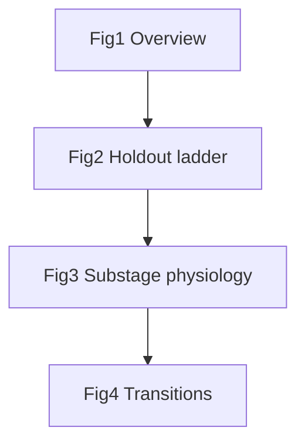

# PLOS Computational Biology manuscript — template, rule, draft, figures

## Canonical manuscript

**Source of truth:** [`docs/paper/plos_my_paper.tex`](docs/paper/plos_my_paper.tex) (user choice).

**Supporting assets:**
- BibTeX: [`docs/paper/references.bib`](docs/paper/references.bib) + `plos2025.bst` from [PLOS LaTeX zip](https://journals.plos.org/ploscompbiol/s/latex) (copy into `docs/paper/`; not yet in repo)
- Figures (upload separately at submission): export to `docs/paper/figures/Fig1.tif` … `Fig4.tif` at 300+ dpi
- [`paper/overleaf/`](paper/overleaf/) becomes **figure/table staging only** (scripts already write there; symlink or copy on build)

**Deprecate:** [`paper/overleaf/main.tex`](paper/overleaf/main.tex) — add one-line pointer in [`paper/overleaf/README.md`](paper/overleaf/README.md) to `docs/paper/plos_my_paper.tex`.

---

## Cursor rule (new)

Create [`.cursor/rules/plos-compbiol-tex.mdc`](.cursor/rules/plos-compbiol-tex.mdc) with `globs: docs/paper/**/*.tex,paper/overleaf/**/*.tex`.

**Must enforce when editing `.tex`:**

| Rule | Source |
|------|--------|
| Single `.tex` file — no `\input` / `\externaldocument` | [PLOS LaTeX](https://journals.plos.org/ploscompbiol/s/latex) |
| **No `\includegraphics`** in manuscript — caption-only `\begin{figure}...\end{figure}`; panels described in caption (A:, B:, …) | Template + [Figures guidelines](https://journals.plos.org/ploscompbiol/s/figures) |
| Cite **Fig** not Figure; cite **Table**; cite **Eq** not Equation | Template |
| Figure/table **immediately after first citing paragraph** (read order) | [Submission guidelines](https://journals.plos.org/ploscompbiol/s/submission-guidelines) |
| Section order: Title → Abstract (≤300 w, no citations) → **Author summary** (150–200 w, first person) → Introduction → Results → Discussion → Materials and methods → Acknowledgments → References → Supporting information captions | PLOS Comp Biol org chart |
| ≤3 heading levels; `\section*{}` for unnumbered main sections | Guidelines |
| Sentence case titles; species in italics (`\textit{Mus musculus}`) | Guidelines |
| Vancouver refs via `\bibliographystyle{plos2025}` + `\bibliography{references}` | Template |
| No footnotes; no `\todo{}` colors in submission PDF — use `% TODO:` comments | Template |
| Data + code availability statements in Methods | Guidelines |
| `\linenumbers` after `\newgeometry`; strip before final acceptance | Template |
| Do not delete template-required packages | Template |

Link rule to [`docs/paper/plos_template.tex`](docs/paper/plos_template.tex) as read-only reference.

---

## Update canonical plan

Extend [`.cursor/plans/5_page_paper_plan.md`](.cursor/plans/5_page_paper_plan.md):

- Manuscript path → `docs/paper/plos_my_paper.tex`
- PLOS Comp Biol section (Neuroscience) + Author summary + data/code statements
- Figure export checklist (TIFF/PDF, combined panels, file names match `Fig N`)
- Striking image candidate: colored hypnogram strip or latent UMAP (single panel, no text)

---

## First draft structure (4 main figures + 2 tables)

Proposed **full title** (≤200 chars):

> Decoder-only conditional latent models with temporal mixture priors enable zero-shot cross-lab mouse sleep staging and substage discovery

**Short title** (≤70 chars): Zero-shot cross-lab mouse sleep staging

**Submission section:** Neuroscience

### Abstract (~280 words, no citations)

Manual scoring of mouse sleep from EEG and EMG lacks consensus across laboratories, and supervised deep learning models trained at one site often fail on data from others until retrained on multi-laboratory labels. We present an unsupervised computational framework for population-level sleep staging on the Mouse Sleep Staging Validation dataset (MSSV; OpenNeuro ds006366), comparing a controlled model ladder on identical features and evaluation protocols: feature-domain hidden Markov model, HMM–Gaussian mixture variational autoencoder without subject conditioning, decoder-only conditional GMVAE, and decoder-only conditional HMM–GMVAE with a warm sticky HMM–GMM latent prior. Models are trained on leave-mice-out cross-validation folds pooling laboratories 2, 3, and 5. Held-out mice are staged by zero-shot inference: spectral epochs are encoded without subject identifiers and states are assigned from the learned mixture prior only, without per-mouse manual calibration. On joint cross-lab holdout, cHMM–GMVAE achieves best-of-three prior normalized mutual information up to 0.65, compared with 0.28–0.41 for matched cGMVAE and 0.51 for a feature HMM baseline. A substage resolution sweep and physiology panels refine wake, NREM, and REM structure and reveal transition substates at macro boundaries. These results show that decoder-only conditioning with temporal mixture priors improves unsupervised generalization across mice and acquisition sites while supporting biologically interpretable substage discovery.

### Author summary (~180 words, first person)

We study how mice sleep can be classified automatically from brain and muscle signals when recordings come from different laboratories with different equipment. Expert human scorers disagree across labs, and supervised computer models often fail on new sites. We built a family of unsupervised models that learn shared sleep patterns from many mice, then test them on held-out animals they have never seen—without asking a human to calibrate each new recording. Our best model combines a neural network that reads EEG and EMG with a temporal prior that enforces realistic sleep bout structure. It outperforms simpler models on cross-lab holdout and discovers finer sleep substates whose brain-wave profiles match known physiology. We validate substages with power spectra, muscle activity, and bout lengths, with guidance from sleep neuroscientists. This work offers a label-free route to comparing sleep across studies and may help researchers find transition states between wake, NREM, and REM that are hard to score by eye alone.

### Introduction (3 paragraphs — draft spine)

1. **Problem:** Rose 2026 bioRxiv + MSSV; manual Wake/NREM/REM; cross-lab DL failure.
2. **Gap:** Supervised ceiling (SPINDLE, REST); transductive unsupervised (AccuSleep, SegWay); static unsupervised (FASTER2, mcRBM, WUCSS) — none combine deep latent + sticky HMM–GMM + zero-shot MSSV holdout.
3. **Contributions:** (i) decoder-only cVAE + zero-shot holdout inference; (ii) fair ladder ending in cHMM–GMVAE; (iii) K sweep + expert-validated substages. Thesis details → SI.

### Results (2 subsections + 4 figure placeholders)

**2.1 Cross-lab holdout ladder** → cite **Fig 1**, **Fig 2**, **Table 1**

**2.2 Substages and transitions** → cite **Fig 3**, **Fig 4**, **Table 2** (optional K sweep summary)

### Discussion (4 tight paragraphs)

Rose complementarity; AccuSleep/SegWay contrast; when temporal prior helps (lab heterogeneity); limits (NMI magnitude, seed fragility, per-lab spectral locks, pending HMMGMVAE runs).

### Materials and methods (subsections)

- Animals and MSSV cohort (labs 2/3/5; ethics if required)
- Preprocessing and features (`cvae_overrides`)
- Model ladder (locked recipes from [`locked_recipes.py`](scripts/cv4fold/locked_recipes.py))
- Training (decoder-only conditioning)
- **Inference (holdout)** — explicit zero-shot paragraph (already drafted in prior session)
- Evaluation (prior NMI, cv4fold, best-of-three seeds)
- Substage sweep and physiology panels
- **Data availability:** OpenNeuro ds006366
- **Code availability:** SPA repo + Zenodo DOI (placeholder)

### Supporting information (main-text captions only)

| SI item | Content |
|---------|---------|
| S1 Fig | Per-fold ladder (all 4 folds × 4 models) |
| S2 Fig | Within-lab holdout heatmap (lab × model) |
| S3 Fig | K sweep curve + model selection |
| S4 Fig | Thesis K=13 full panel |
| S1 Table | Extended literature comparison (from supplement S8) |
| S2 Table | Within-lab holdout NMI |
| S1 File | Locked YAML recipes |

---

## Figure strategy (primary + backups)

Inspired by: **Somnotate** (*PLOS Comp Biol* 2024 — transitions, hypnograms), **Katsageorgiou mcRBM** (*PLOS Biology* 2018 — substage physiology grid), **SPINDLE** (*PLOS Comp Biol* 2019 — cross-lab bars), **SegWay** (HMM smoothing gain).

### Fig 1 — Overview (conceptual; new asset)

**Primary (recommended):** Three-panel schematic exported as single TIFF.

| Panel | Content |
|-------|---------|
| **A** | MSSV multi-lab cohort + cv4fold: train mice (labs 2/3/5) vs held-out fold |
| **B** | **Train vs eval split:** train path uses decoder+subject emb; **holdout path** = encoder → latent μ → HMM–GMM prior only (highlight “no subject ID”) |
| **C** | Model ladder rungs: HMM features → HMMGMVAE → cGMVAE → cHMM–GMVAE |

**Backup A:** Panel B only, larger — zero-shot vs AccuSleep 10-min calibration cartoon.

**Backup B:** Architecture diagram of cHMM–GMVAE (encoder CNN+MLP, latent, sticky prior, decoder with subject emb dashed “training only”).

**Backup C:** Rose 2026 motivation: multi-rater disagreement icons + “supervised fails cross-lab” → “our unsupervised route”.

**Implementation:** Figma/Draw.io/Inkscape (fastest); optional `scripts/paper/plot_fig1_schematic.py` (matplotlib blocks) later. **Striking image:** crop panel B or colorful hypnogram from Fig 4.

---

### Fig 2 — Holdout performance (exists; extend)

**Primary:** Mean joint holdout prior NMI bar chart — 4 rungs (HMM ref, HMMGMVAE, cGMVAE, cHMM–GMVAE).

- **Script:** [`scripts/paper/plot_ladder_figure.py`](scripts/paper/plot_ladder_figure.py) ✅
- **Data:** [`paper/overleaf/tables/holdout_ladder_summary.json`](paper/overleaf/tables/holdout_ladder_summary.json)

**Backup A:** **Grouped bars by fold** (4 folds × 3–4 models) — shows seed/fold variance; extend `plot_ladder_figure.py` with `--by-fold`.

**Backup B:** **Dot plot** per fold (3 seeds as jittered points) — pre-empts “lucky seed” criticism; needs per-seed metrics from postprocess.

**Backup C:** Horizontal **lab × model heatmap** for within-lab scope (companion to main joint story; could move to S2 Fig).

**Do not** put SPINDLE/REST 97% bars in main Fig 2 without caveat — use dashed reference line in **S1 Fig** only.

---

### Fig 3 — Substage biology (Katsageorgiou-style; mostly exists)

**Primary:** Compact physiology grid for **K-sweep winner** on cHMM fold-4 model.

| Rows | Discovered substates (7–9 after expert exclusion) |
|------|-----------------------------------------------------|
| **Cols** | EEG PSD | EMG PSD | θ/δ ratio | EMG power | bout length | macro-label composition | subject mixing |

- **Script:** [`scripts/paper/plot_figure27_compact.py`](scripts/paper/plot_figure27_compact.py) → [`scripts/substage_analysis/frequency_plot.py`](scripts/substage_analysis/frequency_plot.py) ✅
- **Input:** `results.npz` from K-sweep winner run

**Backup A:** **K sweep panel:** line plot of validation score vs K ∈ {3,5,7,9,11,13,15} with chosen K marked; small inset = winner physiology thumbnail. New script `plot_k_sweep_curve.py`.

**Backup B:** **PCA/UMAP** of latent μ colored by substates (thesis Fig 24 style) — shows embedding separation; needs `scripts/paper/plot_latent_umap.py`.

**Backup C:** **Side-by-side hypnogram:** expert macro labels vs discovered substates on same 2 h excerpt (before transition matrix).

**Expert step:** Birgitte names substates + excludes rare states per [`birgitte_interview_guide.md`](docs/paper/birgitte_interview_guide.md).

---

### Fig 4 — Dynamics and transitions (Somnotate-adjacent; mostly exists)

**Primary:** Two-panel figure.

| Panel | Content |
|-------|---------|
| **A** | Substage transition matrix heatmap (row-normalized); sticky diagonal visible |
| **B** | 2 h hypnogram excerpt: substates as color strip; mark Wake→NREM and NREM→REM boundaries |

- **Script:** [`plot_figure27_compact.py`](scripts/paper/plot_figure27_compact.py) ✅

**Backup A:** **Boundary-focused zoom:** 30-min windows around top 3 transition types (Somnotate-style “intermediate states”).

**Backup B:** **Bout-length violins** per substage (validates stable vs transition states).

**Backup C:** **Pre-REM / transition highlight** — states with rising θ before REM (Grieger narrative); requires expert mapping.

---

### Table 1 — Joint holdout NMI (main text)

Fold × {HMM†, HMMGMVAE, cGMVAE, cHMM–GMVAE}; footnote † = thesis reference. PLOS cell-based `tabular`; use `adjustwidth` if wide.

### Table 2 — Chosen substage summary (optional main or S1 Table)

Rows = retained substates; cols = dominant macro label, mean bout (s), θ/δ, expert name.

---

## Implementation tasks (on approval)

### A. Template + rule (no GPU)

1. Create `.cursor/rules/plos-compbiol-tex.mdc`
2. Copy `plos2025.bst` from PLOS zip → `docs/paper/`
3. Replace lorem in [`plos_my_paper.tex`](docs/paper/plos_my_paper.tex) with full draft (caption-only figure environments; no `\includegraphics`)
4. Point `\bibliography{references}` at [`references.bib`](docs/paper/references.bib)
5. Update [`docs/paper/README.md`](docs/paper/README.md) + [`5_page_paper_plan.md`](.cursor/plans/5_page_paper_plan.md)

### B. Figure scripts (CPU / after jobs)

| Script | Fig | Priority |
|--------|-----|----------|
| `plot_ladder_figure.py --by-fold` | S1 or Fig 2 backup | P1 |
| `plot_k_sweep_curve.py` | Fig 3 backup / S3 | P1 after K jobs |
| `plot_figure27_compact.py` on K winner | Fig 3–4 | P0 |
| `plot_fig1_schematic.py` or external SVG | Fig 1 | P1 |
| `plot_latent_umap.py` | Fig 3 backup | P2 |

### C. Experiments (unchanged)

Finish holdout + K-sweep; refresh tables before final numbers in tex.

---

## Realistic figure budget for PLOS Comp Biol

| Fig | Effort | Impact |
|-----|--------|--------|
| Fig 1 schematic | Medium (external draw) | High — sells zero-shot + ladder |
| Fig 2 ladder | **Done** | High — money figure |
| Fig 3 physiology | Low once K winner exists | High — mcRBM comparator |
| Fig 4 transitions | **Done** | Medium–high — Somnotate angle |

**Minimum viable main text:** Fig 1 + Fig 2 + Fig 3 (combine transition matrix as panel D of Fig 3 if figure count tight).
