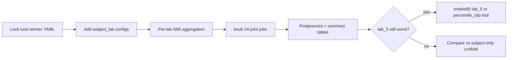

# subject_lab training + audit priorities

## Context

Preprocessing audit ([docs/preprocessing_audit_recommendations.md](docs/preprocessing_audit_recommendations.md)) says: **keep cv4fold preprocessing as-is**; address cross-lab gap via **model conditioning** and **per-lab metrics**, not a large preprocessing sweep.

You chose **all 4 joint folds** for the experiment (24 VAE jobs: 4 folds × 2 models × 3 runs).

Tune winners to lock ([docs/cv4fold/tune_sweep_bayes50_results.md](docs/cv4fold/tune_sweep_bayes50_results.md)):

| Model | Trial | Key params (from doc) |
|-------|-------|------------------------|
| **chmmgmvae** | `5bkceef8` | `lr≈0.0014`, `epochs≈257`, `validate_per_epoch=5`, `batch_size=32`, `num_batches=32`, `latent_dim=4`, `emb_dim=8`, `prior=warm_hmm_gmm`, HMM/GMM warmup ~18/37/18, `ridge≈0.18`, `var_reg≈0.016` |
| **cgmvae** | `8duimqhc` | `lr≈1.2e-5`, `epochs≈240`, `num_batches=256`, `latent_dim=16`, `batch_size=64`, `prior=gmm`, `gmm_warmup=0`, `beta_schedule=anneal` |

W&B YAML paths (`wandb/sweep-*/config-*.yaml`) are **not in repo** — first step is to transcribe full `trainer` / `model.params` / `dataloader` from W&B into the manifest (or checked-in snippet files).

---

## Priority roadmap (what to do and in what order)



| Step | Action | Preprocessing change? |
|------|--------|------------------------|
| 1 | Lock `tune_winners` in manifest + generate configs | **No** |
| 2 | Train `subject_lab` cgmvae + chmmgmvae, joint, 4 folds, 3 runs | **No** |
| 3 | Report **pooled + per-lab + per-mouse** val NMI | **No** |
| 4 | Re-run audit linkage (`--phases 4 5`) after results | **No** |
| 5 | Only if lab_5 still weak: `percentile_clip` ablation or smoke80 per_lab/lab_5 | **One knob max** |

**Explicitly defer:** lab-level `post_normalize`, global norm, placement-aware BP, turning off post_norm globally.

---

## Implementation plan

### 1. Manifest: `tune_winners` + `subject_lab` experiment block

Extend [data/manifests/cv_quality_cohort_v1.yaml](data/manifests/cv_quality_cohort_v1.yaml):

```yaml
tune_winners:
  chmmgmvae:
    trial_id: 5bkceef8
    trainer: { learning_rate: ..., epochs: ..., validate_per_epoch: 5, ... }
    dataloader: { batch_size: 32, num_batches: 32, ... }
    model:
      conditioning_source: subject_lab   # override for this experiment
      params: { latent_dim: 4, emb_dim: 8, prior: warm_hmm_gmm, ... }
  cgmvae:
    trial_id: 8duimqhc
    trainer: { ... }
    dataloader: { num_batches: 256, ... }
    model:
      conditioning_source: subject_lab
      params: { latent_dim: 16, prior: gmm, ... }
```

- Source of truth: export from W&B UI or `wandb/sweep-1gbsbad1/config-5bkceef8.yaml` and `wandb/sweep-8e8jftet/config-8duimqhc.yaml` on your machine.
- Keep **cv4fold preprocessing** unchanged (`post_normalize`, band_pass_freqs, seq64, etc.) from [cgmvae_base.yaml](src/config/run/cvaeprior/cv4fold/templates/cgmvae_base.yaml) / [chmmgmvae_base.yaml](src/config/run/cvaeprior/cv4fold/templates/chmmgmvae_base.yaml).
- Set `conditioning_source: subject_lab` and `decoder_only_conditioning: true` (existing pattern in [lab_and_subject_conditioning_LOLO](src/config/run/cvaeprior/lab_conditioning/lab_and_subject_conditioning_LOLO/generalization_lab_holdout_lab3.yaml)).
- `runs: 3` already in manifest `runs_policy.vae`.

### 2. Config generation: new phase in [scripts/cv4fold/generate_configs.py](scripts/cv4fold/generate_configs.py)

Add phase e.g. `subject_lab_tune_winners`:

- For each `fold in 1..4`, `model in (cgmvae, chmmgmvae)`:
  - `build_config(manifest, model, "joint", None, fold, overrides=tune_winners[model] + conditioning)`
  - Output: `src/config/run/cvaeprior/cv4fold/subject_lab_tune_winners/joint/fold_{k}/{model}.yaml`
  - `results_dir`: `results/cv4fold/subject_lab_tune_winners/{model}/joint/fold_{k}`
  - `run_name`: `cv4fold_{model}_subject_lab_tune_winners_joint_fold{k}`

Optional baseline row (same hyperparams, `conditioning_source: subject`) for ablation — **out of scope unless you want 48 jobs**; compare against existing subject-only full grid if already running.

### 3. Per-lab validation NMI (new reporting)

Today: pooled val NMI in `plots/metrics.txt`; per-mouse NMI in `per_mouse/*/metrics.json` via [scripts/cv4fold/split_per_mouse.py](scripts/cv4fold/split_per_mouse.py) — **no lab aggregation**.

Add [scripts/cv4fold/aggregate_val_nmi_by_lab.py](scripts/cv4fold/aggregate_val_nmi_by_lab.py):

1. Input: `result_root` (timestamped folder with `config.json`, runs `1/2/3`, `per_mouse/run_*`).
2. Load `val_datasets` → map `participant_id` → `lab` from manifest inventory.
3. For each run (1–3) and each lab: macro-average mouse NMI (equal weight per holdout mouse in that lab for this fold).
4. Write:
   - `{result_root}/val_nmi_by_lab.csv` (columns: `run`, `lab`, `nmi_macro`, `n_mice`)
   - Append section to `{result_root}/{best_run}/plots/metrics.txt` or `val_nmi_summary.json`
5. Extend [scripts/cv4fold/postprocess_fold.py](scripts/cv4fold/postprocess_fold.py) to call this after `split_per_mouse` for each run.

**Fold-level summary:** [scripts/cv4fold/summarize_subject_lab_cv.py](scripts/cv4fold/summarize_subject_lab_cv.py) → `results/cv4fold/subject_lab_tune_winners/summary.csv` with columns `model`, `fold`, `run`, `nmi_pooled`, `nmi_lab_2`, `nmi_lab_3`, `nmi_lab_5`, `nmi_macro_mice`.

Metric: **prior prediction NMI** (same as `metrics.txt` / `validate_cvae_hmm` or GMM path for cgmvae) — not latent k-means NMI from training.

### 4. HPC submission

New script [hpc/submit/cv4fold/submit_subject_lab_tune_winners.sh](hpc/submit/cv4fold/submit_subject_lab_tune_winners.sh):

- Mirror [submit_all_cv4fold.sh](hpc/submit/cv4fold/submit_all_cv4fold.sh) but only glob `subject_lab_tune_winners/joint/fold_*/{cgmvae,chmmgmvae}.yaml`
- Wall time: **16:00** VAE (`cv4fold_bsub_vae`); chmm winner needs ~260 epochs vs manifest default 80
- After each job: `postprocess_fold.py` + `select_best_vae_run.py` + lab aggregation

**Job count:** 4 folds × 2 models × 1 bsub each (each config has `runs: 3` internally) = **8 bsub jobs**, not 24.

### 5. Success criteria (how to read results)

Compare to tune in-sample lab means (chmm ~0.48 / 0.72 / 0.55; cgmvae ~0.40 / 0.62 / 0.46) and to existing **subject-only** cv4fold per_lab runs:

| Outcome | Interpretation |
|---------|----------------|
| Per-lab val NMI rises for lab_2/5 vs subject-only, lab_3 stable | `subject_lab` working — keep for thesis grid |
| Pooled NMI up but one lab flat | Report macro per-mouse + per-lab; check sub-072 / sub-087 |
| No improvement | Shift to other levers (data QC, seq length, EMG/montage), not preprocessing soup |

Also run audit linkage once `per_mouse/metrics.json` exists under this results tree.

### 6. Small audit script fix (optional, same PR)

Fix [phase2_model_input.py](scripts/preprocessing_audit/phase2_model_input.py) overwrite bug: write cross-lab PCA to `after/cross_lab/pca_all_labs_unlabeled.png`; keep `lab_*/feature_pca_triple.png` stage-colored only. Rename postnorm plot title to **“pre-post_norm std per run”**.

---

## Commands (after implementation)

```bash
cd /work3/s204070/SPA
# 1. Fill tune_winners in manifest from W&B exports
PYTHONPATH=. python3 scripts/cv4fold/generate_configs.py --phase subject_lab_tune_winners

# 2. Submit (compute node / bsub only)
bash hpc/submit/cv4fold/submit_subject_lab_tune_winners.sh

# 3. After jobs finish (example fold 4 chmm)
PYTHONPATH=. python3 scripts/cv4fold/postprocess_fold.py \
  --result-root results/cv4fold/subject_lab_tune_winners/chmmgmvae/joint/fold_4/<timestamp_dir>
PYTHONPATH=. python3 scripts/cv4fold/aggregate_val_nmi_by_lab.py --result-root <same>
```

---

## Out of scope (this plan)

- Changing preprocessing YAML / percentile_clip production rollout
- Re-running Bayesian sweep (unless subject_lab results collapse)
- Full 48-job subject vs subject_lab side-by-side on all folds (use existing subject-only grid for comparison)
- Biological insights doc (separate plan below)
