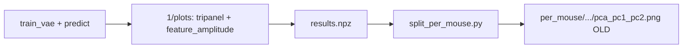

# Tripanel parity, model labels, and broader Bayesian sweep

## 1. Why per-mouse plots differ today

Run-level [`hmm_tripanel_pc1_pc2.png`](src/visuals/visualizer.py) uses `__plot_pca_tripanel` (hex palette, legend, 3 panels, pooled holdout data).

Per-mouse [`pca_pc1_pc2.png`](scripts/cv4fold/split_per_mouse.py) is a **separate minimal script**: sklearn PCA per mouse, `cmap="tab10"`, no legend, single panel, true labels only.



**Goal:** `split_per_mouse` should call the **same** tripanel renderer as the visualizer, subset per mouse.

---

## 2. Model-specific tripanel labels

Add a small helper (e.g. [`src/helpers/model_display_name.py`](src/helpers/model_display_name.py) or function on `GlobalConfig`) mapping config → display string:

| Condition | Label |
|-----------|--------|
| `model.type == hmm` | **HMM** |
| `model.type == marhmm` | **MAR-HMM** |
| `prior == gmm`, no subject conditioning | **GMVAE** |
| `prior == gmm`, subject conditioning | **cGMVAE** |
| `prior in (hmm_gmm, warm_hmm_gmm)`, `emb_dim == 0` | **HMM-GMVAE** |
| `prior in (hmm_gmm, warm_hmm_gmm)`, `emb_dim > 0` | **cHMM-GMVAE** |

Update [`__plot_pca_tripanel`](src/visuals/visualizer.py) (~L1303):

- Replace hardcoded `["HMM init", "HMM trained", "True"]` with `["{name} init", "{name} trained", "True"]` when `train_details` is used.
- When `pred_y` only (post-train validation / per-mouse from `results.npz`): use `["{name} pred", "{name} pred", "True"]` or **2-panel** layout `{name} pred` vs `True` to avoid duplicate middle panel — keep **3-panel layout** for visual parity with current validation outputs (same as today’s `visualize_cvae_gmm` / `visualize_cvae_hmm`).

Pass display name from `Visualizer` (reads `global_config`) and from `split_per_mouse` (reads `config.json`).

---

## 3. Per-mouse tripanel (same style as run-level)

**Refactor** tripanel plotting into a reusable entry point on `Visualizer`:

```python
def plot_pca_tripanel_arrays(
    self,
    x_latent, y_true, y_pred,
    out_dir: Path,
    *,
    display_name: str,
    state_names: list[str] | None = None,
) -> list[Path]
```

- Reuse existing SVD PCA, palette, legend, subsampling logic from `__plot_pca_tripanel`.
- Save as `hmm_tripanel_pc1_pc2.png` (and pc1_pc3, etc.) under each mouse folder — **same filenames** as run-level for easy comparison.

Update [`scripts/cv4fold/split_per_mouse.py`](scripts/cv4fold/split_per_mouse.py):

- Remove inline matplotlib PCA block (L71–81).
- Load `config.json` from parent result root (pass `--config` from [`postprocess_fold.py`](scripts/cv4fold/postprocess_fold.py) — already has `config.json`).
- Lightweight path: construct minimal config + call shared plot function **without** full `Orchestrator` (no GPU dataloader required); state names from config val_datasets order or fallback `State {k}`.

**Optional follow-up (not required for parity):** per-mouse `feature_amplitude_per_state.png` would need validator stats per mouse — defer unless you want it; run-level plots from `visualize_cvae` already cover separability for sweep trials.

---

## 4. Beta schedule: anneal + cyclical (end at 1.0)

**Current** [`vae.py` `regularization_loss`](src/models/vae.py): `no_beta_epochs` → linear warmup → optional `beta_slowdown` decay — **no cyclical**.

**Add** to `model.params` (template + sweep):

- `beta_schedule: anneal | cyclical` (default `anneal` for existing configs)
- `beta_cyclical_period_epochs: int` (used when cyclical)

**Cyclical behaviour (new code in `vae.py`):**

- Within each period, ramp `min_beta → max_beta` (cosine or half-cosine).
- **Final epoch** always forces `beta = max_beta` (1.0) so KL ends at full weight as you requested.
- Keep `max_beta: 1.0` **fixed** in sweep base YAML (not a sweep dimension).

**Sweep dimensions for beta** (not `max_beta`):

- `model.params.beta_schedule`: `values: [anneal, cyclical]`
- `model.params.no_beta_epochs`: int range (e.g. 0–30)
- `model.params.beta_warmup_epochs`: int range, capped `< trainer.epochs`
- `model.params.beta_slowdown_epochs`: 0 or positive (anneal tail only)
- `model.params.beta_cyclical_period_epochs`: e.g. 20–80 when cyclical
- `model.params.min_beta`: log-uniform ~1e-3–0.05

Extend [`_parse_bayes_sweep_value`](src/training/wandb_sweep_runner.py) for new string/int keys (`beta_schedule`, cyclical period).

---

## 5. Broader W&B Bayesian sweep

Replace narrow ranges in [`src/config/sweep/cv4fold/chmmgmvae_joint_fold4_bayes25.yaml`](src/config/sweep/cv4fold/chmmgmvae_joint_fold4_bayes25.yaml) (rename to `..._bayes40.yaml` or keep name, update `count`):

| Parameter | Search space |
|-----------|----------------|
| `trainer.epochs` | 50 – 300 |
| `trainer.learning_rate` | log-uniform **1e-5 – 1e-3** |
| `model.params.gmm_warmup_epochs` | 5 – 25 |
| `model.params.hmm_warmup_epochs` | 10 – 60 |
| `model.params.hmm_transition_ramp_epochs` | 4 – 16 |
| `dataloader.num_batches` | 32, 64, 128, 256 |
| `model.params.latent_dim` | 4, 8, 16 |
| `model.params.emb_dim` | fixed 4 for chmmgmvae base (or omit from sweep) |
| Beta block | as §4 |
| `trainer.grad_clip`, `ridge`, `var_reg`, `sticky_coef` | keep moderate ranges |

**Fixed in base** [`chmmgmvae_joint_fold4_sweep_base.yaml`](src/config/run/cvaeprior/cv4fold/tune/chmmgmvae_joint_fold4_sweep_base.yaml):

- `max_beta: 1.0`
- `runs: 1`, joint fold 4 mice, `validate_per_epoch: 10`
- `validator` + `visualizer`: `summary_statistics`, `state_distinctness`, `pca_tripanel` enabled so each trial still writes **`feature_amplitude_per_state.png`** for wake/NREM/REM separability checks when `latent_dim` changes.

**HPC:** keep W&B-managed BO via [`submit_tune_sweep.sh`](hpc/submit/cv4fold/submit_tune_sweep.sh) + [`launch_wandb_sweep.sh`](hpc/submit/launch_wandb_sweep.sh). Bump default agents to **40** (25 is tight for this many dimensions); document `NUM_AGENTS=50` override.

**No LSF `-w done` chain** — unchanged; W&B suggests next trials from completed runs.

---

## 6. HMM raw smoke (from prior thread)

Already stubbed in [`hmm_raw_thesis_base.yaml`](src/config/run/hmm/cv4fold/templates/hmm_raw_thesis_base.yaml). Regenerate + resubmit:

```bash
PYTHONPATH=. python3 scripts/cv4fold/generate_configs.py --phase smoke
bash hpc/submit/cv4fold/submit_hmm_raw_smoke.sh
```

---

## 7. Docs

Update [`docs/cv4fold/README.md`](docs/cv4fold/README.md):

- Per-mouse outputs now mirror `hmm_tripanel_*.png` naming/styling.
- Tripanel legend uses model family names.
- Sweep: bayes ranges, beta constraints, check `feature_amplitude_per_state.png` when comparing `latent_dim`.
- Lock manifest from best W&B trial (`val/cvae_latent_kmeans_nmi`).

---

## Files to touch (summary)

| File | Change |
|------|--------|
| [`src/visuals/visualizer.py`](src/visuals/visualizer.py) | Model display names; extract `plot_pca_tripanel_arrays` |
| [`scripts/cv4fold/split_per_mouse.py`](scripts/cv4fold/split_per_mouse.py) | Call shared tripanel; drop quick scatter |
| [`src/models/vae.py`](src/models/vae.py) | Cyclical beta schedule |
| [`src/config/sweep/cv4fold/chmmgmvae_joint_fold4_bayes25.yaml`](src/config/sweep/cv4fold/chmmgmvae_joint_fold4_bayes25.yaml) | Expanded bayes search |
| [`src/training/wandb_sweep_runner.py`](src/training/wandb_sweep_runner.py) | Bayes parsers for new params |
| [`hpc/submit/cv4fold/submit_tune_sweep.sh`](hpc/submit/cv4fold/submit_tune_sweep.sh) | Default 40 agents, 8h gpuv100 |
| [`docs/cv4fold/README.md`](docs/cv4fold/README.md) | Workflow notes |
