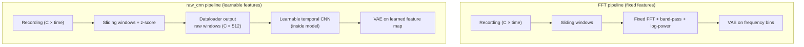
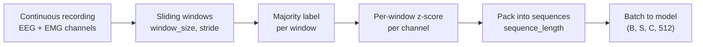
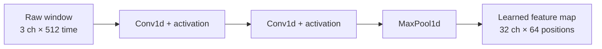
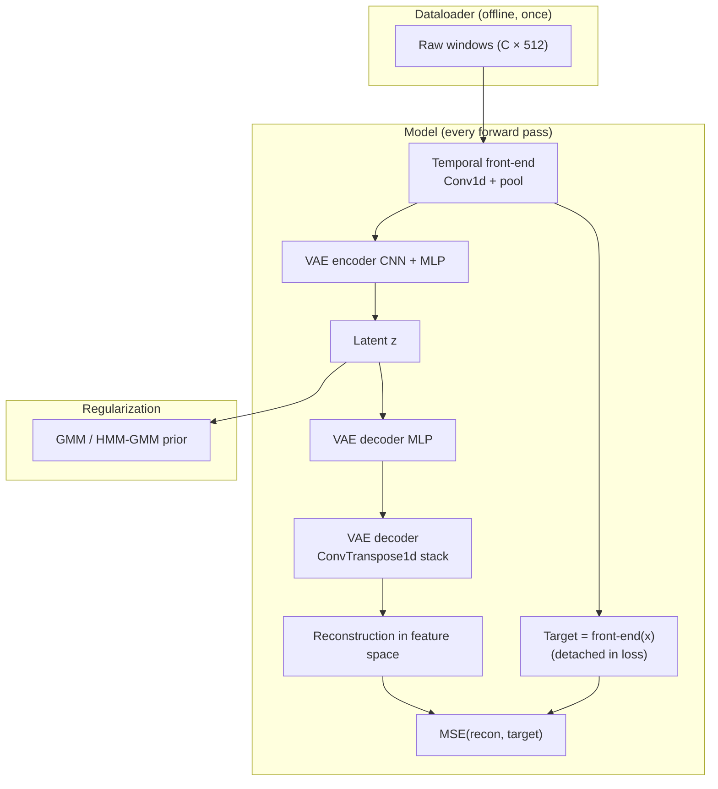
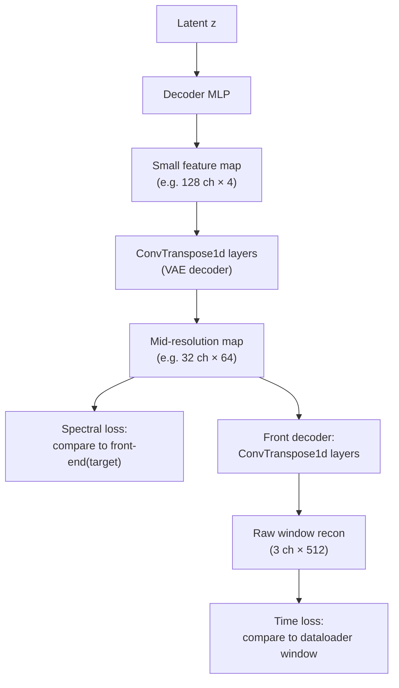

# CNN data preprocessing and end-to-end feature learning

This document explains the **`raw_cnn`** pipeline: what the dataloader prepares, how that differs from the legacy **FFT** path, and how a **learnable convolutional front-end** (plus transposed convolutions in the model) replaces fixed spectral transforms with something trained end-to-end.

For encoder/decoder conditioning and priors, see `conditioning_story_map.md` and `cGMVAE_architecture.md`.

---

## The big idea

**Before (FFT path):**  
Sleep recordings are windowed, then each window is turned into **fixed** frequency features (FFT, band-pass in frequency, log-power). The VAE never sees raw samples inside the window; it sees a hand-crafted spectrum.

**Now (CNN path):**  
The dataloader only prepares **raw time-domain windows** (normalized per window). **Inside the neural network**, a small temporal CNN compresses each window into a shorter **learned feature map**—a data-driven substitute for FFT. That front-end and the rest of the VAE are trained together with backprop.

So “CNN preprocessing” is really two parts:

1. **Dataloader preprocessing** — windowing, labels, sequences (no FFT).
2. **Model preprocessing** — learnable Conv1d front-end (replaces FFT at train time).

---

## What the CNN dataloader actually does

When `cvae.feature_pipeline: raw_cnn` and `dataloader.use_legacy: false`, `DataLoader` uses **`RawWindowPreprocessing`** instead of **`VAEPreprocessing`**.

The dataloader’s job is **not** to compute spectra. It only structures the recording for sequence training.

### Step-by-step (high level)

| Step | What happens | Why |
|------|----------------|-----|
| Load | Full night: channels × time + per-sample labels | Same as FFT path |
| Window | Cut overlapping segments of length `window_size` (e.g. 512 samples ≈ 4 s) | One “frame” per stride |
| Label | One sleep-stage label per window (majority vote inside window) | Align labels with frames |
| Normalize | Per-window z-score per channel | Scale stability; no global FFT stats |
| Sequence | Group `sequence_length` windows into one training unit | Feeds temporal priors (e.g. HMM-GMM) later |

**Output shape (conceptually):**  
`(number of sequences, sequence_length, channels, window_length)`  
e.g. `(N, 1, 3, 512)` for `sequence_length: 1`, or `(N, 64, 3, 512)` for temporal experiments.

### What the dataloader deliberately skips

Compared to FFT preprocessing, the CNN dataloader **does not** apply:

- Hanning taper  
- rFFT / STFT  
- Fixed band-pass in frequency domain  
- Log-power of FFT magnitudes  

Those roles are either dropped or absorbed by the **learnable front-end** and VAE during training.

### Two passes of the same preprocessor

The loader still runs preprocessing twice (as in the FFT path):

- **Normalized windows** → used for training (`self.data`).
- **Unnormalized windows** (`for_raw=True`) → kept for analysis/visualization (`x_non_norm`).

For `raw_cnn`, the only difference in the second pass is skipping z-score; windows are still raw time samples.

---

## Where FFT is replaced: the learnable temporal front-end

After the dataloader, each window is a tensor `(channels, time_length)`—for example `(3, 512)`.

Inside **`ConditionalVAE`**, the **temporal front-end** runs first on every window (flattened as `batch×sequence` independent slices):

1. **Conv1d layers** along time (short kernels, strides) — extract local temporal patterns per channel.  
2. **LeakyReLU** after each conv.  
3. **Max pooling** — shorten the time axis (like compressing many time samples into fewer “bins”).

Think of the output as a **learned spectral-ish map**: fewer positions along the axis, more feature channels—similar *role* to FFT bins, but **weights are learned** from data and the reconstruction / latent objectives.

Typical shrinkage (example config): **512 → 256 → 128 → 64** positions along the feature axis, with channel width growing (e.g. 3 → 32 → 32).

This block is the **replacement for fixed FFT** in the training loop. It is differentiable, so gradients from the VAE loss update both the front-end and the encoder/decoder.

---

## Full forward flow (default spectral reconstruction)

Your CNN configs usually set `raw_cnn_recon_domain: spectral`. That defines **what “reconstruction” means** in the loss—not the dataloader.

### Spectral path (default) — in plain language

- **Encoder** reads the **learned feature map** (output of the front-end), not the raw 512 samples.  
- **Decoder** predicts a feature map of the same kind.  
- **Loss** compares decoder output to `front_end(input)`, not to the raw waveform.

So you are still doing “reconstruction,” but in the **same representation space** the encoder uses—parallel to the old pipeline where the VAE reconstructed **FFT features**, not the original voltage trace.

**Optional FFT anchor:** a small extra term can nudge the learned map toward a coarse FFT summary early in training (`raw_cnn_fft_anchor_weight`), then decay—bridging interpretability without fixing the whole pipeline to `numpy.fft`.

### Time path (optional) — raw waveform reconstruction

If `raw_cnn_recon_domain: time`:

- After the VAE’s ConvTranspose stack, a **front decoder** (another stack of **ConvTranspose1d** layers) upsamples back toward **512 time samples per channel**.  
- Loss is MSE against the **raw window** from the dataloader.

This is the setting where “reconstruct the original signal” is literal. It needs the extra transposed-convolution path to invert the front-end.

---

## Transposed convolutions: where they appear and why

**Conv1d (front-end)** — downsampling / feature extraction along time: “what patterns are in this window?”

**ConvTranspose1d (decoders)** — upsampling along the same axis: “reconstruct a longer signal/map from a compact code.”

There are **two** transpose-conv stacks in the full CNN design:

| Stack | Role | Active when |
|-------|------|-------------|
| **VAE decoder CNN** | Expands latent-driven feature map back to front-end resolution (or encoder resolution in FFT mode) | Always |
| **Front decoder** | Inverts the temporal front-end back to raw window length | `raw_cnn_recon_domain: time` only |

Transpose layers are matched to the encoder lengths (including `output_padding`) so each upsampling step lands on the correct temporal size—mirroring the encoder front-end and VAE CNN geometry.

---

## End-to-end trainable vs fixed FFT (summary for your thesis)

| Aspect | FFT pipeline | `raw_cnn` pipeline |
|--------|----------------|---------------------|
| Features before VAE | Fixed FFT + hand-tuned filters | **Learned** conv front-end |
| Dataloader output | Frequency bins per window | **Raw** normalized windows |
| Who defines “spectrum” | Preprocessing code | **Gradient descent** on front + VAE |
| VAE Conv1d operates along | Frequency axis | Learned feature axis (after front) |
| Default reconstruction target | FFT / log-power features | **Front-end feature map** (spectral mode) |
| Temporal dynamics across nights | `sequence_length` + prior | Same |

**One sentence:**  
The CNN dataloader supplies clean raw windows; the model learns its own time-to-feature transform; transposed convolutions reconstruct either that learned map (default) or, optionally, the original waveform.

---

## Typical configuration knobs (conceptual)

| Knob | Example | Effect |
|------|---------|--------|
| `feature_pipeline` | `raw_cnn` | Switches dataloader + model path |
| `window_size` / `stride` | 512 / 512 | Window length and overlap |
| `sequence_length` | 1 or 64 | i.i.d. windows vs sequences for HMM prior |
| `front_channels`, `front_kernels`, … | e.g. [32,32], [15,7] | Capacity and receptive field of FFT replacement |
| `raw_cnn_recon_domain` | `spectral` (default) or `time` | Feature-space vs waveform reconstruction |
| `raw_cnn_fft_anchor_weight` | e.g. 0.1 | Soft tie to classical spectrum early in training |

Example run: `src/config/run/cvaeprior/cnn_cgmvae/sub039_cgmvae_gmm.yaml`.

---

## How this fits your story map

1. **Subject / lab conditioning** — unchanged; metadata is embedded in the decoder (see `conditioning_story_map.md`).  
2. **FFT → CNN** — this document: dataloader stays in time; spectrum is learned inside the network.  
3. **cGMVAE / cHMM-GMVAE** — same VAE backbone; prior may be static GMM or temporal HMM-GMM over sequences of latents (`cHMM_GMVAE.md`).

---

## Related docs

- `data_loader.md` — full `DataLoader` behavior (FFT vs raw, legacy mode, batching).  
- `cGMVAE_architecture.md` — layer tables and conditioning in the VAE.  
- `cHMM_GMVAE.md` — when `sequence_length > 1` and HMM-GMM prior apply on top of this pipeline.
