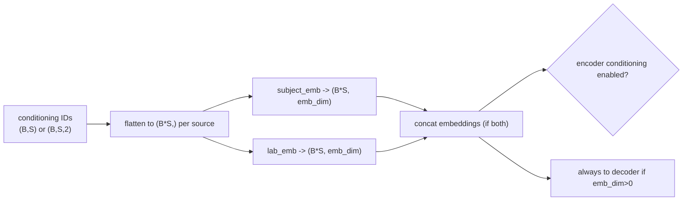

# cGMVAE architecture (implementation-grounded)

This document describes the actual `ConditionalVAE` architecture used in this repo (`src/models/vae.py`), with a concrete example from:

- `src/config/run/cvaeprior/cnn_cgmvae/sub039_cgmvae_gmm.yaml`

It is written as a thesis/presentation-friendly model card: components, layer stack, data flow, and training objective.

---

## 1) Big-picture model graph

```mermaid
flowchart LR
    X["Input x\nshape: (B,S,C,F_time or F_feat)"] --> FRONT{"feature_pipeline"}
    FRONT -->|raw_cnn| TF["Temporal front-end CNN\nlearned spectral-like features"]
    FRONT -->|fft| ID["Identity pass (already features)"]

    TF --> ENCIN["Encoder input per step\n(B*S, C_enc, L_enc)"]
    ID --> ENCIN

    ENCIN --> ECNN["Encoder Conv1D stack"]
    ECNN --> EFLAT["Flatten"]
    CID["Conditioning IDs\nsubject/lab"] --> EMB["Embedding lookup\n(subject_emb/lab_emb)"]
    EMB --> CATE["Concat into encoder (optional)"]
    EFLAT --> CATE
    CATE --> EMLP["Encoder MLP"]
    EMLP --> MU["mu"]
    EMLP --> LOGV["logvar"]
    MU --> Z["z = mu + eps * exp(0.5*logvar)"]
    LOGV --> Z

    Z --> CATD["Concat z + embedding (decoder path)"]
    EMB --> CATD
    CATD --> DMLP["Decoder MLP"]
    DMLP --> DRESH["Reshape to conv map"]
    DRESH --> DCNN["Decoder ConvTranspose1D stack"]
    DCNN --> OUT{"raw_cnn_recon_domain"}
    OUT -->|spectral| XR1["x_recon in front feature space"]
    OUT -->|time| FDEC["Temporal front decoder"]
    FDEC --> XR2["x_recon in raw time space"]
```

---

## 2) Core components

- **Backbone class:** `ConditionalVAE` in `src/models/vae.py`
- **Conditioning mechanism:** learned embedding tables
  - `subject_emb: nn.Embedding(n_subjects, emb_dim)`
  - `lab_emb: nn.Embedding(n_labs, emb_dim)`
- **Front-end (optional):** `build_temporal_front(...)` in `src/models/temporal_front.py`
- **Encoder:** Conv1D stack -> MLP -> `fc_mu`, `fc_logvar`
- **Decoder:** MLP -> ConvTranspose1D stack (optionally followed by front decoder for time-domain reconstruction)
- **Prior choices:** `standard`, `gmm`, `warm_gmm`, `hmm_gmm`, `warm_hmm_gmm`

---

## 3) Concrete layer stack (your `sub039_cgmvae_gmm` config)

From `sub039_cgmvae_gmm.yaml`:

- `feature_pipeline: raw_cnn`
- `latent_dim: 8`
- `emb_dim: 4`
- `decoder_only_conditioning: true`
- `front_channels: [32, 32]`
- `front_kernels: [15, 7]`
- `front_strides: [2, 2]`
- `front_paddings: [7, 3]`
- `front_pool_kernel: 2`
- `conv_channels: [32, 64, 128, 128]`
- `kernel_sizes: [7, 5, 5, 3]`
- `strides: [2, 2, 2, 2]`
- `paddings: [3, 2, 2, 1]`

For a typical raw window length `F_time = 512`:

## 3.1 Temporal front-end (`raw_cnn`)

| Stage | Layer | Channels | Length |
|---|---|---:|---:|
| input | raw window | `C=3` | `512` |
| front-1 | Conv1d(k=15,s=2,p=7) + LeakyReLU | `3 -> 32` | `256` |
| front-2 | Conv1d(k=7,s=2,p=3) + LeakyReLU | `32 -> 32` | `128` |
| front-pool | MaxPool1d(k=2,s=2) | `32 -> 32` | `64` |

So encoder sees `enc_in_ch=32`, `enc_in_len=64` (when `raw_cnn` is active).

## 3.2 Encoder CNN + MLP

| Stage | Layer | Channels | Length |
|---|---|---:|---:|
| enc-1 | Conv1d(k=7,s=2,p=3)+LReLU | `32 -> 32` | `64 -> 32` |
| enc-2 | Conv1d(k=5,s=2,p=2)+LReLU | `32 -> 64` | `32 -> 16` |
| enc-3 | Conv1d(k=5,s=2,p=2)+LReLU | `64 -> 128` | `16 -> 8` |
| enc-4 | Conv1d(k=3,s=2,p=1)+LReLU | `128 -> 128` | `8 -> 4` |

Flattened conv output per time-step:

- `flat_dim = 128 * 4 = 512`

Encoder MLP:

- Linear `512 -> 256` + LeakyReLU
- Linear `256 -> 128` + LeakyReLU
- Heads:
  - `fc_mu: 128 -> 8`
  - `fc_logvar: 128 -> 8`

Because `decoder_only_conditioning: true`, encoder input is **not** concatenated with embeddings in this config.

## 3.3 Decoder MLP + Transposed CNN

Decoder MLP input:

- `z_dim + conditioning_dim = 8 + 4 = 12` (subject-conditioned decoder only)

Decoder MLP:

- Linear `12 -> 128` + LeakyReLU
- Linear `128 -> 256` + LeakyReLU
- Linear `256 -> 512`

Reshape to conv map:

- `(B*S, 128, 4)`

Transpose-conv decoder mirrors encoder lengths:

| Stage | Layer | Channels | Length |
|---|---|---:|---:|
| dec-1 | ConvTranspose1d(k=3,s=2,p=1,out_pad=1)+LReLU | `128 -> 128` | `4 -> 8` |
| dec-2 | ConvTranspose1d(k=5,s=2,p=2,out_pad=1)+LReLU | `128 -> 64` | `8 -> 16` |
| dec-3 | ConvTranspose1d(k=5,s=2,p=2,out_pad=1)+LReLU | `64 -> 32` | `16 -> 32` |
| dec-4 | ConvTranspose1d(k=7,s=2,p=3,out_pad=1) | `32 -> 32` | `32 -> 64` |

Since `raw_cnn_recon_domain: spectral`, final reconstruction is:

- `x_recon` shape `(B,S,32,64)`

and is trained against front-end-transformed target features (not raw waveform) in loss.

---

## 4) Conditioning path in architecture

Implementation detail:

- Encoder concat happens only if `use_encoder_conditioning = emb_dim > 0 and not decoder_only_conditioning`.
- Decoder concat happens whenever `emb_dim > 0`.

---

## 5) Objective function (cGMVAE and cHMM-GMVAE variants)

Per batch:

- `Loss = ReconLoss + BetaSchedule(epoch) * PriorRegLoss`

Where:

- **ReconLoss**
  - `raw_cnn + spectral` mode: MSE between `x_recon` and `front_end(x)` target features
  - optional FFT anchor term (`raw_cnn_fft_anchor_weight`, decayed over epochs)
- **PriorRegLoss** depends on `prior`:
  - `gmm` / `warm_gmm`: mixture prior in latent space
  - `hmm_gmm` / `warm_hmm_gmm`: temporal latent prior with transitions

For your `sub039_cgmvae_gmm.yaml`, prior is `warm_gmm`.

---

## 6) cGMVAE vs cHMM-GMVAE in architecture terms

- **Shared architecture:** front-end, encoder, decoder, conditioning embeddings, latent heads are identical.
- **Only prior block changes:**
  - cGMVAE (`gmm`/`warm_gmm`): static mixture latent prior.
  - cHMM-GMVAE (`hmm_gmm`/`warm_hmm_gmm`): adds transition logits and sequence forward likelihood.

So the structural diagram is the same up to `z`; difference is in the regularization/prior computation.

---

## 7) Slide-ready short description

“Our cGMVAE uses a learnable temporal CNN front-end on raw windows, a Conv1D encoder-decoder VAE backbone, and metadata conditioning through embedding concatenation (decoder-only in our main experiments). The latent space is regularized by a warm-started GMM prior; swapping this prior for HMM-GMM adds temporal state transitions without changing the encoder-decoder architecture.”
