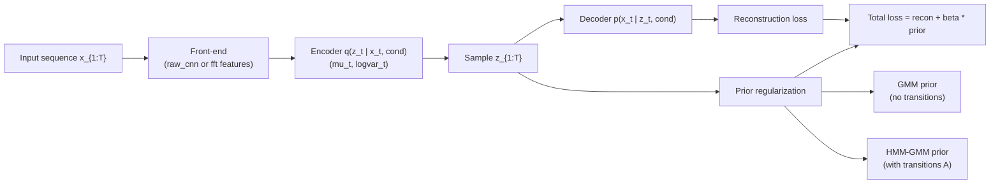
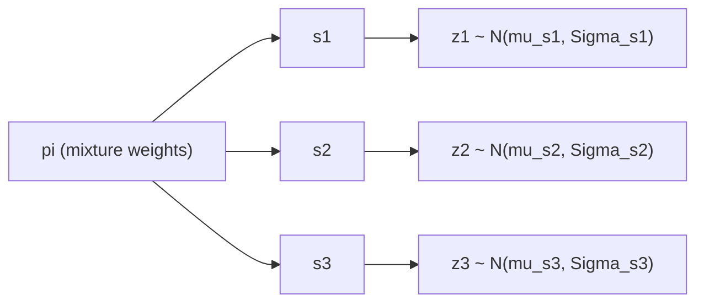
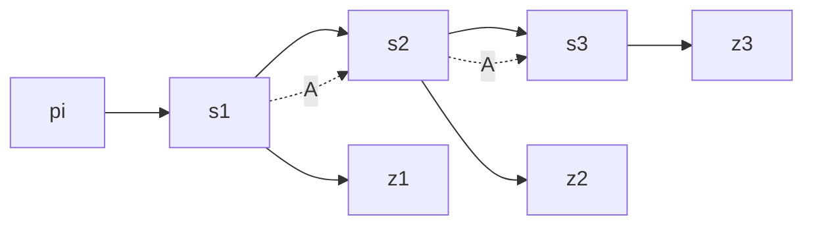
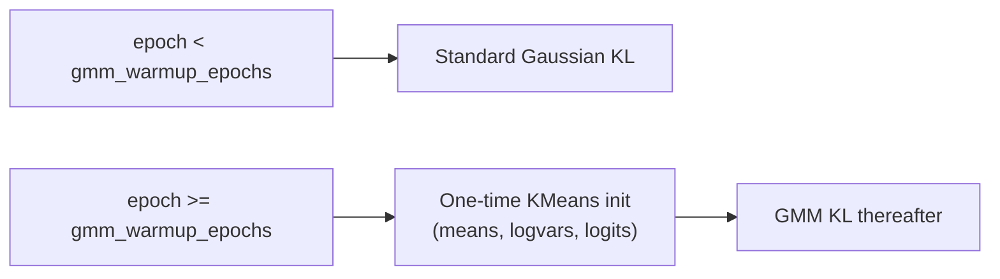
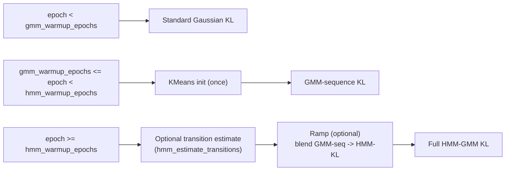

# cHMM-GMVAE: code-accurate notes

This document describes what the current code actually does for the cHMM/cGMVAE setup.

## One-minute professor version

- **Both models use the same encoder/decoder.** The only difference is the latent prior term in the ELBO.
- **GMM prior (`gmm` / `warm_gmm`)** assumes latent states at different timesteps are conditionally independent given mixture weights.
- **HMM-GMM prior (`hmm_gmm` / `warm_hmm_gmm`)** adds a transition matrix, so latent state at time `t` depends on state at `t-1`.
- In your common configs, training is `training_pipeline: cvae`, so this is a **VAE-prior comparison**, not a MAR-HMM-vs-VAE training comparison.

## High-level architecture

## What "cHMM-GMVAE" means in this repo

- The core model is `ConditionalVAE` in `src/models/vae.py`.
- Temporal HMM behavior is implemented as a **latent prior option** inside that VAE:
  - `prior: hmm_gmm`
  - `prior: warm_hmm_gmm`
- The wrapper model `CVAEMARHMM` (`src/models/cvae_mar_hmm.py`) contains both:
  - `cvae` (`ConditionalVAE`)
  - `marhmm` (`MARHMM`)
- In most cHMM-GMVAE configs under `src/config/run/cvaeprior/...`, training uses:
  - `model.type: cvae_marhmm`
  - `cvae.training_pipeline: cvae`

So in those runs, the MAR-HMM module is present but frozen/unused; temporal structure comes from the VAE prior (`hmm_gmm` / `warm_hmm_gmm`), not from MAR-HMM training.

## GMM vs HMM-GMM: what mathematically changes

### GMM prior (time-independent)

At each time step:

- choose latent class `s_t ~ Categorical(pi)`
- sample `z_t ~ N(mu_{s_t}, diag(sigma^2_{s_t}))`

No transition term ties `s_t` to `s_{t-1}`.

### HMM-GMM prior (temporal)

- initial state `s_1 ~ Categorical(pi)`
- transition `s_t ~ Categorical(A[s_{t-1}, :])`
- emission `z_t ~ N(mu_{s_t}, diag(sigma^2_{s_t}))`

So `A` controls switching dynamics and persistence.

In code, this corresponds to:

- GMM-style per-step mixture density: `_gmm_log_p_per_step(...)`
- HMM sequence log-probability via forward algorithm: `forward_log_marginal(...)`

## Data path used by these configs

Typical cHMM-GMVAE configs (for example `src/config/run/cvaeprior/cnn_cgmvae/sub039_chmmgmvae.yaml`) use:

- `dataloader.use_legacy: False`
- `cvae.feature_pipeline: raw_cnn`
- `dataloader.sequence_length: 64` (for temporal prior)

With this setup:

1. `DataLoader.process_data()` selects `RawWindowPreprocessing`.
2. Continuous signals are windowed (`window_size`, `stride`), labels are majority-voted per window.
3. Windows are packed into sequences of length `sequence_length`.
4. The model receives `x` with sequence structure and learns latent `z_t` per step.

If `sequence_length` is `1`, HMM transitions are effectively not learnable from data (there are no within-sequence transitions), and code falls back to sticky transition init when needed.

## Prior behavior in `ConditionalVAE`

`calculate_loss()` in `src/models/vae.py` chooses the prior regularizer by `model.params.prior`:

- `standard`: standard Gaussian KL.
- `gmm`: static mixture prior (per-step style).
- `warm_gmm`: standard KL warmup, then KMeans-initialized GMM.
- `hmm_gmm`: HMM-GMM sequence KL directly.
- `warm_hmm_gmm`: phased schedule:
  1. standard KL (`epoch < gmm_warmup_epochs`)
  2. GMM-sequence KL (`epoch < hmm_warmup_epochs`)
  3. HMM-GMM KL, optionally ramped by `hmm_transition_ramp_epochs`

Key implementation points:

- Emission model is diagonal Gaussian per latent state (`gaussian_log_prob_diag` in `src/models/hmm_gmm_prior.py`).
- Sequence log-likelihood is computed with forward recursion (`forward_log_marginal`).
- Transition logits are initialized sticky via `hmm_sticky_kappa`.
- If `hmm_estimate_transitions: true`, transitions are estimated once at HMM phase start from current latent assignments.

## How training differs in practice (`warm_gmm` vs `warm_hmm_gmm`)

Both use the same reconstruction objective and same encoder/decoder updates. The difference is the prior KL term over epochs.

### `warm_gmm`

- Early phase: stable standard VAE KL.
- At warmup boundary: initialize GMM parameters from latent means (`__get_kmeans_centroids`).
- After that: optimize against static GMM prior.

### `warm_hmm_gmm`

- Phase 1: standard KL (same as `warm_gmm`).
- Phase 2: sequence-scaled GMM KL (still no transition matrix in objective).
- Phase 3: HMM-GMM KL uses transition logits and forward recursion.
- Optional smooth transition with `hmm_transition_ramp_epochs`.

## Why HMM-GMM can outperform GMM (when sequence structure matters)

- GMM can cluster latent states well but has no temporal consistency model.
- HMM-GMM can prefer plausible state trajectories (e.g., persistence + realistic switching).
- This often reduces implausible rapid switching in decoded latent state paths.
- The benefit requires `sequence_length > 1`; with `sequence_length = 1`, HMM transitions have little/no temporal evidence to learn from.

## Raw-CNN front-end details (current behavior)

When `cvae.feature_pipeline: raw_cnn`:

- A temporal convolutional front-end (`build_temporal_front`) maps raw windows to learned features before the encoder CNN.
- Reconstruction domain is controlled by `raw_cnn_recon_domain`:
  - `spectral` (used in the provided cnn configs) reconstructs in learned spectral-like feature space.
  - `time` enables a temporal front decoder path.
- Optional anchor term `raw_cnn_fft_anchor_weight` adds a decaying MSE-to-FFT-power target in reconstruction loss.

## Training pipeline semantics (important)

Config field `cvae.training_pipeline` supports:

- `cvae`
- `marhmm`
- `cvae_then_marhmm`

In orchestrator (`src/orchestrator/orchestrator.py`):

- `cvae` trains only CVAE-stage objective.
- `marhmm` trains only MAR-HMM stage (CVAE frozen).
- `cvae_then_marhmm` runs CVAE stage first, then MAR-HMM stage.

For cHMM-GMVAE configs in `cvaeprior/hmmgmm`, the common setting is `training_pipeline: cvae`, so claims about joint end-to-end CVAE+MARHMM optimization are not true for those runs.

## Metrics and prediction path

After CVAE training/prediction (`orchestrator.predict_cvae()`):

- If prior is `hmm_gmm` or `warm_hmm_gmm`, validation uses HMM decoding path (`validate_cvae_hmm`) and reports HMM-oriented metrics including sequence log-probability.
- Otherwise it uses GMM path (`validate_cvae_gmm`).

## Practical config checklist for a true cHMM-GMVAE run

- `model.type: cvae_marhmm`
- `cvae.training_pipeline: cvae`
- `model.params.prior: warm_hmm_gmm` (or `hmm_gmm`)
- `dataloader.sequence_length > 1` (typically 64)
- `dataloader.use_legacy: False`
- `cvae.feature_pipeline: raw_cnn` (or `fft`, if intentionally using FFT features)

If any of these differ, behavior can shift to plain cGMVAE or non-temporal variants.
