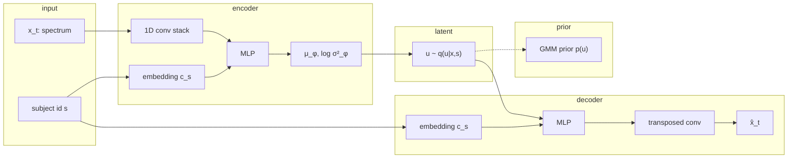

# cGMVAE Training

This document describes **how the subject-conditioned Gaussian mixture VAE (cGMVAE) is trained** in this repository: the probabilistic objective, data flow, conditioning, prior, and optimisation schedule. It is written at a conceptual and mathematical level; implementation lives mainly in `src/models/vae.py` and the `cvae` stage of `src/orchestrator/orchestrator.py`.

---

## 1. Role in the pipeline

The cGMVAE is the **representation-learning stage** of the cGMVAE–MAR-HMM pipeline. It maps each sleep epoch to a low-dimensional latent code. A separate **MAR-HMM** stage (not covered here in detail) is then fit on those latent sequences to impose temporal structure.

Training modes are controlled by `cvae.traning_pipeline`:

| Mode | What is trained |
|------|-----------------|
| `cvae` | cGMVAE only (MAR-HMM frozen) |
| `marhmm` | MAR-HMM only on fixed latent means (cGMVAE frozen; requires a checkpoint) |
| `cvae_then_marhmm` | cGMVAE first, then MAR-HMM on the learned embeddings |

Most thesis experiments use **`cvae`** for the representation model, then train or evaluate the temporal model separately.

---

## 2. Probabilistic model

### Observations and conditioning

For each epoch \(t\), the model sees a spectral observation \(x_t \in \mathbb{R}^{D}\) (frequency-domain input after preprocessing) and a discrete conditioning index \(s \in \{1,\ldots,S\}\) (typically **subject ID**; some configs use **lab** or **subject + lab**).

The generative story is a **conditional VAE** with a **Gaussian mixture prior** on the latent variable \(u_t \in \mathbb{R}^{d}\) (default \(d = 8\)):

\[
q_\phi(u_t \mid x_t, s) = \mathcal{N}\bigl(u_t \mid \mu_\phi(x_t, s),\, \mathrm{diag}(\sigma^2_\phi(x_t, s))\bigr),
\]

\[
p_\theta(x_t \mid u_t, s) \approx \text{Gaussian decoder with MSE training loss},
\]

\[
p(u_t) = \sum_{k=1}^{K_{\mathrm{mix}}} \omega_k \,\mathcal{N}\bigl(u_t \mid \mu_k,\, \mathrm{diag}(\sigma^2_k)\bigr),
\quad \sum_k \omega_k = 1.
\]

The **c** in cGMVAE is the explicit dependence on \(s\) in \(q_\phi\) and \(p_\theta\). The **GMVAE** part is the mixture prior with \(K_{\mathrm{mix}}\) components (config: `num_gmm_states`, defaulting to the dataset’s macro state count when omitted).

### ELBO objective

Learning maximises the evidence lower bound (ELBO). Per epoch (up to constants), the training loss decomposes as:

\[
\mathcal{L}_{\mathrm{cGMVAE}}
= \underbrace{\mathbb{E}_{q_\phi(u \mid x, s)}\bigl[\log p_\theta(x \mid u, s)\bigr]}_{\text{reconstruction}}
- \beta \cdot \underbrace{\mathrm{KL}\bigl(q_\phi(u \mid x, s)\,\|\,p(u)\bigr)}_{\text{regularisation}},
\]

where \(\beta\) is a scalar weight schedule (see §6). In practice:

- **Reconstruction** is **mean squared error** between the decoder output and the input spectrum (a Gaussian observation model with fixed variance).
- **KL** is computed in closed form for diagonal Gaussian \(q\) and \(p\) (either a **standard normal** during warm-up, or the **mixture** afterward).

The stochastic latent used in the forward pass is

\[
u = \mu_\phi(x, s) + \epsilon \odot \exp\bigl(\tfrac{1}{2}\log\sigma^2_\phi(x, s)\bigr),
\quad \epsilon \sim \mathcal{N}(0, I),
\]

(the reparameterisation trick). For downstream temporal modelling and GMM-based prediction, the repository typically uses the **encoder mean** \(\mu_\phi(x, s)\) as a deterministic embedding.

---

## 3. Data: from recordings to tensors

### Epochs and channels

Inputs are **fixed-length epochs** (window size 512 samples in MSSV configs) from EEG/EMG (and related) channels. Artifact epochs can be removed before training (`remove_artifact: true`).

### Frequency-domain representation

For the main MSSV frequency pipeline (`band_pass_filter_type: frequency_domain`):

1. Band-pass filtering is applied **per channel** in the FFT domain (channel-specific frequency bands in config).
2. The signal is transformed into a **compact spectral vector** per epoch (power / log-power style features along frequency bins).
3. Optional **post-normalisation** standardises features across the training set.

Each batch item has shape **(batch, sequence_length, channels, frequency_bins)**. With `sequence_length: 1`, each training step is effectively **one epoch per sequence step**; the conv encoder still expects the `(C, F)` layout per step.

### Batching and conditioning IDs

The dataloader shuffles windows, normalises when configured, and attaches **subject (or lab) indices** so every forward pass can look up the correct embedding vector \(c_s \in \mathbb{R}^{d_{\mathrm{emb}}}\) (default \(d_{\mathrm{emb}} = 4\)).

---

## 4. Architecture (high level)



**Encoder:** four strided 1D convolutions (channels 32→64→128→128) with Leaky ReLU, flatten, optionally **concatenate** \(c_s\), then two fully connected layers (256, 128) and linear heads for \(\mu_\phi\) and \(\log\sigma^2_\phi\).

**Decoder:** concatenate \(u\) with \(c_s\) (when decoder conditioning is on), invert the MLP, then mirror the conv stack with transposed convolutions to reconstruct the spectrum.

**Subject conditioning variants:**

| Setting | Encoder | Decoder |
|---------|---------|---------|
| Full conditioning (`decoder_only_conditioning: false`) | \(c_s\) concatenated | \(c_s\) concatenated |
| Decoder-only (`decoder_only_conditioning: true`) | no \(c_s\) | \(c_s\) concatenated |

Decoder-only conditioning forces **sleep-related structure into \(u\)** while the decoder explains subject-specific scaling and offsets. Full conditioning is the default in population configs such as `cvae_final.yaml`.

Embeddings can also condition on **lab** or **subject + lab** when `conditioning_source` is set accordingly.

---

## 5. Gaussian mixture prior and KL

### Mixture prior parameters

The prior has learnable parameters per component \(k\):

- mixture logits → \(\omega_k\) via softmax,
- means \(\mu_k \in \mathbb{R}^{d}\),
- diagonal log-variances for each component.

These are trained jointly with the encoder and decoder when the GMM KL is active.

### KL for a mixture prior

For each latent sample \(u\), the implementation evaluates:

\[
\log q_\phi(u \mid x, s), \qquad
\log p(u) = \log \sum_{k=1}^{K_{\mathrm{mix}}} \omega_k \,\mathcal{N}(u \mid \mu_k, \sigma^2_k),
\]

and uses the Monte Carlo estimate \(\log q_\phi(u \mid x,s) - \log p(u)\) with \(u\) drawn from \(q_\phi\). The log-sum-exp over components implements the mixture marginal.

### Free bits (minimum KL)

To avoid posterior collapse, a **free-nats** floor is applied per latent dimension (`free_nats_per_dim`, often 0 in production configs): each dimension’s KL contribution is clamped below that minimum before averaging. This keeps the latent channels used even when \(\beta\) is large.

### Prior modes (`prior` config)

| `prior` | Behaviour |
|---------|-----------|
| `gmm` | KL to the learnable GMM from epoch 0 (subject to \(\beta\) schedule) |
| `standard` | KL to \(\mathcal{N}(0, I)\) |
| `warm_gmm` | KL to \(\mathcal{N}(0, I)\) for `gmm_warmup_epochs`, then **K-means initialisation** of mixture parameters from encoder means \(\mu_\phi\) over the training set, then KL to the GMM |

**Warm GMM initialisation:** after the warm-up epoch threshold, all training data are encoded to \(\mu_\phi\); sklearn K-means with \(K_{\mathrm{mix}}\) clusters sets prior means, empirical cluster variances set prior log-variances, and cluster frequencies set mixture logits. Training then continues with the mixture KL.

---

## 6. \(\beta\) scheduling and “no beta” warm-up

The KL term is scaled by \(\beta\) (`min_beta`, `max_beta`, epoch schedules):

1. **`no_beta_epochs`:** for the first \(N\) epochs, \(\beta = 0\) — only reconstruction is optimised. This stabilises the conv/MLP weights before pulling latents toward the prior (thesis: 10 epochs).
2. **`beta_warmup_epochs`:** linear ramp from `min_beta` to `max_beta`.
3. **`beta_slowdown_epochs` (optional):** linear decay back toward `min_beta` after the warm-up plateau.

Typical MSSV settings: `min_beta = 0.01`, `max_beta = 1.0`, `no_beta_epochs = 10`, no slowdown. Experimental configs (`warm_gmm`) use longer warm-ups and smaller \(\beta\) caps.

---

## 7. Training loop (one run)

At a high level, each **run** (repeated `runs` times with incremented seed) proceeds as follows:

```mermaid
sequenceDiagram
  participant Data
  participant Enc as Encoder q_φ
  participant Dec as Decoder p_θ
  participant Prior as GMM prior
  participant Opt as Adam

  loop each epoch
    loop each minibatch
      Data->>Enc: x_t, subject id s
      Enc->>Enc: μ_φ, log σ²_φ
      Enc->>Dec: sample u
      Dec->>Dec: x̂_t = decode(u, s)
      Enc->>Prior: KL(q || p), β(epoch)
      Note over Enc,Prior: L = MSE(x, x̂) + β·KL
      Prior->>Opt: backprop
      Opt->>Enc: update φ, θ, prior, embeddings
    end
  end
```

**Optimiser:** Adam (default learning rate \(3 \times 10^{-4}\), 80 epochs in thesis configs). Optional gradient clipping (`grad_clip`). Optional learning-rate scheduler (usually off for cGMVAE).

**What is *not* trained in the `cvae` stage:** MAR-HMM parameters are frozen (`requires_grad = False`).

After training, checkpoints are saved and validation can report reconstruction quality, latent geometry (e.g. PCA), and **GMM component assignments** via \(\arg\max_k \, p(k \mid u)\) using the learned mixture.

---

## 8. Data splits and evaluation protocol (conceptual)

Training data and held-out subjects are defined in YAML (`train_datasets`, `val_datasets`). Important protocol points from the thesis evaluation:

- **Subject-level:** models are often trained per subject on that subject’s recordings; generalisation uses a **2/3 train, 1/3 test** split within the subject.
- **Population-level (leave-one-subject-out):** most subjects train the model; one or more subjects are held out for predictive metrics. Because the encoder **must see each subject ID during training**, a fraction of held-out subject data is sometimes included **only to learn that subject’s embedding** — metrics are still computed on disjoint segments. Interpret cross-subject numbers with that partial leakage in mind.

Each configuration is typically repeated **three runs** with different seeds; results aggregate mean ± SEM over runs and subjects.

---

## 9. After training: latent use (context only)

The cGMVAE training stage itself does **not** fit sleep stage transitions. Once trained:

- **MAR-HMM** (`traning_pipeline: marhmm` or second phase of `cvae_then_marhmm`) is trained on sequences of \(\hat{u}_t = \mu_\phi(x_t, s)\) with autoregressive Gaussian emissions and sticky HMM dynamics.
- **cGMVAE Prior** inference assigns each epoch to a mixture component \(\hat{k}_t = \arg\max_k p(k \mid \hat{u}_t)\) without a downstream HMM.

Substages experiments set \(K_{\mathrm{mix}}\) explicitly (e.g. 7 or 15) to match the desired granularity; \(K_{\mathrm{mix}} = 3\) aligns with canonical wake / NREM / REM structure.

---

## 10. Default hyperparameters (thesis / `cvae_final` family)

| Quantity | Typical value |
|----------|----------------|
| Latent dimension \(d\) | 8 |
| Embedding dimension | 4 |
| Conv channels | [32, 64, 128, 128] |
| MLP widths | encoder [256, 128], decoder [128, 256] |
| \(K_{\mathrm{mix}}\) | 3 (macro stages) or set explicitly for substages |
| Learning rate | \(3 \times 10^{-4}\) |
| Epochs | 80 |
| `no_beta_epochs` | 10 |
| \(\beta\) range | 0.01 → 1.0 |
| Prior | `gmm` (learnable from start) |
| Conditioning | subject, encoder + decoder |

---

## 11. Summary

The cGMVAE is trained by **amortised variational inference**: a subject-conditioned encoder maps spectral epochs to Gaussian latents; a subject-conditioned decoder reconstructs them; a **learnable Gaussian mixture prior** encourages multi-modal latent geometry aligned with discrete sleep structure. Optimisation minimises reconstruction error plus a **scheduled KL** to that prior, with an initial reconstruction-only phase and optional warm-start of mixture parameters from K-means on encoder means. Temporal sleep staging is **delegated to a later MAR-HMM fit** on the encoder means, or to direct mixture assignment for the cGMVAE Prior baseline.

For configuration entry points, see `src/config/run/cvaemarhmm/` and `src/config/run/cvaeprior/`.
