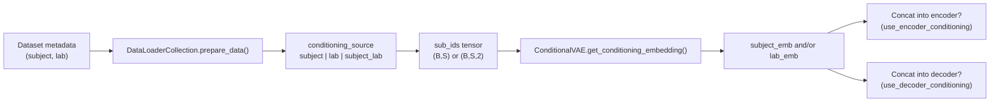
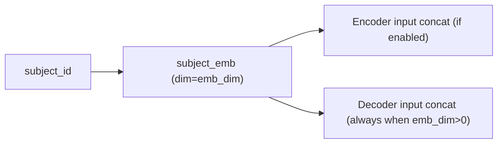
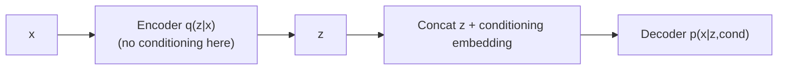
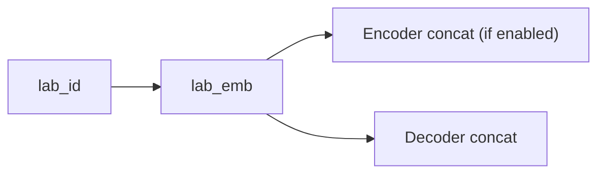
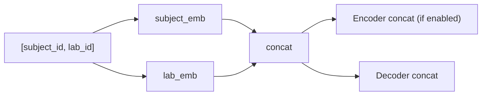

# Conditioning story map (code-grounded)

This note explains your conditioning setup in the exact order you asked:

1. Subject conditioning
2. Decoder-only conditioning
3. Lab conditioning
4. Combined lab + subject conditioning

It is based on:

- `src/data/data_loader_collection.py`
- `src/models/vae.py`
- your run configs under `src/config/run/cvaeprior/...`

---

## Shared mechanics (all four modes)

At a high level, conditioning is implemented in two stages:

1. **DataLoaderCollection builds integer IDs** per sample/sequence (`sub_ids`):
   - subject ID, or
   - lab ID, or
   - both `[subject_id, lab_id]`.
2. **ConditionalVAE converts IDs into embeddings** and concatenates them into encoder and/or decoder inputs depending on config.

Key config switches:

- `model.conditioning_source`: `subject`, `lab`, or `subject_lab`
- `model.params.emb_dim`: embedding size (must be `>0` to enable conditioning)
- `model.params.decoder_only_conditioning`: whether encoder gets embeddings

In code (`src/models/vae.py`):

- `use_encoder_conditioning = emb_dim > 0 and not decoder_only_conditioning`
- `use_decoder_conditioning = emb_dim > 0`

So decoder conditioning is always on when `emb_dim > 0`, and encoder conditioning is optional.

## Exactly how IDs become embeddings and enter tensors

This is the exact path in your code.

### Step A: metadata -> integer IDs in `DataLoaderCollection`

`prepare_data()` uses dataset metadata to create per-sequence conditioning arrays:

- subject mode: `cond_arr` shape `(N_seq, S)` with one integer subject ID repeated across sequence positions
- lab mode: `cond_arr` shape `(N_seq, S)` with one integer lab ID
- subject+lab mode: `cond_arr` shape `(N_seq, S, 2)` where last dimension is `[subject_id, lab_id]`

After concatenating all datasets:

- `x_all` -> torch tensor, shape roughly `(B, S, C, F)`
- `sub_ids_all` -> torch tensor, shape `(B,S)` or `(B,S,2)`

### Step B: flattening IDs to match `(B*S, ...)`

In `ConditionalVAE.get_conditioning_embedding(...)`:

- `_flatten_conditioning_ids(...)` converts IDs into a flat vector of length `B*S`
- then embedding lookup is done:
  - subject: `self.subject_emb(subject_ids_flat)` -> `(B*S, emb_dim)`
  - lab: `self.lab_emb(lab_ids_flat)` -> `(B*S, emb_dim)`
  - subject+lab: concatenate both -> `(B*S, 2*emb_dim)`

### Step C: where this embedding is concatenated

- Encoder (`encode`):
  - CNN output is flattened to `h_flat` with shape `(B*S, flat_dim)`
  - if encoder conditioning is on: `torch.cat([h_flat, emb], dim=-1)`
- Decoder (`decode`):
  - latent `z` flattened to `z_flat` shape `(B*S, latent_dim)`
  - if decoder conditioning is on: `torch.cat([z_flat, emb], dim=-1)`

So embedding injection is literal feature concatenation before MLPs, not attention/gating.

### Concrete shape example

Example config:

- `emb_dim = 4`
- `conditioning_source = subject_lab`
- batch from loader has `B=32`, `S=64`

Then:

- `sub_ids` shape is `(32, 64, 2)`
- `subject_emb(...)` gives `(2048, 4)`
- `lab_emb(...)` gives `(2048, 4)`
- concatenated embedding is `(2048, 8)`
- this `(2048, 8)` is concatenated into encoder and/or decoder flat inputs.

---

## 1) Subject conditioning

## What it means

Each sample/sequence gets a subject ID, mapped to a learned subject embedding.

- `DataLoaderCollection` with `conditioning_source: subject` creates `cond_arr` shape `(B,S)` filled with `subject_id`.
- `ConditionalVAE` uses `subject_emb(subject_ids)` to condition the model.

### Important current-project note

Your current `cvaeprior` configs largely set:

- `conditioning_source: subject`
- `decoder_only_conditioning: true`

So in those runs, subject embedding influences **decoder only** (see next section).

---

## 2) Decoder-only conditioning

## What it means

Conditioning embedding is appended only in `decode(...)`, not `encode(...)`.

In `src/models/vae.py`:

- Encoder path uses embedding only when `use_encoder_conditioning` is true.
- With `decoder_only_conditioning: true`, `use_encoder_conditioning` becomes false.
- Decoder still receives embedding via:
  - `emb = get_conditioning_embedding(subject_ids)`
  - `h_in = torch.cat([z_flat, emb], dim=-1)`

### Why people use this

- Keeps latent posterior less tied to identity metadata in encoder.
- Still lets reconstruction adapt by subject/lab in decoder.

### Why decoder-only is useful for your zero-shot story

Your zero-shot goal is usually: learn latent structure from physiology, not from a shortcut that encodes subject identity directly in the posterior.

When encoder conditioning is off:

- `q(z|x)` is forced to rely on `x` itself
- subject/lab metadata cannot directly shape `mu, logvar` during encoding
- decoder still uses metadata to reconstruct style/context differences

This separation helps when evaluating on new subject/lab combinations:

- latent representation tends to be more identity-agnostic
- conditioning acts as a controllable decoder context rather than a latent shortcut

Important caveat for strict unseen IDs:

- `nn.Embedding` needs an index seen in the embedding table.
- True unseen subject IDs require either:
  - mapping to an existing token/index policy, or
  - retraining/expanding embedding table.

So in practice, your "zero-shot" setting is strongest for *distribution shift in signals* with known conditioning vocabulary (or carefully defined fallback mapping), not arbitrary new integer IDs without handling.

---

## 3) Lab conditioning

## What it means

Same mechanism as subject conditioning, but IDs come from `lab` instead of subject.

- `conditioning_source: lab`
- `DataLoaderCollection` fills `(B,S)` with `lab_id`.
- `ConditionalVAE` uses `lab_emb(lab_ids)`.

Typical config pattern in your repo (`lab_conditioning/lab_conditioning_not_subject_LOLO/...`):

- `conditioning_source: lab`
- often `decoder_only_conditioning: true` in these runs as well

---

## 4) Lab + subject conditioning combined

## What it means

Both identifiers are used at once.

- `conditioning_source: subject_lab`
- `DataLoaderCollection` creates `cond_arr` of shape `(B,S,2)`:
  - `[...,0] = subject_id`
  - `[...,1] = lab_id`
- `ConditionalVAE.get_conditioning_embedding(...)`:
  - extracts subject IDs and lab IDs separately
  - looks up `subject_emb` and `lab_emb`
  - concatenates them: `torch.cat([subject_emb, lab_emb], dim=-1)`

In this mode, total conditioning dimension is:

- `conditioning_dim = emb_dim (subject) + emb_dim (lab) = 2 * emb_dim`

## Example: how metadata is used end-to-end

Suppose metadata has:

- `sub-039`, `lab=lab3`
- `sub-041`, `lab=lab5`

With sorted label maps, loader may build:

- subject map: `{sub-039: 0, sub-041: 1, ...}`
- lab map: `{lab3: 0, lab5: 1, ...}`

For one sequence from `sub-039` in `lab3` and `S=64`:

- subject mode -> IDs are `[0,0,...,0]` (64 times)
- lab mode -> IDs are `[0,0,...,0]`
- subject_lab mode -> IDs are `[[0,0],[0,0],...,[0,0]]` (64 rows)

Those IDs are what `get_conditioning_embedding(...)` consumes to fetch vectors from learned embedding tables.

---

## Data leakage: what is controlled, and what to watch

### What your setup does to reduce leakage risk

- Conditioning IDs are derived from explicit metadata fields (`get_id()`, `get_lab()`), not from labels.
- Decoder-only conditioning reduces risk that encoder latent directly memorizes metadata shortcuts.
- Your LOLO configs separate train/val by held-out lab in dataset selection, which is the main anti-leakage split strategy.

### Remaining leakage risks (important)

- If the same subject/run appears in both train and validation, leakage can still happen regardless of conditioning style.
- If preprocessing computes global stats across combined train+val, that leaks information; your pipeline uses train/val loaders separately, which is good, but split definitions still matter most.
- Using `conditioning_source: subject_lab` creates a very informative context token; if split strategy is weak, this can amplify leakage-like behavior.

### Practical checks to mention to professor

- Verify subject IDs and run IDs are disjoint where intended.
- Verify held-out lab rows are absent from training metadata.
- Report results for both:
  - known-ID generalization
  - held-out lab/subject splits
  so conditioning gains are not mistaken for leakage.

---

## Quick comparison table

| Mode | `conditioning_source` | ID tensor shape | Embeddings used |
|---|---|---|---|
| Subject | `subject` | `(B,S)` | `subject_emb` |
| Decoder-only subject | `subject` + `decoder_only_conditioning: true` | `(B,S)` | `subject_emb` (decoder only) |
| Lab | `lab` | `(B,S)` | `lab_emb` |
| Lab + subject | `subject_lab` | `(B,S,2)` | `subject_emb` + `lab_emb` |

---

## How to explain this to your professor (short script)

- “The conditioning signal is metadata-driven and created in the dataloader as integer IDs.”
- “The VAE turns IDs into learned embeddings and injects them into encoder/decoder.”
- “Decoder-only conditioning is controlled by one switch: `decoder_only_conditioning`.”
- “Subject vs lab is just which metadata field becomes the ID.”
- “Subject+lab combines both embeddings by concatenation.”
- “Most of my current experiments use decoder-only, so identity/context influences reconstruction while the encoder remains unconditioned.”
