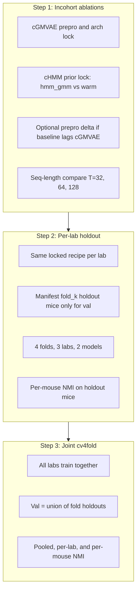
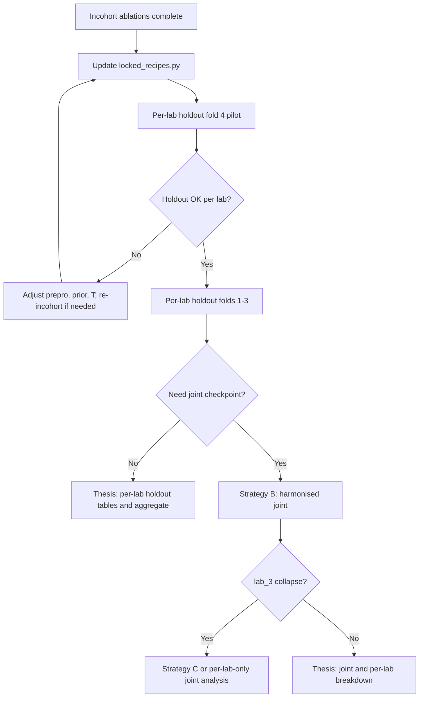

# From incohort ablations → cross-lab cv4fold

**Added 2026-06-08.** How to use per-lab incohort ablation results when you move to **within-lab holdout** and **joint cross-lab cv4fold**. Read this before locking recipes or submitting joint jobs.

Related: [README.md](README.md), [per_lab_holdout_pilot.md](per_lab_holdout_pilot.md), [cross_lab_cv4fold.md](cross_lab_cv4fold.md), [ablation_chmm_incohort.md](ablations/ablation_chmm_incohort.md), [`locked_recipes.py`](../../scripts/cv4fold/locked_recipes.py).

---

## The core question

Incohort ablations answer: **“What recipe maximizes prior NMI when all HQ mice in one lab are both train and val?”**

Cross-lab cv4fold answers: **“Does that recipe generalize to held-out mice — alone per lab, then jointly across labs?”**

Those are **different experiments**. Incohort NMI is an **upper bound / recipe search** signal. It does **not** substitute for holdout or joint cv4fold numbers in the thesis.

---

## Evaluation ladder (recommended order)




| Rung                | Train val split                  | Primary metric                     | Also report                         | Purpose                         |
| ------------------- | -------------------------------- | ---------------------------------- | ----------------------------------- | ------------------------------- |
| **Incohort**        | Same mice (pooled)               | Best-of-3 prior NMI                | Per-mouse optional (recipe search)  | Lock recipe knobs               |
| **Per-lab holdout** | Within-lab; val = fold holdout   | Best-of-3 on **holdout mice only** | **Per-mouse NMI** on each holdout   | Gate generalisation **per lab** |
| **Joint cv4fold**   | 20 mice; val = all fold holdouts | Best-of-3 pooled holdout NMI       | **Per-mouse + per-lab** breakdown   | Cross-lab generalisation story  |


**Do not skip Step 2.** Old joint fold-4 pilots (~0.31 pooled NMI) used **tune-winner hyperparams and `subject_lab`**, not your new locked per-lab prepro — see [cross_lab_cv4fold.md](cross_lab_cv4fold.md).

---

## What incohort ablations lock (single source of truth)

Everything downstream should flow from [`locked_recipes.py`](../../scripts/cv4fold/locked_recipes.py) after ablations finish.


| Knob                                                               | cGMVAE source                               | cHMM source                  | Where stored                                      |
| ------------------------------------------------------------------ | ------------------------------------------- | ---------------------------- | ------------------------------------------------- |
| **Signals / montage**                                              | lab_2 REM ablation                          | same                         | manifest `inventory.signals` + `LOCKED_SOURCES`   |
| **Prepro** (`post_normalize`, `band_pass_freqs`, `notch_freqs`, …) | prepro/EMG ablations                        | seq1 + optional prepro delta | `LOCKED_SOURCES[lab].prepro` YAML path            |
| **Arch** (`wide_mlp`, latent dim, …)                               | arch ablation                               | same                         | `LOCKED_SOURCES[lab].arch`                        |
| **Prior**                                                          | `gmm`                                       | `hmm_gmm` vs `warm_hmm_gmm`  | `LOCKED_CHMM_PRIOR_TIER[lab]`                     |
| **Sequence length**                                                | 1 (incohort default)                        | seq-length compare           | add to locked recipe / generator when T is chosen |
| **Training**                                                       | `no_beta_epochs: 10`, scratch, decoder-only | same                         | `_finalize_cfg` / holdout generator               |


**Update checklist after ablations:**

1. Scrape incohort results → [ablation_chmm_incohort.md](ablations/ablation_chmm_incohort.md) and [ablation_findings_20260608.md](ablations/ablation_findings_20260608.md).
2. If a **prepro delta** beats baseline for a lab, point `LOCKED_SOURCES[lab].prepro` at that YAML (or merge overrides into locked loader).
3. Set `LOCKED_CHMM_PRIOR_TIER[lab]` to `simple` or `warm` (+0.01 rule).
4. Set **`sequence_length`** per lab (2026-06-08): lab_2 **1** (cGMVAE); lab_3 **64** (cHMM warm); lab_5 **32** (cHMM — confirm with reliability). See [ablation_findings_20260608.md](ablations/ablation_findings_20260608.md).
5. Regenerate holdout configs:
  ```bash
   PYTHONPATH=. python3 scripts/cv4fold/generate_configs.py \
     --phase per_lab_holdout --fold 4 --models cgmvae chmmgmvae
  ```

---

## Metrics: do not mix contexts


| Mistake                                                  | Why it is wrong                                                                   |
| -------------------------------------------------------- | --------------------------------------------------------------------------------- |
| Compare incohort NMI (0.59 / 0.74 / 0.53) to holdout NMI | Holdout is strictly harder; val mice were in the incohort pool                    |
| Compare incohort seq1 cHMM to seq64 joint cv4fold        | Different `sequence_length`; HMM transitions inactive at seq=1                    |
| Use mean-of-3 seeds for thesis tables                    | Project standard is **best-of-3** with ≥2/3 healthy seeds                         |
| Re-use manifest `tune_winners` as the joint recipe       | Those trials use **`subject_lab`**, old LR/epochs, and **no per-lab prepro lock** |


**Correct comparisons:**

- Incohort: variant A vs B **within the same lab**, same seq length, same split.
- Holdout: locked recipe vs alternate **on the same fold holdout mice**.
- Joint: locked line vs ablation **on the same fold IDs**; always report **per-lab** columns from postprocess.

Scrape incohort:

```bash
PYTHONPATH=. python3 scripts/cv4fold/scrape_experiment_results.py \
  --search-root results/cv4fold/ablation_chmm
```

Holdout postprocess: [postprocess.md](postprocess.md), [per_lab_holdout_pilot.md § When jobs finish](per_lab_holdout_pilot.md#when-jobs-finish-postprocess).

---

## Per-mouse NMI (required for holdout and joint)

Pooled holdout NMI hides **which mice fail**. You need **per-mouse prior NMI** on validation mice for both **per-lab holdout** (Strategy A) and **joint cv4fold** (Strategy B/C) so you can spot consistently troublesome subjects (e.g. short recordings, bad runs, lab-specific artefacts).

### What to enable before submit

Pilot configs default to `save_results_npz: false` (disk-safe). For holdout and joint runs, turn on validation npz **before** submit:

```yaml
visualizer:
  save_results_npz: true   # required for per-mouse split
```

Set this in [`locked_recipes.py`](../../scripts/cv4fold/locked_recipes.py) (or per-phase generator) when you move from incohort ablations → holdout/joint. Incohort ablations can stay lean; **holdout and joint cannot** if you want per-mouse tables.

Manifest already has `eval.report_per_mouse: true` — the missing piece is writing `plots/{1,2,3}/results.npz` at end of training.

### Postprocess workflow

After each holdout or joint job finishes:

```bash
PYTHONPATH=. python3 scripts/cv4fold/postprocess_fold.py \
  --result-root results/cv4fold/per_lab_holdout/lab_2/fold_4/cgmvae/<run_name_timestamp>/ \
  --per-mouse-metrics
```

Same flag for joint result dirs under `results/cv4fold/<batch>/<model>/joint/fold_<k>/`.

**Outputs (tiny on disk):**

```
<run_name_timestamp>/
  per_mouse/run_1/sub-080/metrics.json   # {"nmi": 0.42, "n_epochs": ..., "participant_id": "sub-080"}
  per_mouse/run_2/sub-080/metrics.json
  per_mouse/run_3/sub-080/metrics.json
  best_run.json                          # which seed to prefer for tables
  val_nmi_by_lab.csv                     # per-lab macro NMI when --per-mouse-metrics used
  val_nmi_summary.json                   # val_mouse_ids, best run pointer
```

Use **`best_run.json`** to pick the seed for thesis per-mouse tables; keep all three seeds to check stability on difficult mice.

### How this differs by stage

| Stage | Val mice | Per-mouse tells you |
|-------|----------|---------------------|
| **Per-lab holdout** | 1–3 holdout mice **in that lab only** | Which mouse drives a lab's holdout drop vs incohort |
| **Joint cv4fold** | All fold holdouts (~4–6 mice across labs) | Whether failure is **lab-wide** or **one outlier mouse**; compare to per-lab holdout on the same mouse |

Example: if fold 4 joint NMI is low but per-mouse shows only `sub-060` ≈ 0.05 while others are ≈ 0.4, the story is **mouse quality / recording**, not necessarily wrong prepro. If **every** holdout mouse in lab_3 is low in both per-lab and joint, suspect **lab recipe or harmonisation**.

### Building a troublesome-mouse view

After postprocessing all folds, assemble a **mouse × fold × model** table (spreadsheet or pivot from `per_mouse/` JSON):

| Mouse | Lab | Fold | cGMVAE NMI (best seed) | cHMM NMI | Notes |
|-------|-----|------|------------------------|----------|-------|
| sub-060 | lab_3 | 4 | TBD | TBD | short recording (7212 epochs) |
| sub-092 | lab_5 | 4 | TBD | TBD | single holdout for lab_5 |

**Cross-fold patterns:**

- Mouse is holdout in **one fold only** — track its NMI whenever it appears in `val_datasets`.
- Same mouse low in **per-lab holdout and joint** — strong signal of difficult subject or bad run.
- Low in **joint only** — may indicate harmonised prepro hurting that lab (Strategy B) or batch mixing effects.

Optional batch loop (extend the holdout loop in [postprocess.md](postprocess.md)):

```bash
for run_dir in results/cv4fold/per_lab_holdout/lab_2/fold_4/cgmvae/*/; do
  [[ -f "${run_dir}config.json" ]] || continue
  PYTHONPATH=. python3 scripts/cv4fold/postprocess_fold.py \
    --result-root "${run_dir}" --per-mouse-metrics
done
```

### Incohort ablations: per-mouse optional

Incohort train = val (all HQ mice pooled). Per-mouse NMI there is useful for **outlier detection** during recipe lock but is **not** a generalisation metric. Prioritise per-mouse effort on **holdout and joint** where val mice were excluded from training.

---

## Three strategies for cross-lab cv4fold

### Strategy A — Per-lab holdout only (recommended first)

**Idea:** Treat each lab as its own generalisation experiment. Combine results **in tables**, not in one training run.


| Pros                                                                   | Cons                                            |
| ---------------------------------------------------------------------- | ----------------------------------------------- |
| Uses locked per-lab prepro/arch **exactly** as incohort                | No single “joint model” checkpoint              |
| Matches Morten’s “analyse each lab separately”                         | Thesis narrative is per-lab + aggregate summary |
| **Already supported** by `generate_configs.py --phase per_lab_holdout` |                                                 |


**How incohort feeds in:** `load_locked_recipe(lab)` → `apply_model_variant(..., lab=lab)` → manifest fold split. No manual YAML copying.

**Thesis table shape:**


| Lab   | Model | Fold | Incohort (ref) | Holdout best-of-3 | Δ   |
| ----- | ----- | ---- | -------------- | ----------------- | --- |
| lab_2 | cHMM  | 4    | 0.59*          | TBD               | …   |


Reference only — not a target for holdout to match.

**Gate before joint:** holdout NMI “reasonable” per lab (pilot thresholds in [per_lab_holdout_pilot.md](per_lab_holdout_pilot.md): e.g. lab_2 ≳ 0.45, lab_3 ≳ 0.55 — tune after first fold-4 scrape).

---

### Strategy B — Joint cv4fold with harmonised prepro (pragmatic joint line)

**Idea:** One YAML trains on all 20 mice; **one global `cvae:` block** applies the same front-end to every lab.


| Pros                                                 | Cons                                                                                                 |
| ---------------------------------------------------- | ---------------------------------------------------------------------------------------------------- |
| True joint encoder + subject embeddings              | **Cannot** apply lab_2 no-postnorm + wide EMG and lab_3 postnorm + standard EMG simultaneously today |
| Comparable to earlier `subject_tune_winners` batches | May **underperform** per-lab locked recipes                                                          |
| Single checkpoint / story                            | Requires picking a **compromise** prepro                                                             |


**When to choose:** After Strategy A shows holdout works per lab, but you need one joint model for comparison to prior fold-4 work or HMM-raw baseline.

**Harmonisation options (pick one explicitly):**

1. **Conservative:** lab_3/lab_5 style — `post_normalize: true`, EEG 0–20 Hz, EMG 5–60 Hz; lab_2 keeps EEG1+EEG4 via manifest signals only.
2. **lab_2-aligned:** no postnorm, wider bands — may hurt lab_3/5.
3. **Paper-style:** `robust_normalize` + shared bands from [lab_preprocessing_review_20260607.md](lab_preprocessing_review_20260607.md) — good for fairness, may sacrifice peak incohort NMI.

**Hyperparams:** Do **not** copy manifest `tune_winners` wholesale. Start from locked recipe trainer settings (LR 3e-4, 200 ep lab_2/3, 300 ep lab_5), `conditioning_source: subject` only, `sequence_length` = locked T.

**Status:** Paper main line implemented — see [unified_holdout_paper_line.md](unified_holdout_paper_line.md) (`within_lab_holdout`, `joint_holdout`, per-lab `cvae_overrides`).

---

### Strategy C — Joint cv4fold with per-lab prepro preserved (best science, needs plumbing)

**Idea:** Joint training, but each lab’s mice keep **their incohort-winning** `cvae` knobs (and arch if needed).


| Pros                                                | Cons                                                                                                                                        |
| --------------------------------------------------- | ------------------------------------------------------------------------------------------------------------------------------------------- |
| Respects lab-specific ablation conclusions          | **Not supported today** — one `GlobalConfig.cvae` for all loaders (`[data_loader_collection.py](../../src/data/data_loader_collection.py)`) |
| Best alignment between incohort lock and joint eval | Requires per-dataset cvae overrides or per-lab preprocessing transforms                                                                     |


**When to choose:** If Strategy B joint NMI collapses on one lab (especially lab_3) and you suspect harmonised prepro is the cause.

**Path:** Engineering task — extend dataset entries or `DataLoader` to accept optional `cvae_overrides` per mouse/lab. Until then, use Strategy A for faithful per-lab evaluation and Strategy B as an approximate joint line.

---

## Recommended default path (decision summary)




**Default recommendation:** **Strategy A** through all 4 folds for both cGMVAE and cHMM with locked recipes. Add **Strategy B** only if the thesis requires a joint model comparison. Treat **Strategy C** as a follow-up if harmonisation fails.

**Conditioning:** **`subject` only** (decoder-only embedding). Do not use `subject_lab` until/unless re-tuned from scratch with locked prepro — prior fold-4 showed collapse.

**Sequence length:** Lock T from [ablation_chmm incohort seq compare](ablations/ablation_chmm_incohort.md#phase-4--sequence-length-after-priorprepro-lock). Use the **same T** for cHMM in holdout and joint. cGMVAE can stay at seq=1 unless you explicitly ablate otherwise.

---

## Combining results across labs (reporting)

Even without joint training, you can summarise cross-lab performance:

1. **Per-lab holdout best-of-3** per fold → `summary.csv` under `results/cv4fold/per_lab_holdout/<lab>/fold_<k>/<model>/`.
2. **Per-mouse holdout NMI** → `per_mouse/run_<best>/sub-XXX/metrics.json` after `--per-mouse-metrics`.
3. **Macro average** across labs (equal weight per lab, not per mouse) — avoids lab_5’s 4 mice dominating lab_2’s 6.
4. **Per-lab Δ vs incohort** — shows generalisation gap; cite incohort only as reference.
5. **Model comparison** — cGMVAE vs cHMM on **same fold, same lab, same prepro**; primary metric remains prior NMI on holdout mice.

For joint runs (Strategy B/C), report **three levels**:

| Level | Source | Use |
|-------|--------|-----|
| Pooled | `val_nmi_summary.json` | Headline cv4fold number |
| Per-lab | `val_nmi_by_lab.csv` (with `--per-mouse-metrics`) | lab_2 vs lab_3 vs lab_5 on same fold |
| Per-mouse | `per_mouse/run_<best>/sub-XXX/metrics.json` | Identify troublesome holdout mice |

Same fold IDs as manifest `splits.fold_k` across per-lab and joint runs so you can align mouse-level rows.

---

## Implementation gaps (before joint submit)


| Piece                                            | Status  | Action                                                                                                                             |
| ------------------------------------------------ | ------- | ---------------------------------------------------------------------------------------------------------------------------------- |
| `generate_configs.py --phase per_lab_holdout`    | ✓       | Use now; set `sequence_length` in locked recipe when T is known                                                                    |
| **`save_results_npz: true` on holdout/joint**    | ✓       | Enabled on `within_lab_holdout` / `joint_holdout` YAMLs ([unified_holdout_paper_line.md](unified_holdout_paper_line.md))          |
| **`postprocess_fold.py --per-mouse-metrics`**    | ✓       | Run on every holdout and joint result dir                                                                                          |
| Per-mouse summary CSV across folds               | manual  | Pivot `per_mouse/*/metrics.json` into mouse × fold table (script TBD)                                                              |
| `generate_configs.py --phase joint_holdout`      | ✓       | [unified_holdout_paper_line.md](unified_holdout_paper_line.md) — Phase 0 pilot fold 4 chmmgmvae first                            |
| `generate_configs.py --phase within_lab_holdout` | ✓       | Unified recipes; 3 models × 4 folds × 3 labs                                                                                       |
| Per-lab cvae in one joint job                    | ✓       | `DatasetConfig.cvae_overrides` + merge in `DataLoader.process_data`                                                                |
| `LOCKED_CHMM_PRIOR_TIER` + seq T in holdout YAML | partial | `apply_model_variant(..., lab=lab)` reads prior tier; seq length still default 1 in holdout configs — **update after seq compare** |
| Scrape helper for `ablation_chmm`                | partial | Extend `scrape_experiment_results.py` search roots if needed                                                                       |


---

## Quick reference: result paths


| Stage                | Path pattern                                                          |
| -------------------- | --------------------------------------------------------------------- |
| cGMVAE incohort lock | `results/cv4fold/ablation_*`, `per_lab_incohort/<lab>/`               |
| cHMM incohort        | `results/cv4fold/ablation_chmm/<lab>/`, `ablation_chmm_seq<T>/<lab>/` |
| Per-lab holdout      | `results/cv4fold/per_lab_holdout/<lab>/fold_<k>/<model>/` + `per_mouse/run_*/sub-XXX/metrics.json` |
| Joint (future)       | `results/cv4fold/<batch>/<model>/joint/fold_<k>/` + same `per_mouse/` layout                         |


---

## What not to do

- Submit joint cv4fold using old `subject_lab_tune_winners` configs as “the locked line.”
- Lock cHMM holdout on `warm_hmm_gmm` by default — prefer `hmm_gmm` unless warm wins by >+0.01 on incohort **and** holds on holdout.
- Run full 12-variant prepro matrix at every sequence length (use seq-length compare on **winner recipe only**).
- Compare incohort ablation NMI directly to cross-lab cv4fold NMI in one table without labelling the split difference.
- Run holdout or joint cv4fold with `save_results_npz: false` and expect per-mouse diagnostics — pooled NMI alone is not enough for thesis troubleshooting.

---

## Changelog

- **2026-06-08** — Per-mouse NMI section: required for holdout/joint, `save_results_npz`, postprocess workflow, troublesome-mouse table.
- **2026-06-08** — Initial strategy doc: evaluation ladder, three joint strategies, lock checklist, metric warnings, implementation gaps.

