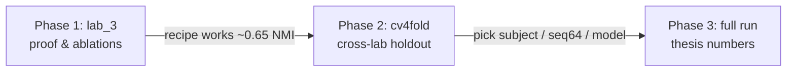

# Decoder conditioning — thesis roadmap

Added 2026-06-06. High-level story map for **decoder-only vs encoder+decoder** cGMVAE / cHMM-GMVAE work.

**Metric everywhere:** post-train **prior NMI** (`plots/metrics.txt`), best checkpoint — not WandB KMeans, not `feature_amplitude_per_state.png` (encoder means at final epoch).

---

## The question

Can a **subject-conditioned decoder** (encoder sees only the signal) learn sleep-state structure that **generalizes** beyond one lab and held-out mice?

We answer in two stages: **controlled proof** → **cross-lab holdout**.

---

## Phases

| Phase | Question | Setting | Detail doc |
|-------|----------|---------|------------|
| **1 — lab_3 proof** | Does the model work at all? Does cHMM beat cGMVAE? Does hotstart help? | Single lab, same mice train/val, decoder-only + enc+dec ablations | [decoder_only_lab3_chmm_experiments.md](decoder_only/decoder_only_lab3_chmm_experiments.md) |
| **2 — cv4fold** | Does it transfer to **new mice** and **other labs**? Which conditioning / recipe? | 4-fold holdout, labs 2/3/5, population joint training, tune-winner hyperparams | [cv4fold/cross_lab_cv4fold.md](cv4fold/cross_lab_cv4fold.md) |
| **3 — thesis line** *(planned)* | Locked recipe, all folds, reliability | TBD after Phase 2 decision | — |

---

## Flow

---

## Phase 1 — headline (see detail doc)

- **Decoder-only hotstart** reaches **~0.63–0.65** prior NMI on lab_3.
- **cHMM-GMM** slightly beats **cGMVAE GMM** with the same baseline checkpoint.
- **Encoder+decoder** is best (~0.74) but is a different conditioning story.
- **Scratch** works but noisier than hotstart.

→ Phase 1 says: *the stack is sound in a friendly setting.*

---

## Phase 2 — headline (see cv4fold doc)

- Same **ideas**, harder **test**: train on 3 folds, validate on held-out mice (fold 4 first, then all folds).
- **Much lower NMI** than lab_3 (~0.31 best pooled on fold 4 vs ~0.65 in-lab).
- **`subject` conditioning** beats **`subject_lab`** on holdout; **seq64** beats **seq1** for cv4fold.
- **Seed fragility**: many runs collapse to NMI ≈ 0.

→ Phase 2 says: *generalization is the bottleneck, not the lab_3 implementation.*

---

## Supporting docs

| Topic | Doc |
|-------|-----|
| Checkpoint load/save | [cvae_checkpointing.md](training/cvae_checkpointing.md) |
| Tracing which `.pth` a run used | [decoder_only_checkpoint_tracing.md](decoder_only/decoder_only_checkpoint_tracing.md) |
| cv4fold index | [cv4fold/README.md](cv4fold/README.md) |

## Results roots

| Phase | Path |
|-------|------|
| 1 | `results/decoder_only/` |
| 2 | `results/cv4fold/` |
