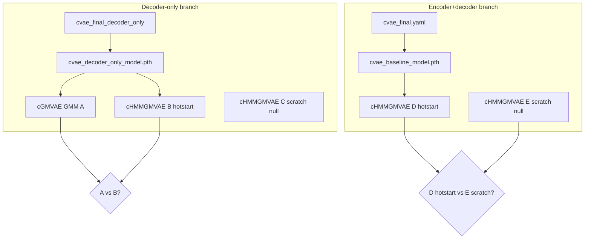

# Phase 1 — lab_3 cGMVAE vs cHMMGMVAE experiments

Added 2026-06-05. Branch: `vae_decoder_chmm`.

**Context:** Detail doc for **Phase 1** of the [decoder conditioning roadmap](../decoder_conditioning_roadmap.md). **Next step (cross-lab holdout):** [cv4fold/cross_lab_cv4fold.md](../cv4fold/cross_lab_cv4fold.md).

## Matrix

| # | Conditioning | Model | Init checkpoint | Seeds |
|---|--------------|-------|-----------------|-------|
| **0** | decoder-only | baseline VAE | scratch | 3 |
| **0b** | encoder+decoder | baseline VAE | scratch | 3 |
| **A** | decoder-only | cGMVAE GMM | `cvae_decoder_only_model.pth` | 10 |
| **B** | decoder-only | cHMMGMVAE | same as A | 10 |
| **C** | decoder-only | cHMMGMVAE | `null` | 10 |
| **D** | encoder+decoder | cHMMGMVAE | `cvae_baseline_model.pth` | 10 |
| **E** | encoder+decoder | cHMMGMVAE | `null` | 10 |

**Compare fairly:** A vs B (decoder-only, same `.pth`). D vs E optional (full conditioning, hotstart vs scratch).

**Metrics:** GMM/HMM prior NMI in `plots/metrics.txt`. WandB KMeans NMI is auxiliary.

## Flow



## Scripts & YAMLs

| Job | Script | YAML |
|-----|--------|------|
| 0 | `baseline/run_decoder_only.sh` | `final/cvae_final_decoder_only.yaml` |
| 0b | `baseline/run_encoder_decoder.sh` | `final/cvae_final.yaml` |
| A | `reliability/run_cgmvae.sh` | `reliability_cgmvae_decoder_only_mssv_frequency.yaml` |
| B | `reliability/run_chmm_decoder_only.sh` | `reliability_chmmgmvae_decoder_only_mssv_frequency.yaml` |
| C | `reliability/run_chmm_decoder_only_scratch.sh` | `..._scratch.yaml` (decoder) |
| D | `reliability/run_chmm_encoder_decoder.sh` | `reliability_chmmgmvae_encoder_decoder_mssv_frequency.yaml` |
| E | `reliability/run_chmm_encoder_decoder_scratch.sh` | `..._encoder_decoder_..._scratch.yaml` |

All under `hpc/submit/decoder_only/`.

## Logs & results

| Job | LSF log pattern | `results_dir` |
|-----|-----------------|---------------|
| 0 / 0b | `baseline/decoder_only_%J.out` / `encoder_decoder_%J.out` | `results/decoder_only/` |
| A | `reliability/cgmvae_%J.out` | `.../cgmvae_decoder_only/` |
| B | `reliability/chmmgmvae_decoder_only_%J.out` | `.../chmmgmvae_decoder_only/` |
| C | `reliability/chmmgmvae_decoder_only_scratch_%J.out` | `.../chmmgmvae_decoder_only_scratch/` |
| D | `reliability/chmmgmvae_encoder_decoder_%J.out` | `.../chmmgmvae_encoder_decoder/` |
| E | `reliability/chmmgmvae_encoder_decoder_scratch_%J.out` | `.../chmmgmvae_encoder_decoder_scratch/` |

Walltime: 0 `1:30`, 0b `3:00`, A–E `6:00`.

## Submit order

```bash
# Decoder branch (0 → A,B; C parallel)
bsub < hpc/submit/decoder_only/baseline/run_decoder_only.sh
bsub -w "done(<J0>)" < hpc/submit/decoder_only/reliability/run_cgmvae.sh
bsub -w "done(<J0>)" < hpc/submit/decoder_only/reliability/run_chmm_decoder_only.sh
bsub < hpc/submit/decoder_only/reliability/run_chmm_decoder_only_scratch.sh

# Encoder+decoder branch (0b → D; E parallel)
bsub < hpc/submit/decoder_only/baseline/run_encoder_decoder.sh
bsub -w "done(<J0b>)" < hpc/submit/decoder_only/reliability/run_chmm_encoder_decoder.sh
bsub < hpc/submit/decoder_only/reliability/run_chmm_encoder_decoder_scratch.sh
```

See: [cvae_checkpointing.md](../training/cvae_checkpointing.md).

## Results (2026-06-06)

All jobs below **completed** on branch `vae_decoder_chmm` after baselines were re-run with legacy `[92, 4]` `subject_emb` (jobs `28603982`, `28603983`). Metric: **post-train prior NMI** from LSF stdout (`GMM NMI` for A, `HMM-GMM NMI` for B–E). `seq_len=1` → HMM switch rate 0.0 expected.

### Summary table

| Job | LSF ID | Prior NMI (mean ± SEM) | Seeds | Status |
|-----|--------|------------------------|-------|--------|
| **0** decoder-only baseline | `28603982` | GMM **0.655** (1 run) | 1 | ok |
| **0b** encoder+decoder baseline | `28603983` | GMM **0.737 ± 0.002** | 3 | ok |
| **A** cGMVAE GMM hotstart | `28603984` | GMM **0.630 ± 0.002** | 10/10 | ok |
| **B** cHMM dec-only hotstart | `28603985` | HMM-GMM **0.650 ± 0.0004** | 10/10 | ok |
| **C** cHMM dec-only scratch | `28603742` | HMM-GMM **0.612 ± 0.020** | 10/10 | ok |
| **D** cHMM enc+dec hotstart | `28603986` | HMM-GMM **0.736 ± 0.0005** | 10/10 | ok |
| **E** cHMM enc+dec scratch | `28603765` | HMM-GMM **0.630 ± 0.019** | 10/10 | ok |

### Per-seed prior NMI

**A (cGMVAE GMM):** 0.621, 0.623, 0.629, 0.625, 0.637, 0.635, 0.634, 0.637, 0.626, 0.633

**B (cHMM decoder-only hotstart):** 0.648, 0.652, 0.651, 0.649, 0.651, 0.651, 0.649, 0.651, 0.651, 0.649

**C (cHMM decoder-only scratch):** 0.645, 0.712, 0.702, 0.624, 0.543, 0.548, 0.552, 0.614, 0.561, 0.626

**D (cHMM encoder+decoder hotstart):** 0.738, 0.737, 0.736, 0.737, 0.738, 0.737, 0.735, 0.736, 0.734, 0.733

**E (cHMM encoder+decoder scratch):** 0.736, 0.618, 0.685, 0.556, 0.644, 0.652, 0.548, 0.648, 0.649, 0.561

### Comparisons (fair pairs)

| Comparison | Δ mean NMI | Notes |
|------------|------------|-------|
| **B vs A** (decoder-only, same `cvae_decoder_only_model.pth`) | **+0.020** (0.650 vs 0.630) | cHMM-GMM beats cGMVAE GMM; B SEM much tighter |
| **C vs B** (scratch vs hotstart, decoder-only) | **−0.038** (0.612 vs 0.650) | Scratch works but noisier; hotstart helps |
| **D vs E** (enc+dec hotstart vs scratch) | **+0.106** (0.736 vs 0.630) | Full conditioning benefits strongly from baseline checkpoint |
| **D vs 0b** | ~0.000 | Hotstart cHMM ≈ baseline GMM NMI (~0.737) |

### Takeaways

1. **Minimal cHMM port works on lab_3:** decoder-only hotstart (B) improves over cGMVAE (A) with the same checkpoint.
2. **Scratch ablation (C, E):** cHMM learns end-to-end (~0.61–0.63) without baseline, but below hotstart — matches thesis expectation (~0.68–0.72 hotstart vs ~0.68–0.70 scratch for cGMVAE).
3. **Encoder+decoder (D)** is best and very stable (SEM ≈ 0.0005); **E** shows high seed variance (0.55–0.74).
4. **Not a failure of conditioning design** — baselines and A/B/D completed; earlier batch failed on wrong `[10, 4]` checkpoint load.

### Logs & artifacts

| Job | LSF stdout |
|-----|------------|
| 0 | `hpc/output/decoder_only/baseline/decoder_only_28603982.out` |
| 0b | `hpc/output/decoder_only/baseline/encoder_decoder_28603983.out` |
| A | `hpc/output/decoder_only/reliability/cgmvae_28603984.out` |
| B | `hpc/output/decoder_only/reliability/chmmgmvae_decoder_only_28603985.out` |
| C | `hpc/output/decoder_only/reliability/chmmgmvae_decoder_only_scratch_28603742.out` |
| D | `hpc/output/decoder_only/reliability/chmmgmvae_encoder_decoder_28603986.out` |
| E | `hpc/output/decoder_only/reliability/chmmgmvae_encoder_decoder_scratch_28603765.out` |

Checkpoints: `results/decoder_only/cvae_final_decoder_only/cvae_decoder_only_model.pth`, `results/decoder_only/cvae_baseline/cvae_baseline_model.pth`. Run dirs under `results/decoder_only/reliability/`.

### Per-run best checkpoints (2026-06-06+)

After retraining with checkpoint saving ported from `chmmgmm_fold`, each seed keeps:

| File | When updated |
|------|----------------|
| `{run_name}/{N}/checkpoints/cvae_best_prior_pred_nmi.pth` | Best prior-prediction NMI during training (not latent KMeans) |
| `{run_name}/{N}/checkpoints/cvae_best_checkpoint_score.pth` | Best thesis score `S(e)` when `trainer.checkpoint_score.enabled: true` |
| `{run_name}/{N}/checkpoints/cvae_final_model.pth` | Weights at last epoch |
| `{run_name}/{N}/checkpoints/validation_checkpoint.txt` | Which file was used for post-train prior validation |

Post-train plots use **best prior-pred NMI** (or best score if enabled), not necessarily the final epoch. See [cvae_checkpointing.md](../training/cvae_checkpointing.md).
