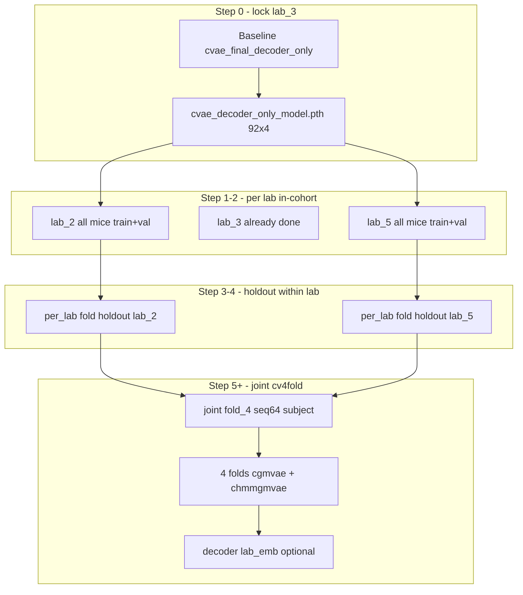

# Cross-lab baby steps (chmmgmm_fold-inspired)

## Where you are

| Layer | Status on `vae_decoder_chmm_cv4` |
|-------|----------------------------------|
| Phase 1 lab_3 | Done — decoder-only ~**0.65**, enc+dec ~**0.74** prior NMI ([decoder_only_lab3_chmm_experiments.md](docs/decoder_only_lab3_chmm_experiments.md)) |
| Baseline job `28605085` | Finishing 3 seeds; use best `cvae_best_prior_pred_nmi.pth` as canonical hotstart |
| cv4fold infra | **Docs only** — no `data/manifests/`, `scripts/cv4fold/`, or `hpc/submit/cv4fold/` on this branch |
| `chmmgmm_fold` | Full pipeline: manifest, `generate_configs.py`, tune winners, joint/per_lab folds, `conditioning_source` + `lab_emb` — but **compact** subject indexing and fold-4 **subject_lab collapse** |

## What not to copy blindly from `chmmgmm_fold`

1. **Compact `subject_emb` `[N,4]`** — stay on **legacy `[92,4]`** (`sub-041` → row 41) per your checkpoint line.
2. **`subject_lab` tune winners on holdout** — pooled NMI **~0** on fold 4; pause until fold-4 re-tune ([cross_lab_cv4fold.md](docs/cv4fold/cross_lab_cv4fold.md)).
3. **`seq_len=1` for cross-lab** — lab_3 recipe; cv4fold pilot needs **`sequence_length: 64`** for temporal prior.
4. **Config path `cvaeprior/`** — this branch trains via [`cvaemarhmm`](src/config/run/cvaemarhmm/); templates must live under `cvaemarhmm/cv4fold/` (or generator rewrites paths).
5. **Any mouse outside the quality cohort** — do not use full `metadata.csv` or old lab_3 YAMLs that list non-cohort mice.

## Quality cohort only (20 mice) — hard rule

**All cross-lab steps use exclusively** the mice in `data/manifests/cv_quality_cohort_v1.yaml`, built from the frozen `COHORT` dict in `chmmgmm_fold`’s `scripts/data_exploration/build_cv_fold_manifest.py`. No other MSSV subjects enter train/val.

| Lab | High-quality mice (6 + 10 + 4 = **20**) |
|-----|----------------------------------------|
| **lab_2** | sub-071, sub-072, sub-076, sub-077, sub-080, sub-081 |
| **lab_3** | sub-038, sub-039, sub-041, sub-043, sub-048, sub-054, sub-056, sub-059, sub-060, sub-069 |
| **lab_5** | sub-087, sub-088, sub-089, sub-092 |

**Enforcement (implementation):**

- **Single source of truth:** `generate_configs.py` calls `manifest_utils.dataset_entries()` only — never hand-edit `train_datasets` with extra IDs.
- **Port** `build_cv_fold_manifest.py` so the manifest can be regenerated from `metadata.csv` but still writes this same `COHORT` whitelist (not “all mice in metadata”).
- **Assert at config gen:** every `id` in generated YAML ∈ `manifest["cohort"]` flattened; fail loudly if not.
- **Phase 1 lab_3 baseline** ([cvae_final_decoder_only.yaml](src/config/run/cvaemarhmm/final/cvae_final_decoder_only.yaml)) already uses exactly these **10** lab_3 mice — aligned with quality cohort; keep it that way when refreshing baselines.
- **Tune / cv4fold / per-lab:** max **20 mice** total; joint folds hold out subsets defined only in `manifest["splits"]`.

## Target architecture (end state)



---

## Step 0 — Lock lab_3 checkpoint (no new science)

**Goal:** One trusted `[92,4]` baseline for hotstart.

- Wait for job `28605085` to finish; pick best seed (`…/1/` or `…/3/` ~0.65–0.67).
- Copy to canonical path expected by reliability YAMLs:
  `results/decoder_only/cvae_final_decoder_only/cvae_decoder_only_model.pth`
- Verify shape: `cvae.subject_emb.weight` → `[92, 4]`; decoder-only encoder input has no subject concat.
- Optional: set `save_pretrained_checkpoint: true` in [cvae_final_decoder_only.yaml](src/config/run/cvaemarhmm/final/cvae_final_decoder_only.yaml) for future baseline jobs.

**Gate:** GMM prior NMI **≥ 0.64** on lab_3 (matches job 0 / `28603982`).

---

## Step 1 — Port minimal cv4fold plumbing from `chmmgmm_fold`

Cherry-pick or re-copy (adapt paths, do not merge whole branch):

| Asset | Source branch | Destination |
|-------|---------------|-------------|
| Cohort manifest | `data/manifests/cv_quality_cohort_v1.yaml` | **20 HQ mice only** (table above), fold splits, `tune_winners` |
| Manifest builder | `scripts/data_exploration/build_cv_fold_manifest.py` | same `COHORT` whitelist; regen from metadata but never expand mouse list |
| Manifest helpers | `scripts/cv4fold/manifest_utils.py` | same; all `dataset_entries()` ⊆ quality cohort |
| Config generator (trimmed) | `scripts/cv4fold/generate_configs.py` | new phase: `per_lab_incohort` only |
| Postprocess | `scripts/cv4fold/postprocess_fold.py`, `aggregate_val_nmi_by_lab.py` | same |
| HPC | `hpc/submit/cv4fold/cv4fold_bsub.sh` + one submit script | `submit_per_lab_incohort.sh` |
| Docs | Extend [docs/cv4fold/README.md](docs/cv4fold/README.md) with workflow | link from [decoder_conditioning_roadmap.md](docs/decoder_conditioning_roadmap.md) |

**Generator changes for this branch:**

- Templates under `src/config/run/cvaemarhmm/cv4fold/templates/` — start from `chmmgmm_fold` [`cgmvae_base.yaml`](https://github.com/...) but:
  - `decoder_only_conditioning: true`, `emb_dim: 4`, `sequence_length: 64` (or `1` for first lab_3-style sanity)
  - `prior: gmm` / `chmmgmvae` template for step 4+
  - `model_checkpoint_path` → lab_3 baseline `.pth` for hotstart per-lab runs
  - **No `conditioning_source` yet** — use existing `sub_ids` + legacy map in [data_loader_collection.py](src/data/data_loader_collection.py)
- `train_datasets` / `val_datasets`: **same mice** (all cohort mice in that lab, all runs) — in-cohort proof, not holdout.

**Do not port yet:** full `submit_all_cv4fold.sh`, tune sweep, `subject_lab_tune_winners`.

---

## Step 2 — Per-lab in-cohort proof (your chosen first gate)

**Goal:** Show the **same decoder-only recipe** works on lab_2 and lab_5 **before** mixing labs or holding out mice.

| Lab | Mice (from manifest) | Signals | Stages | Notes |
|-----|----------------------|---------|--------|-------|
| lab_3 | **10 HQ mice** (see table) | EEG1+EEG2+EMG | 4 | Baseline reference ~0.65; same list as manifest |
| lab_2 | **6 HQ mice** | EEG1+**EEG3**+EMG | **3** (no Artifact) | Montage differs — expect harder recon |
| lab_5 | **4 HQ mice** | EEG1+EEG2+EMG | 4 | Smallest cohort |

**Runs (2 jobs × 2 models optional):**

1. **cGMVAE GMM** — `prior: gmm`, hotstart from lab_3 checkpoint, `runs: 3`
2. **cHMMGMVAE** — same + HMM prior (after lab_3 cHMM is trusted)

**Configs:** `results/cv4fold/per_lab_incohort/{lab_2,lab_5}/cgmvae/` (and chmm).

**Metrics:** post-train **prior NMI** + `val_nmi_by_lab.csv` (single lab) + W&B `prior_pred_nmi`, `n_unique_pred_states == 3`.

**Gates (pragmatic):**

- Prior NMI **> 0.45** per lab (well above chance); compare to lab_3 ~0.65.
- **3 states used** (no prior collapse).
- If lab_2 **≪** lab_3: inspect montage / 3-stage labels before joint cv4fold (preprocessing audit already flagged lab batch effects).

**HPC:** one job per lab per model; logs `hpc/output/cv4fold/per_lab_incohort/%J.out`; walltime ~6h (smaller than full joint).

---

## Step 3 — Per-lab holdout (still single-lab)

**Goal:** LODO **within one lab** before joint 3-lab holdout.

- Use manifest `splits.fold_k.{lab_2|lab_3|lab_5}` but **scope = per_lab** only (train pool = that lab’s mice minus holdout).
- Start with **fold 4** holdouts you already know ([cross_lab_cv4fold.md](docs/cv4fold/cross_lab_cv4fold.md)): lab_2 `sub-080/081`, lab_3 `056/059/060`, lab_5 `sub-092`.
- Recipe: **`sequence_length: 64`**, decoder-only **subject**, scratch **or** hotstart from lab_3 baseline (ablation).

**Gate:** per-lab holdout NMI **> 0** with stable seeds; compare hotstart vs scratch for that lab only.

---

## Step 4 — Joint fold-4 holdout (re-enter chmmgmm_fold path)

Only after Steps 2–3 pass.

- Port `generate_configs --phase subject_tune_winners --folds 4` (adapt to `cvaemarhmm`).
- Reproduce fold-4 pilot **B** (~0.31 pooled NMI) as regression; report **per-lab** NMI (`val_nmi_by_lab.csv`), not pooled only.
- Fix **seed collapse** (runs 2–3 → NMI ≈ 0) before scaling to folds 1–3 — investigate GMM init, `checkpoint_score`, seed offsets (known issue in [cross_lab_cv4fold.md](docs/cv4fold/cross_lab_cv4fold.md)).

---

## Step 5 — Full cv4fold + tune winners (chmmgmm_fold Phase 1–2)

From [`chmmgmm_fold` cv4fold README](docs on that branch):

1. In-sample **Bayesian tune** (`submit_tune_sweep.sh`) on **all 20 HQ mice only** — lock `tune_winners` in manifest.
2. `generate_configs --phase full` → `submit_all_cv4fold.sh` (joint + per_lab, 4 folds, `runs: 3`).
3. Models: **cgmvae** then **chmmgmvae**; optional `hmm_raw` baseline later.

---

## Step 6 — Lab conditioning (later; cleaner than `subject_lab`)

**Do not** re-enable `subject_lab` from `chmmgmm_fold` without fold-4 re-tune.

Instead (aligns with [decoder_conditioning_roadmap.md](docs/decoder_conditioning_roadmap.md) and `.github/prompts/plan-labConditionedDecoder.md`):

- Port **only** `lab_emb` on **decoder** + `lab_map` from metadata (`lab_2/3/5` → 3 rows + unknown).
- Keep **legacy `[92,4]` subject** for in-cohort; at LODO test, prior metric still uses unconditioned encoder — lab helps **reconstruction**, not current NMI path unless encoder stays clean.
- Cherry-pick from `chmmgmm_fold`: `lab_map` in data loader + `conditioning_source: lab` **decoder path** — but **merge with `LEGACY_SUBJECT_EMB_NUM_ROWS=92`**, not compact `get_num_subjects()`.

Ablate on fold 4: `subject` vs `lab` decoder vs `subject+lab` decoder.

---

## Indexing / checkpoint rule (all steps)

```text
subject_emb: [92, 4]  — legacy sub-NNN rows (current branch)
lab_emb:     [4, 2]  — only after Step 6 (3 labs + unknown)
Checkpoints: same lineage within cv4fold; orchestrator skips incompatible subject_emb shapes
```

---

## Suggested order of work (implementation)

1. Finish Step 0 (checkpoint publish).
2. Cherry-pick manifest + `manifest_utils` + minimal `generate_configs` phase `per_lab_incohort`.
3. Add templates + one HPC submit script; **manual** `bsub` after you confirm commands.
4. Run lab_5 then lab_2 in-cohort (lab_5 smaller → faster iteration).
5. Document gates in [docs/cv4fold/cross_lab_cv4fold.md](docs/cv4fold/cross_lab_cv4fold.md) (per-lab section).
6. Steps 3–6 only after gates pass.

---

## Success criteria summary

| Step | Success |
|------|---------|
| 0 | Canonical `[92,4]` `.pth`, lab_3 NMI ≥ 0.64 |
| 2 | lab_2 & lab_5 in-cohort prior NMI > 0.45, 3 active states |
| 3 | Per-lab LODO > 0, seeds stable |
| 4 | Joint fold-4 ≥ ~0.31 (regression), per-lab breakdown documented |
| 5 | All 4 folds summarized; cHMM vs cGMVAE on same splits |
| 6 | Lab decoder ablation on fold 4 without prior collapse |

