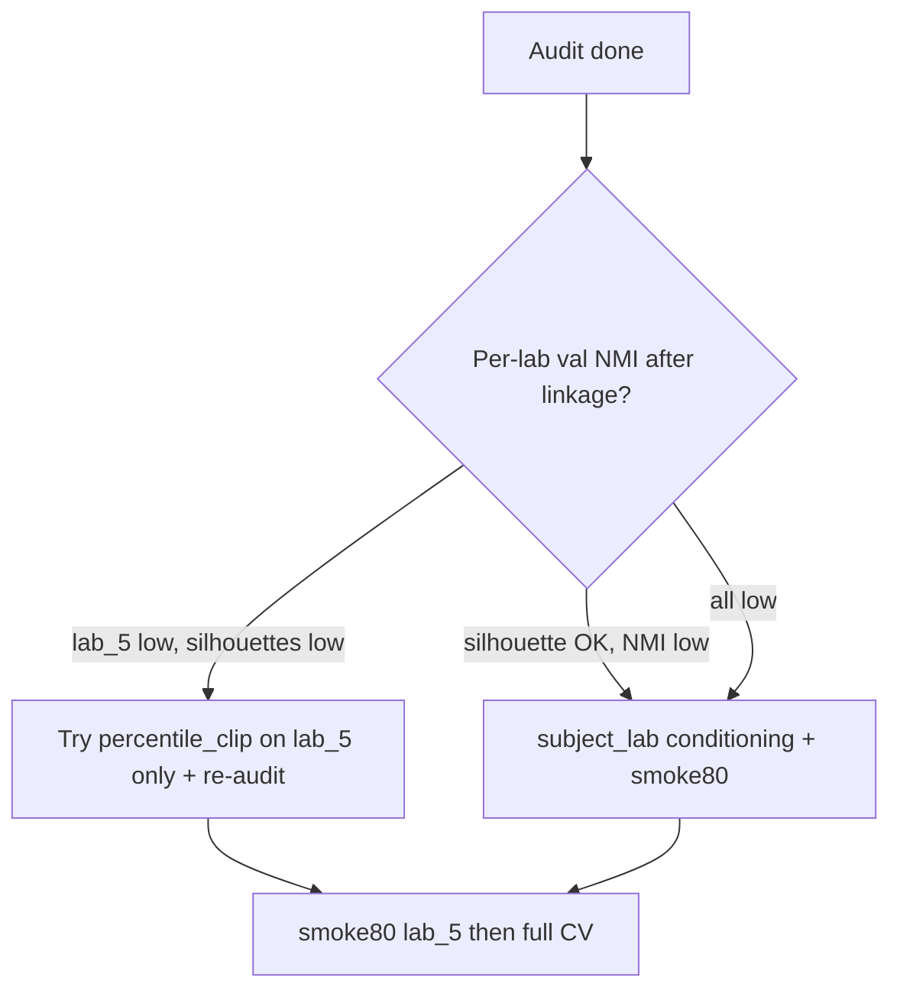

# Preprocessing audit — recommendations

> **Biological interpretation:** see [preprocessing_audit_biology.md](preprocessing_audit_biology.md).

Practical follow-up after [preprocessing_audit_findings.md](preprocessing_audit_findings.md). Goal: **best cross-lab model performance without over-complicating preprocessing** unless there is strong evidence.

---

## Do this first (minimal, high impact)

| Priority | Action | Why |
|----------|--------|-----|
| **1** | **Lab-aware modeling** — train/eval `chmmgmvae` with `conditioning_source: subject_lab` (or at minimum track **per-lab validation NMI**) | Cross-lab PCA shows **lab structure dominates** model inputs more than stage. Subject-only VAE cannot fix that with small preprocessing tweaks alone. See [conditioning_story_map.md](conditioning_story_map.md). |
| **2** | **Re-run audit linkage** after cv4fold finishes | `PYTHONPATH=. python -m scripts.preprocessing_audit.run --phases 4 5 --out results/preprocessing_audit` — separates “bad features” vs “bad model” via silhouette vs NMI. |
| **3** | **Smoke80 on lab_5** | Weakest pre-VAE separability in the audit; cheap check before full grid: `bash hpc/submit/cv4fold/submit_smoke_80.sh` (per-lab lab_5 scope). |

**Quick checks (~30 min, no new pipeline):**

1. Per-lab validation NMI from existing cv4fold runs (not pooled joint metric only).
2. Run 1 vs run 2 for 2–3 mice per lab: stage % and mean FFT features — postnorm plot suggests **run-to-run scale differences** while training pools both runs.
3. EMG REM vs Wake separation on **model features** for lab_5 vs lab_3 (mouse REM is often EMG-driven).

---

## Keep the current preprocessing baseline

**Do not change** cv4fold defaults without a full-cohort re-audit:

- `post_normalize: true` (per mouse × run)
- Frequency-domain band-pass `[[null, 20], [null, 20], [5, 60]]`
- No `percentile_clip_channels`, no `pre_normalize`, no `normalize_global`, no Hanning

Subset ablations did **not** show a clear global winner. `no_post_normalize` helped lab_3 slightly on 2 mice but **hurt lab_5**. Placement-aware BP, time-domain BP, global norm, and artifact_harmonized showed **no meaningful gain** on the subset.

**Fix generalization in the model/conditioning first**; touch preprocessing only with one target lab and one knob.

---

## Only if lab_5 still fails after steps above

Try **one** preprocessing change, then re-run the audit on the **full cohort**:

| Knob | When | Note |
|------|------|------|
| `percentile_clip_channels: true` | lab_5 NMI/features still worst | Mildest ablation for lab_5 on the subset; confirm on all mice before locking in YAML |

---

## Avoid for now (unless new evidence)

| Change | Reason |
|--------|--------|
| Lab-level `post_normalize` | Not how training works today; counterfactual shifts features but no proven NMI gain |
| Turning off `post_normalize` globally | Helps lab_3 on subset, hurts lab_5 |
| `bp_time_domain` / Hanning / placement-aware BP only | No consistent silhouette gain on subset |
| Large preprocessing grid before linkage + conditioning | High complexity, low payoff so far |

---

## Discuss with cohort / scoring (not a tuning knob)

- **lab_2 has no Artifact label** — `remove_artifact: true` in the manifest is a **no-op** for lab_2 but strips Artifact on lab_3/5. Same flag ≠ same effective data.
- **Montage:** lab_2 uses EEG1+EEG3 (both parietal); lab_3/5 use EEG1 (P) + EEG2 (F). Band-pass is applied by **channel index**, not anatomy.

Harmonizing artifact policy or montage-aware filters is a **scientific/protocol** decision, not something to slip in silently via YAML.

---

## Plot guide (how to read the audit figures)

### `after/normalization_scope/postnorm_scale_by_run.png`

**Title is misleading.** The y-axis is the **mean std of features before `post_normalize`** (the per-run statistics used for z-scoring), **not** spread after normalization. After `post_normalize`, features are ~0 mean / ~1 std within each run by design.

**Still useful:**

- Run 1 vs run 2 often differ → two amplitude regimes per mouse when both runs are pooled in training.
- lab_5 **sub-092** has the largest pre-norm spread → harder recording for a fixed pipeline.
- Values are mostly ~0.8–1.0 → not catastrophic, but **not lab-harmonized** (intentionally per run).

### PCA figures (fixed 2026-06-03)

- **Per lab:** `after/lab_*/feature_pca_triple.png` — PCA colored by **sleep stage** (Awake / NREM / REM).
- **Cross-lab:** `after/cross_lab/pca_all_labs_unlabeled.png` — all labs pooled, colored by lab.

**Interpretation of the cross-lab PCA:** labs form **separate manifolds** (lab_2/3 as tight vertical bands ≈ run/cohort dominating PC1; lab_5 more diffuse). The model can learn **lab identity** easier than **stage** under subject-only conditioning. See [preprocessing_audit_biology.md](preprocessing_audit_biology.md) §5.

---

## Biological read-through (condensed)

### Raw (`results/preprocessing_audit/raw/`)

- **NREM > Awake theta (EEG1)** in all labs — consistent with mouse NREM theta.
- **Lab offsets differ** (lab_2 high θ in Awake/NREM; lab_3 lower; lab_5 high REM θ) — montage (P+P vs P+F) and scoring, not necessarily worse sleep at one site.
- **REM ranking ≠ NREM ranking** across labs — REM uses **EMG + frontal** contributions; do not judge labs on EEG alone.
- **~6–7% REM** — sparse class; expect hard unsupervised separation.
- **PSD roll-off ~25–30 Hz** in exploration plots — largely from **loader bandpass 0.5–30 Hz** on raw plots, not the VAE path alone.

### Model input (`results/preprocessing_audit/after/`)

- **Stage separability low everywhere** (silhouette &lt; 0.15) — hand-crafted FFT features alone do not separate wake/NREM/REM cleanly; VAE + prior must carry discrimination.
- **Lab contrast heatmaps** — same layout, different log-power levels/patterns across labs on ch0.
- **Lab 3 good per-lab NMI does not imply lab-3-only preprocessing** — pre-VAE separability is modest in **all** labs; lab_5 is weakest.

---

## Decision flow

---

## Related files

| Doc / path | Content |
|------------|---------|
| [preprocessing_audit_findings.md](preprocessing_audit_findings.md) | Full audit numbers and gates |
| [results/preprocessing_audit/00_INDEX.md](../results/preprocessing_audit/00_INDEX.md) | Go/no-go table |
| [results/preprocessing_audit/DECISIONS.md](../results/preprocessing_audit/DECISIONS.md) | Checklist to fill after review |
| `data/manifests/cv_quality_cohort_v1.yaml` → `preprocessing_audit:` | Smoke target (lab_5) and ablation hints |

---

*Preprocessing stays run-level (`post_normalize` per mouse × run, not per lab). Partner question: see normalization table in [preprocessing_audit_findings.md](preprocessing_audit_findings.md).*
